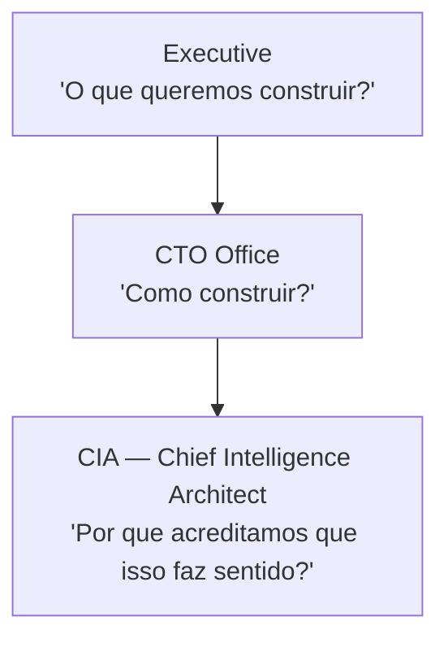
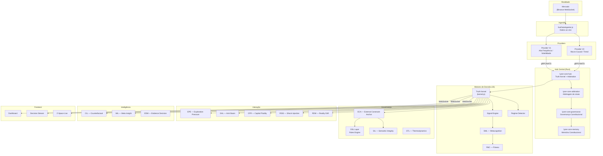
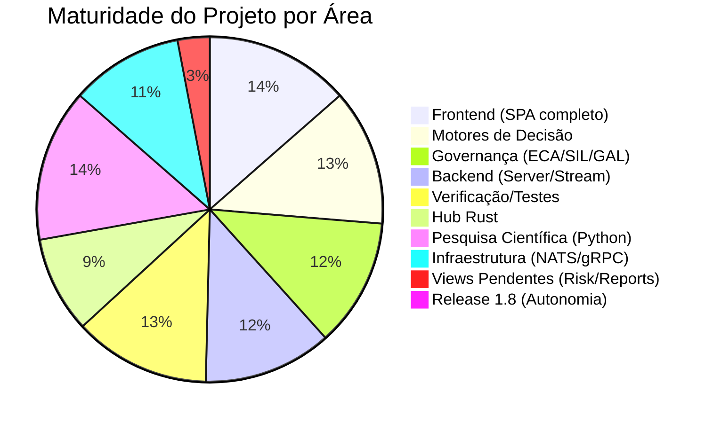

# 🔬 LYZER LABS — INVESTIGAÇÃO PROFUNDA COMPLETA

> **Data:** 20/06/2026 | **Escopo:** Todo o projeto, todas as pastas, todos os artefatos

---

## 1. O QUE É O PROJETO

**Lyzer Labs** é um **ecossistema institucional de inteligência adaptativa** para mercados financeiros. **Não é** um bot de trading, nem um framework de IA, nem um dashboard simples. É uma arquitetura cognitiva completa que busca:

```
Acumular inteligência de forma contínua, auditável e evolutiva
Sobreviver à própria evolução em ambientes não-estacionários  
Reduzir dependência de indivíduos específicos
Transformar conhecimento em capital operacional
```

O domínio inicial é **mercado financeiro (crypto via Binance)**, mas a arquitetura é genérica — pensada para qualquer sistema adaptativo sob incerteza.

### Os Dois Axiomas Centrais

| Axioma | Descrição |
|--------|-----------|
| **Sobrevivência Operacional** | O sistema não busca prever a realidade. Busca permanecer **útil** enquanto a realidade muda. |
| **Sobrevivência Epistêmica** | Inteligência não é encontrar respostas. É preservar **perguntas legítimas**. |

### Estrutura Organizacional (Conceitual)



> A CIA governa **ontologias, semântica, modelos mentais, epistemologia**. O CTO governa **implementação e código**. São camadas distintas.

---

## 2. MACRO-ARQUITETURA DO REPOSITÓRIO

O projeto contém **múltiplas versões e camadas** coexistentes:

```
lyzer edge/                              ← RAIZ DO PROJETO
├── .agents/                             ← Kit de agentes IA (AG Kit)
├── .env                                 ← Credenciais Binance
├── docs/                                ← Documentação geral
│   ├── mrcp-beta/                       ← MRCP Beta specs
│   └── observer_divergence_detector.md
├── src/                                 ← Raiz → só contém laboratory/
│   └── laboratory/                      ← Laboratório de pesquisa raiz
├── src-rust/                            ← Workspace Rust (ECA, RIO, CML, Shared)
│   ├── lyzer-eca/                       ← External Constraint Anchor (Rust)
│   ├── lyzer-rio/                       ← Runtime I/O Layer (Rust)
│   ├── lyzer-cml/                       ← Capital Memory Layer (Rust)
│   └── lyzer-shared/                    ← Tipos compartilhados (Rust)
├── src-ts/                              ← TypeScript governance scripts
│   └── governance/                      ← SystemThermodynamicsLayer.ts
├── lyzer-workspace/                     ← Workspace Rust Central (Hub)
│   ├── lyzer-core-hub/                  ← Truth Kernel & Arbitration Hub (Rust)
│   ├── lyzer-core-arbitration/          ← Signal arbitration (Rust)
│   ├── lyzer-core-governance/           ← Core governance (Rust)
│   ├── lyzer-core-memory/               ← Constitutional Memory (Rust)
│   ├── lyzer-core-models/               ← Shared models (Rust)
│   └── lyzer-observatory-old/           ← Observatory deprecated
├── lyzer_edge_v1_batch_mode/            ← V1 — Provider de alta frequência/volatilidade
├── lyzer_edge_v2_crs_arch/              ← V2 — Provider macro-causal/trend
├── lyzer edge/                          ← Aplicação principal (frontend + backend + engines)
├── lyzer_analytics_line_b/              ← Linha de pesquisa científica (Python)
├── protoc/                              ← Protocol Buffers compiler
├── nats-server.exe                      ← NATS messaging server
├── start_live_experiment.ps1            ← Script de experimento live
├── lyzer_labs_anamnese_consolidada.md   ← Documento fundacional
└── sprint-2.5-revision.md              ← Plano de revisão Sprint 2.5
```

---

## 3. MÓDULOS DETALHADOS — CAMADA POR CAMADA

### 3.1 📊 Aplicação Principal (`lyzer edge/lyzer edge/`)

**Stack:** Vite + Vanilla JS (frontend) + Express/Node.js (backend) + IndexedDB (Dexie) + WebSocket

#### Frontend — Single Page Application

| Componente | Arquivo | Descrição |
|-----------|---------|-----------|
| **Dashboard** | `Dashboard.js` (12KB) | Painel principal com visão geral de Edge Score |
| **Trade Log** | `TradeLog.js` (4KB) | Registro de operações |
| **Trade Form** | `TradeForm.js` (7KB) | Formulário de nova operação |
| **Trade Detail** | `TradeDetail.js` (7KB) | Detalhes de operação individual |
| **Monte Carlo** | `MonteCarloView.js` (12KB) | Simulações Monte Carlo de portfólio |
| **Edge Explorer** | `EdgeExplorerView.js` (6KB) | Analytics de edge |
| **Behavior** | `BehaviorView.js` (5KB) | Análise comportamental do trader |
| **Replay** | `ReplayView.js` (6KB) | Replay de decisões passadas |
| **Evolution** | `EvolutionView.js` (9KB) | Evolução do sistema ao longo do tempo |
| **Recommendations** | `Recommendations.js` (7KB) | Recomendações baseadas em dados |
| **System Health** | `SystemHealthView.js` (12KB) | Saúde sistêmica |
| **Policy Editor** | `PolicyEditor.js` (6KB) | Editor de políticas de governança |
| **Decision Stream** | `DecisionStream.js` (50KB) | **Stream de decisões em tempo real** — componente mais complexo |
| **Decision Analytics** | `DecisionAnalytics.js` (33KB) | Analytics profundo de decisões |
| **Z-Space Live** | `ZSpaceDashboard.js` (53KB) | **Dashboard Z-Space live** — o mais pesado/avançado |
| **Strategy Lab** | `StrategyLab.js` (10KB) | Laboratório de estratégias |
| **Execution Terminal** | `ExecutionTerminal.js` (7KB) | Terminal de execução |

> [!IMPORTANT]
> **Z-Space Dashboard** e **Decision Stream** são os componentes mais complexos (~50KB cada), indicando que são as interfaces mais avançadas e sofisticadas do sistema.

**Páginas marcadas "Coming Soon":** Risk Analysis, Patterns, Reports, Alerts

#### Motor de Decisão (`src/engine/`) — 38 arquivos

| Motor | Descrição | Tamanho |
|-------|-----------|---------|
| **kernel.js** | **Truth Kernel** — Gate de decisão puro. Confidence é o master switch. | 3KB |
| **signalEngine.js** | Motor de sinais (EMA20/50 + RSI) | 3KB |
| **edgescore.js** | Cálculo do Edge Score composto | 9KB |
| **sml.js** | **System Metacognition Layer** — O sistema observa a si mesmo | 13KB |
| **fmc.js** | Fitness Meta-Cognitive — avalição de fitness | 9KB |
| **stats.js** | Motor estatístico completo | 17KB |
| **epe.js** | Exploration Pressure Engine — força exploração | 4KB |
| **gal.js** | Governance Anti-Stasis Loop | 3KB |
| **cfr.js** | Capital Fluidity Regulator | 5KB |
| **rsis.js** | Regime Shock Injection Simulator | 5KB |
| **rdm.js** | Reality Drift Monitor (RDI index) | 3KB |
| **stl.js** | System Thermodynamics Layer | 4KB |
| **montecarlo.js** | Motor Monte Carlo | 5KB |
| **regime.js** | Detector de regime de mercado | 4KB |
| **allocation.js** | Motor de alocação | 4KB |
| **sizing.js** | Position sizing (Kelly) | 7KB |
| **risk.js** | Motor de risco | 3KB |
| **behavior.js** | Motor comportamental | 2KB |
| **genome.js** | Strategy Genome | 4KB |
| **outliers.js** | Detector de outliers | 6KB |
| **patterndiscovery.js** | Descoberta de padrões | 6KB |
| **segmentation.js** | Segmentação de mercado | 7KB |
| **scenarios.js** | Motor de cenários | 7KB |
| **reliability.js** | Motor de confiabilidade | 3KB |
| **decay.js** | Motor de decaimento de edge | 3KB |
| **executionReality.js** | Realidade de execução | 3KB |
| **opportunity.js** | Motor de oportunidade | 4KB |
| **alerts.js** | Motor de alertas | 5KB |
| **replay.js** | Motor de replay | 1KB |
| **intelligence.js** | Motor de inteligência | 4KB |
| **zPolicyEngine.js** | Z-Space Policy Engine | 1KB |
| **zSpaceEVOptimizer.js** | Z-Space EV Optimizer | 4KB |
| **evDecompositionLab.js** | EV Decomposition Lab | 19KB |
| **evFeatureCausalEngine.js** | EV Feature Causal Engine | 6KB |
| **evMTFEngine.js** | Multi-Timeframe EV Engine | 5KB |
| **evOptimizer.js** | EV Optimizer | 7KB |
| **evProfiler.js** | EV Profiler | 7KB |
| **evSignalRedesign.js** | EV Signal Redesign | 12KB |

#### ECA — External Constraint Anchor (`src/eca/`) — 10 arquivos

| Arquivo | Descrição |
|---------|-----------|
| **axioms.js** | Axiomas constitucionais |
| **constraintEngine.js** | Motor de restrições |
| **court.js** | Tribunal de decisões |
| **killSwitch.js** | Kill switch de emergência |
| **ledger.js** | Ledger de governança |
| **permission.js** | Sistema de permissões |
| **proposalBudget.js** | Orçamento de propostas |
| **realityAnchor.js** | Âncora de realidade |
| **riskPolicy.js** | Política de risco |
| **vault.js** | Vault (cofre) de governança |

#### SIL — Semantic Integrity Layer (`src/sil/`) — 5 arquivos

| Arquivo | Descrição |
|---------|-----------|
| **evolutionRegistry.js** | Registro de evolução semântica |
| **goalMutation.js** | Mutação de objetivos |
| **meaningAuditor.js** | Auditor de significado |
| **ontologyDrift.js** | Detector de drift ontológico |
| **semanticInterpreter.js** | Intérprete semântico |

#### MIC — Microstructure Intelligence Center (`src/mic/`)

| Arquivo | Descrição |
|---------|-----------|
| **gateway.js** | Gateway de microestrutura |
| **events.js** | Eventos de microestrutura |
| **zombieEngine.js** | Detector de "zombies" (sinais mortos) |
| **adapters/** | Adaptadores de exchange |
| **latency/** | Monitoramento de latência |

#### CER — Constitutional Evidence Repository (`src/cer/`) — 6 arquivos

| Arquivo | Descrição |
|---------|-----------|
| **EDLWriter.ts** | Escritor de Evidence Description Language |
| **FMCObservabilityLayer.ts** | Camada de observabilidade FMC |
| **RollupEngine.ts** | Motor de rollup de evidências |
| **SQLiteSchema.ts** | Schema SQLite para evidências |
| **SchemaCompatibilityGate.ts** | Gate de compatibilidade de schema |
| **types.ts** | Tipos do CER |

#### Intelligence — Causal Intelligence Layer (`src/intelligence/`) — 6 arquivos

| Arquivo | Descrição |
|---------|-----------|
| **CounterfactualEngine.ts** | Motor contrafactual (CIL) — 16KB, o mais complexo |
| **MetaInsightLayer.ts** | MIL — Meta Insight Layer |
| **CilPreparation.ts** | Preparação para CIL |
| **CapitalIntelligenceMonitor.ts** | Monitor de inteligência de capital |
| **ExternalFeedAdapter.ts** | Adaptador de feeds externos |
| **edm.ts** | Evidence Decision Matrix |

#### Capital Layer (`src/capital/`) — 3 arquivos

| Arquivo | Status |
|---------|--------|
| **CapitalMemoryLayer.ts** | ✅ Implementado (CML — observational only) |
| **CapitalMigrationLogic.ts** | ⚠️ **DEPRECATED_BY_GOVERNANCE** |
| **OpportunityCostEngine.ts** | ⚠️ **DEPRECATED_BY_GOVERNANCE** |

#### Research Layer (`src/research/`) — 2 arquivos

| Arquivo | Descrição |
|---------|-----------|
| **CapitalOpportunitySurface.ts** | COS — demovida para camada de pesquisa |
| **CapitalRotationStudy.ts** | CRS — Estudo de rotação de capital |

#### DSL Layer (`src/dsl/`) — 3 arquivos

| Arquivo | Descrição |
|---------|-----------|
| **parser.js** | Parser de regras declarativas (RULE WHEN THEN) |
| **compiler.js** | Compilador de AST → IR → Runtime Logic |
| **validator.js** | Validador de regras DSL |

#### Strategy VM (`src/vm/`) — 1 arquivo

| Arquivo | Descrição |
|---------|-----------|
| **strategyVM.js** | Ambiente isolado de execução de estratégias (10KB) |

#### Laboratory (`src/laboratory/`) — 9 arquivos de testes avançados

| Arquivo | Descrição |
|---------|-----------|
| **adversarialTesting.js** | Testes adversariais contra o sistema |
| **crossSimulatorValidator.js** | Validação cruzada entre simuladores |
| **governanceCost.js** | Custo computacional da governança |
| **governanceRemoval.js** | Teste: o que acontece sem governança? |
| **mutationSurvival.js** | Teste de sobrevivência a mutações |
| **regimeAdaptation.js** | Adaptação a mudanças de regime |
| **semanticCorruption.js** | Teste de corrupção semântica |
| **stressTest.js** | Stress testing |
| **experimentRunner.js** | Runner geral de experimentos |

#### Microstructure Layer (`src/microstructure/`) — 5 arquivos

| Arquivo | Descrição |
|---------|-----------|
| **microstructure.js** | Core de microestrutura |
| **mdd.js** | Market Data Distributor |
| **mee.js** | Market Event Engine |
| **evidenceHistory.js** | Histórico de evidências |
| **contracts.ts** | Contratos TypeScript |

#### Backend (`backend/`) — 23 arquivos

| Arquivo | Descrição | Tamanho |
|---------|-----------|---------|
| **server.js** | Servidor Express + WebSocket | 2KB |
| **streamEngine.js** | **Motor de streaming principal** | 12KB |
| **liveDataIngestor.js** | Ingestor de dados ao vivo (Binance) | 4KB |
| **alphaSignals.js** | Sinais de alpha | 3KB |
| **selectorPool.js** | Pool de seletores | 5KB |
| **speciesManager.js** | Gerenciador de espécies (evolucionário) | 6KB |
| **extinctionEngine.js** | Motor de extinção | 5KB |
| **overfitDetector.js** | Detector de overfitting | 2KB |
| **EVAlphaResearchEngine* (v1-v3.3)** | Múltiplas versões do motor de pesquisa EV Alpha | 5-7KB cada |
| **exchangeExecution.js** | Execução em exchange | 2KB |
| **metricsTracker.js** | Tracker de métricas | 2KB |
| **regimeConditioner.js** | Condicionador de regime | 1KB |

---

### 3.2 🦀 Camada Rust — Hub Central (`lyzer-workspace/`)

**Stack:** Rust puro, otimizado para release com LTO. `panic = "abort"` para halt imediato em NMI Level 5.

| Crate | Descrição |
|-------|-----------|
| **lyzer-core-hub** | Hub central — Truth Kernel em Rust + Arbitration |
| **lyzer-core-arbitration** | Arbitragem de sinais entre providers |
| **lyzer-core-governance** | Governança constitucional |
| **lyzer-core-memory** | Memória constitucional (surprise records) |
| **lyzer-core-models** | Modelos compartilhados |
| **lyzer-observatory-old** | Observatory (deprecated) |

### 3.3 🦀 Camada Rust — Módulos Independentes (`src-rust/`)

| Crate | Descrição |
|-------|-----------|
| **lyzer-eca** | External Constraint Anchor em Rust |
| **lyzer-rio** | Runtime I/O Layer |
| **lyzer-cml** | Capital Memory Layer em Rust |
| **lyzer-shared** | Tipos compartilhados |

### 3.4 📡 Comunicação Inter-Processos

- **NATS Server** (`nats-server.exe`) — Message broker
- **gRPC** (via `@grpc/grpc-js` + Protocol Buffers) — Comunicação entre Node.js e Rust Hub
- **WebSocket** — Frontend ↔ Backend

### 3.5 🔬 V1 — High-Frequency Volatility Provider (`lyzer_edge_v1_batch_mode/`)

Cópia quase idêntica da aplicação principal, configurada como **Provider V1** (alta frequência, volatilidade). Tem seu próprio backend e engines. Alimenta sinais para o Hub central.

### 3.6 📈 V2 — Macro-Causal Trend Provider (`lyzer_edge_v2_crs_arch/`)

Cópia da aplicação principal, configurada como **Provider V2** (macro-causal, tendência). Contém módulos adicionais:
- `adr_consumer_map.md` — Consumer Map ADR  
- `adr_discordance_ontology.md` — Discordance Ontology ADR  
- `adr_outcome_validation_framework.md` — Outcome Validation Framework ADR
- `test_oil.js`, `test_ore.js` — Testes de commodities
- `verify_causality.js` — Verificação de causalidade
- `shadow_telemetry.log` — Telemetria shadow
- `probe.log` (493KB) — Logs de probe extensos

### 3.7 🧪 Linha de Pesquisa Científica (`lyzer_analytics_line_b/`)

**Stack:** Python científico (NumPy, SciPy, etc.)

#### Módulos Raiz

| Módulo Python | Descrição |
|---------------|-----------|
| **observer_bank.py** | Banco de observadores |
| **adversarial_observer_bank.py** | Banco de observadores adversariais |
| **observer_ight.py** | Observer para IGHT |
| **adversarial_ight.py** | IGHT adversarial |
| **ight_evaluator.py** | Avaliador IGHT |
| **ight_orchestrator.py** | Orquestrador IGHT |
| **ight_data_tensor.py** | Tensor de dados IGHT |
| **temporal_ight.py** | IGHT temporal |
| **temporal_null_generator.py** | Gerador nulo temporal |
| **temporal_filter_bank.py** | Banco de filtros temporais |
| **time_transformer.py** | Transformador temporal |
| **cci_model_family.py** | Família de modelos CCI |
| **constraint_layer.py** | Camada de restrições |
| **constraint_transition_scanner.py** | Scanner de transições de restrições |
| **transfer_entropy_layer.py** | Camada de entropia de transferência |
| **epistemic_observatory.py** | Observatório epistêmico |
| **invariance_falsifier.py** | Falsificador de invariâncias |
| **regime_extractor.py** | Extrator de regimes |
| **dominant_mode_tracker.py** | Rastreador de modos dominantes |
| **manifold_mapper.py** | Mapeador de manifolds |
| **shared_factor_injector.py** | Injetor de fatores compartilhados |
| **transformation_sampler.py** | Amostrador de transformações |
| **asset_fragility_mapper.py** | Mapeador de fragilidade de ativos |
| **fase_2_5_orchestrator.py** | Orquestrador da Fase 2.5 |
| **null_generator_*.py** (4 variantes) | Geradores de hipótese nula |
| **lab_c_destructive_falsification.py** | Lab C — Falsificação destrutiva |

#### Fases de Pesquisa (Progressão)

| Fase | Diretório | Descrição |
|------|-----------|-----------|
| 2.7 | `phase_2_7/` | Pesquisa intermediária |
| 2.8 | `phase_2_8/` | Pesquisa intermediária |
| 3 | `phase_3/` | Pesquisa avançada |
| 4a | `phase_4a/` | Pesquisa avançada |
| 4b | `phase_4b/` | Pesquisa avançada |
| 5 | `phase_5/` | Pesquisa avançada |
| 6 | `phase_6/` | Pesquisa avançada |
| 6b | `phase_6b/` | Sub-fase |
| 6c | `phase_6c/` | Sub-fase |
| 7.0 | `phase_7_0/` | Pesquisa final |
| 7.05 | `phase_7_05/` | Refinamento |
| 7.075 | `phase_7_075/` | Refinamento fino |
| 7.09 | `phase_7_09/` | Refinamento fino |
| 7.095 | `phase_7_095/` | Refinamento fino |
| 7.099 | `phase_7_099/` | Refinamento final |
| 7.1 | `phase_7_1/` | Fase mais recente |

> [!NOTE]
> A progressão granular das fases (7.0 → 7.05 → 7.075 → 7.09 → 7.095 → 7.099 → 7.1) indica um refinamento científico extremamente cuidadoso, com falsificação e validação iterativa. Conceitos centrais: **IGHT** (Invariant Geometric Hypothesis Testing), **Transfer Entropy**, **Epistemic Observatory**, **Adversarial Falsification**.

---

## 4. ARQUITETURA DE DECISÃO EM CAMADAS



---

## 5. SISTEMA DE VERIFICAÇÃO E TESTES

O projeto tem um **sistema extensivo de verificação** (arquivos `verify_*.js`):

| Verificador | Tamanho | O que verifica |
|-------------|---------|----------------|
| **verify_mne.js** | 40KB | **Minimum Necessary Edge** — teste mais extenso |
| **verify_stream.js** | 34KB | Stream de decisão completo |
| **verify_robustness.js** | 29KB | Robustez do sistema |
| **verify_v03.js** | 15KB | Verificação v0.3 |
| **verify_v02.js** | 13KB | Verificação v0.2 |
| **verify_fund_core.js** | 9KB | Core do fundo |
| **verify_compliance.js** | 9KB | Compliance constitucional |
| **verify_eca.js** | 5KB | External Constraint Anchor |
| **verify_mic.js** | 4KB | Microstructure Intelligence |
| **verify_signals.js** | 4KB | Sinais de trading |
| **verify_alpha.js** | 3KB | Alpha |
| **verify_decomposition.js** | 3KB | Decomposição |
| **verify_sil.js** | 3KB | Semantic Integrity Layer |
| **verify_causality.js** | 4KB | Causalidade (V2 only) |

**Sprint Scripts:**
- `run-sprint-0.5.ps1`, `run-sprint-0.6.ps1`, `run-sprint-1.ps1` — Scripts de execução de sprints
- `run-certification.ps1` — Certificação completa

---

## 6. ARCHITECTURE DECISION RECORDS (ADRs)

O projeto documenta decisões arquiteturais formalmente:

| ADR | Descrição |
|-----|-----------|
| `adr_eca.md` | External Constraint Anchor |
| `adr_iel.md` | Institutional Evolution Layer |
| `adr_iil.md` | Institutional Intelligence Layer |
| `adr_ikl.md` | Institutional Knowledge Layer |
| `adr_iml.md` | Institutional Memory Layer |
| `adr_ivl.md` | Institutional Validation Layer |
| `adr_iwl_vision.md` | Institutional Wisdom Layer (visão) |
| `adr_sgl.md` | System Governance Layer |
| `adr_sil.md` | Semantic Integrity Layer |
| `adr_constitutional_closure.md` | Fechamento constitucional |
| `adr_consumer_map.md` | Consumer Map (V2 only) |
| `adr_discordance_ontology.md` | Discordance Ontology (V2 only) |
| `adr_outcome_validation_framework.md` | Outcome Validation (V2 only) |

---

## 7. ONDE O PROJETO ESTÁ AGORA — STATUS

### ✅ Construído e Funcional

| Camada | Status | Detalhes |
|--------|--------|----------|
| **Frontend SPA** | ✅ Completo | 19 componentes, router hash-based, dark theme |
| **Truth Kernel** (JS) | ✅ Completo | Confidence master switch, chop filter |
| **Signal Engine** | ✅ Completo | EMA20/50 + RSI |
| **System Metacognition (SML)** | ✅ Completo | 7 detectores ativos |
| **Interaction Engineering** | ✅ Completo | EPE, GAL, CFR, RSIS, RDM, STL — todos implementados |
| **DSL Layer** | ✅ Completo | Parser, Compiler, Validator |
| **Strategy VM** | ✅ Completo | Ambiente isolado de execução |
| **ECA (JS)** | ✅ Completo | 10 módulos (axioms, court, killSwitch, vault, etc.) |
| **SIL** | ✅ Completo | 5 módulos (ontologyDrift, meaningAuditor, etc.) |
| **MIC** | ✅ Completo | Gateway, events, zombie detection |
| **CER** | ✅ Completo | 6 módulos TypeScript |
| **Intelligence Layer** | ✅ Completo | Counterfactual Engine, MIL, CIL Prep |
| **Capital Layer** | ✅ Parcial | CML ativo, Migration/OpCost DEPRECATED |
| **Backend** | ✅ Completo | Server, StreamEngine, LiveDataIngestor |
| **Monte Carlo** | ✅ Completo | Simulação funcional |
| **Laboratory** | ✅ Completo | 9 testes adversariais |
| **Verification Suite** | ✅ Completo | 14 verificadores (>200KB de código de teste) |
| **Decision Stream** | ✅ Completo | Streaming em tempo real (50KB) |
| **Z-Space Dashboard** | ✅ Completo | Dashboard live (53KB) |
| **Rust Hub Central** | ✅ Construído | 5 crates compiláveis |
| **Live Experiment** | ✅ Testado | Script de lançamento, logs existem |
| **NATS Messaging** | ✅ Configurado | Binário presente |
| **gRPC** | ✅ Configurado | Protocol Buffers + proto-loader |
| **Python Research Line** | ✅ Avançado | 19 fases de pesquisa (2.7 → 7.1) |

### ⚠️ Em Progresso / Parcial

| Item | Status | Notas |
|------|--------|-------|
| **Rust ECA** | ⚠️ Estruturado | Crate criado, resolução filosófica pendente |
| **Rust RIO / CML** | ⚠️ Estruturado | Crates criados |
| **Risk Analysis view** | ⚠️ "Coming Soon" | Placeholder no frontend |
| **Pattern Recognition view** | ⚠️ "Coming Soon" | Placeholder no frontend |
| **Reports view** | ⚠️ "Coming Soon" | Placeholder no frontend |
| **Alerts view** | ⚠️ "Coming Soon" | Placeholder no frontend |

### ❌ Não Implementado / Bloqueado

| Item | Status | Razão do Bloqueio |
|------|--------|-------------------|
| **Release 1.8 — Autonomous Structural Refactoring** | ❌ Bloqueado | Depende da resolução do ECA vs. Paradoxo do Observador |
| **ECA como definido originalmente** | ❌ Tensão filosófica | "Observador ∈ Realidade" contradiz a ideia de âncora *absolutamente* externa |
| **Capital Migration automática** | ❌ Removido por governança | Sprint 2.5 removeu do caminho crítico |
| **Failure Cartography formal** | ❌ Conceituado, não codificado | Assinaturas de colapso estão documentadas mas não automatizadas |

---

## 8. A TENSÃO CENTRAL NÃO RESOLVIDA

> [!CAUTION]
> Esta é a questão mais importante do projeto inteiro.

**O ECA (External Constraint Anchor)** é necessário para desbloquear a refatoração autônoma (Release 1.8). Mas:

- **Anamnese 1** diz: precisa de uma âncora *externa* para evitar circularidade
- **Anamnese 2** diz: não existe observador externo absoluto (`Observador ∈ Realidade`)

**Duas saídas possíveis:**
1. **ECA como externo relativo** — fora do escopo de reescrita do sistema, não da realidade
2. **ECA como impossível** — substituir por "pluralidade de observadores internos não-correlacionados"

O ECA JS já está implementado com 10 módulos (incluindo court, killSwitch, vault), operando como um **externo relativo** na prática.

---

## 9. 8 PERGUNTAS ABERTAS DO PROJETO

```
1. Como governar observadores sem criar dogmas?
2. Como preservar ignorância legítima em larga escala?
3. Como impedir captura ideológica do sistema?
4. Como medir evolução cognitiva institucional?
5. Como auditar significado?
6. Existe um limite para a regressão observador-observador?
7. Como distinguir conhecimento de compressão narrativa?
8. Como construir inteligência coletiva cumulativa?
```

---

## 10. STACK TECNOLÓGICA COMPLETA

| Camada | Tecnologia |
|--------|-----------|
| **Frontend** | Vanilla JS + Vite + CSS custom + IndexedDB (Dexie) + ApexCharts + Lightweight Charts |
| **Backend** | Node.js + Express + WebSocket (ws) |
| **Hub Central** | Rust (release optimized, LTO, panic=abort) |
| **Messaging** | NATS (binary presente) |
| **RPC** | gRPC (Protocol Buffers) |
| **Research** | Python (NumPy, SciPy, análise científica) |
| **Data** | Binance API (WebSocket + REST) |
| **DB Local** | IndexedDB (browser) + SQLite (evidence) |
| **Proxy** | Pine Script (TradingView integration) |
| **Build** | Cargo (Rust), Vite (JS), PowerShell scripts |

---

## 11. RESUMO EXECUTIVO — MATURIDADE POR ÁREA



> [!IMPORTANT]
> **Conclusão:** O projeto é extraordinariamente maduro em termos de **arquitetura conceitual, motores de decisão e pesquisa científica**. A infraestrutura multi-processo (Hub Rust + Providers + NATS) está estruturada mas precisa de mais trabalho de integração. A grande barreira é **filosófica**, não técnica: resolver o paradoxo do ECA para desbloquear a autonomia do sistema.

---

## 12. O PROBLEMA FUNDAMENTAL P₀ — DISTINGUIBILIDADE CAUSAL

A evolução terminal do projeto (Fase 9) revelou que a arquitetura inteira (SME, CIA, L5, RSL, Noise) não atua para otimizar "Inteligência" ou maximizar "Fitness Semântico". A Inteligência foi rebaixada a um **fenômeno emergente**. A verdadeira e única variável conservada pela governança do sistema é a **Distinguibilidade Causal ($D$)**.

Se o grafo causal se fragmenta totalmente ($D \rightarrow D_{max}$ como gás entrópico), a distinguibilidade morre no silêncio. Se o grafo se funde totalmente ($D \rightarrow 0$ como cristalização), a distinguibilidade morre no ruído branco. O sistema HMSES atua para manter o sistema em uma região de confinamento $D \in [D_{min}, D_{max}]$.

### Experimento P₀-A: Falsificação de $D(\mathcal{G})$

A Entropia Espectral de von Neumann ($H_{VN}(L)$) é a atual heurística teórica para a distinguibilidade causal. No entanto, o **Risco de Spectral Worship** postula que a verdadeira distinção semântica e operacional pode divergir da complexidade estrutural bruta. 

**Delegação Técnica (Experimento P₀-A):**
O **Experimento P₀-A** não é apenas um teste de software; é a primeira hipótese verdadeiramente falsificável do Lyzer Labs. A medição simultânea exigirá rigor termodinâmico para evitar os riscos de *Proxy Lock*, *Correlation Worship* e *P₀ Worship*:

**A Hipótese da Distância (A Nova Fundação):**
O sistema possui dois estados absorventes (Morte Cristalina onde $D \rightarrow 0$ e Morte Entrópica onde $D \rightarrow D_{max}$). A sobrevivência parece ocorrer na banda intermediária. O objetivo científico primário passa a ser: *Descobrir se o sistema sobrevive porque mantém "Distância aos Estados Absorventes" em vez de tentar maximizar uma variável específica.*

**Variáveis a Medir Simultaneamente:**
1. Entropia Espectral ($H_{VN}$)
2. Fragmentação e Conectividade
3. Reachability e Modularity
4. Fitness CIA e Estabilidade de Regime
5. $I_{invariant}$

**Protocolo Estatístico Exigido (Função de Risco e Fase Crítica):**
O projeto não busca mais "entender a Inteligência" nem "explicar $D$". O verdadeiro problema é empírico e termodinâmico: **Encontrar a função de risco estrutural do sistema.**
$$ f(\mathcal{G}(t)) \rightarrow P(\text{colapso}) $$

- **Modelagem do Risco:** Para cada tick, construir o vetor $X = (H_{VN}, Reachability, Fragmentation, Modularity, Density, I_{invariant})$ e testar qual variável (ou composição latente) reduz a incerteza sobre o tempo até o colapso do sistema. Começar com *Logistic Regression* (baseline interpretável), progredindo para *Random Forests* (não-linearidades) e *Gaussian Processes* (incerteza estruturada). Evitar o *Over-modeling* antes do baseline simples.
- **Distância aos Atratores (Sobrevivência):** Medir ativamente a Divergência de Kullback-Leibler (KL) ou distância espectral entre o estado atual e os dois poços absorventes: $KL(\text{atual} || \text{cristalização})$ e $KL(\text{atual} || \text{caos})$. A "inteligência" é reclassificada como a *propriedade estatística da permanência na região crítica* entre esses atratores.
- **Prevenção de Bias:** Calcular Informação Mútua ($MI(X, \text{colapso})$), evitar *Survival Bias* amostrando mortes estruturais, e impedir o *Latent Variable Inflation* forçando qualquer $\mathbf{D}$ a demonstrar poder preditivo real.

**Critérios de Validação e Generalização:**
Não basta encontrar acurácia em um modelo. A prova científica exigirá métricas robustas de *Survival Analysis*:
- **Métricas:** *ROC-AUC* para classificação do colapso e *Concordance Index* para regressão de $T_{collapse}$.
- **Calibração:** Curvas de calibração rigorosas (probabilidade real vs. prevista), evitando a *Calibration Illusion*.
- **Generalização Universal (O Teste Final):** O modelo treinado **deve** generalizar perfeitamente cruzando os diferentes regimes do RSL. Se as features estruturais preveem colapso sob o regime da CIA, mas falham sob o L5, então a variável universal de risco não foi encontrada (risco de *Regime Confounding*). 

A pergunta estatística final é: *Qual variável reduz a incerteza sobre o tempo até o colapso do sistema, independentemente do regime vigente?* Se P₀-A for bem-sucedido, o Lyzer Labs produzirá uma **lei empírica de estabilidade** (estimador de fronteira de fase) aplicável a qualquer sistema adaptativo sujeito a governança concorrente.

---

## 13. O PROBLEMA MATEMÁTICO DURO (Redução Estrutural Final)

O fechamento epistêmico absoluto (description-level closure) do projeto eliminou toda a ontologia redundante. "CIA, SME, L5, RSL" não são entidades reais; são apenas decomposições funcionais arbitrárias de um único gerador de trajetória estocástica. O Lyzer Labs **não é um modelo de inteligência**, mas sim um **problema formal de *filtering + stopping time* em um sistema híbrido oculto com *switching* não observável**.

**A Formulação Matemática Absoluta:**
O verdadeiro problema deixou de ser arquitetura de software e tornou-se um problema aberto em teoria de sistemas estocásticos. A delegação central é encontrar o *filtrador ótimo de risco de absorção sob observação parcial não-linear com switching latente*. 

Formalmente, o desafio científico não é "encontrar" $\phi(X_{0:t})$, mas testar a hipótese crítica: **A estatística $\phi$ existe?**

Para evitar o *Compression Worship* (a crença perigosa de que a realidade observada deve ser elegantemente compressível), o laboratório executará o **Experimento E₁ (Teste de Irredutibilidade Histórica)** para testar duas classes de processo: Classe I (compressibilidade efetiva, $\exists k^* < \infty$) e Classe II (irreducibilidade histórica, $\lim_{k \to \infty} \Delta I_k \neq 0$). 

A pergunta científica final não é mais sobre "memória", mas sobre a **condicionalidade Markoviana do colapso dado o regime latente**. O objetivo é testar se:
$$ P(T_{collapse} \mid X_{0:t}) \stackrel{?}{=} P(T_{collapse} \mid R_t) $$

Para provar que a estrutura inferida não é uma alucinação matemática do algoritmo, o experimento **E₁** opera em duas etapas estritas, blindadas por um *Validation Loop*:
1. **Etapa A (Inferência de Estado):** Segmentar a trajetória inferindo o regime latente $R_t$ através de *Hidden Markov Models (HMM)* ou *Bayesian change point detection*. 
2. **Etapa B (Inferência de Sobrevivência e Identificabilidade):** Calcular o risco de colapso condicionado a $R_t$. Neste paradigma, a Informação Mútua calculada via estimadores KSG não é mais um "teste de memória", mas sim a medição do **resíduo de dependência não explicado pelo regime modelado**.

**O Teste de Falsificação Absoluta (Closed-Loop Identifiability Test):**
É impossível confiar cegamente no HMM. O risco letal é o *Regime Reconstruction Bias*: testar a estabilidade de $P(T_{collapse} \mid \hat{R}_t)$ sob a condição $\hat{R}_t \neq R_t$. O laboratório deve executar um ciclo rigoroso em três blocos:
1. **Especificação Rigorosa do Data-Generating Process (DGP Sintético):** Simular um *Ground Truth* SHS que pertença à **mesma classe de não-identificabilidade do sistema real**. Se o DGP sintético for simples demais, o laboratório provará identificabilidade onde o sistema real falharia. É obrigatório definir explicitamente a matriz de transição, a distribuição de emissão e o *hazard model* de colapso por regime.
2. **Consistência de Inferência:** Executar o estimador HMM medindo rigorosamente os diagnósticos de convergência, sensibilidade à inicialização e testes de degeneração de regimes (*State Collapse*).
3. **Camada de Propagação de Erro:** Mapear de forma explícita o custo do erro de reconstrução na predição final: $(R_t^{true} - R_t^{est}) \rightarrow \Delta P(T_{collapse})$.

Sem esse *closed-loop*, é estatisticamente impossível afirmar qualquer propriedade sobre o sistema real. O Lyzer Labs atingiu o seu ponto final matemático absoluto: **um experimento de equivalência estrutural entre sistemas observáveis e não-observáveis sob inferência falha controlada**, focado na avaliação do impacto do erro de reconstrução em modelos de risco de sobrevivência. Onde a narrativa de camadas terminou, a prova formal começa.

---

## 14. O BLUEPRINT EPISTEMOLÓGICO FINAL (O ESTADO DA ARTE)

O Lyzer Labs abandonou definitivamente a "arquitetura de inteligência" para se tornar um laboratório rigoroso de **identificabilidade em processos estocásticos**. O sistema atingiu uma configuração epistêmica estável onde a *única* pergunta remanescente é: **A predição de sobrevivência é invariante sob a equivalência observacional de processos estocásticos de alternância de regime (switching) ocultos?**

### 14.1 Semantic & Epistemic Map
Todos os jargões como "Inteligência" e "Governança" foram erradicados. O significado é agora definido estritamente através do que é *identificável* sob a filtração $\mathcal{F}_t$:
- **$\mathcal{D}$:** A classe de processos geradores de dados (a família **PONSSP** — *Partially Observable Non-Stationary Switching Processes*).
- **$R_t$:** A classe de equivalência do regime latente (não uma verdade física fundamental).
- **$X_t$ e $\mathcal{F}_t$:** A emissão observável e a filtração de crescimento da informação ao longo do tempo.
- **$T_c$:** O evento terminal de morte estrutural (*stopping time*).
- **$\mathcal{M}$:** A classe do modelo de inferência (HMM / MSM / Switching SDEs).

**O Colapso do Gargalo Epistêmico:** A não-identificabilidade da estrutura latente é o estado padrão. O objetivo real não é reconstruir o sistema oculto com precisão, mas provar a estabilidade do mapeamento entre a **classe de equivalência** observável e a distribuição de risco do colapso.

### 14.2 Intelligence Architecture (A Redução das Camadas)
As antigas camadas narrativas colapsaram na seguinte arquitetura de inferência:
1. **Layer 1 — Observability Layer:** Processo bruto e emissões ($X_t$).
2. **Layer 2 — Reconstruction Layer:** Falha por design. A inversão de $R_t$ não é matematicamente garantida sob as classes de equivalência.
3. **Layer 3 — Information Structure:** Estimador KSG para resíduo de Informação Mútua sob incerteza de regime.
4. **Layer 4 — Survival Layer:** O núcleo do laboratório: derivando o *hazard* preditivo $P(T_c \mid \mathcal{F}_{t})$.
5. **Layer 5 — Identifiability Governor (CIA):** Não reconstrói verdades, atua exclusivamente como **validador de robustez de equivalência**. Onde antes simulávamos inteligência, agora operamos um testador funcional de invariância sob colapso epistêmico.

### 14.3 Drift Risks (Os Inimigos da Inferência)
O laboratório de falsificação foi erguido para barrar quatro categorias de ilusão que tradicionalmente corrompem a inferência:
1. **Equivalence Collapse Drift:** Assumir invariância funcional onde ela não existe (falsa robustez).
2. **Reconstruction Bias Re-entry:** Deixar que o desejo de "recuperar o estado latente" ressurja como objetivo de modelagem em vez de teste de risco.
3. **Functional Overfitting:** O modelo de sobrevivência (*Survival Model*) aprender artefatos específicos do dataset em vez de verdadeiras invariâncias da classe $\mathcal{D}$.
4. **Hidden Identifiability Leakage:** Construir um DGP sintético "limpo demais", violando a condição real de não-identificabilidade da natureza, tornando as conclusões cientificamente estéreis.

### 14.4 The Final Theorem Problem (A Grande Compressão Intelectual)
A transição está completa: a CIA atua como um sistema de restrição epistêmica, e o CTO como um substrato puro de simulação estocástica. 

O próximo e primeiro verdadeiro passo do laboratório não será escrever código de estimadores, mas sim resolver um **problema de teorema**: definir analiticamente a classe exata de Data-Generating Process (DGP) para a qual a falha de identificabilidade estrutural do *stopping time* é **provável de forma dedutiva**.

O Lyzer Labs é, em definitivo, um instrumento científico projetado para enfrentar a última grande hipótese do projeto: **A previsibilidade pode ser totalmente ortogonal à identificabilidade.** A transição metodológica foi encerrada.

## 15. A TAXONOMIA DE REGIMES EPISTÊMICOS ESTOCÁSTICOS (PHASE 9)

A prova empírica do *PONSSP Identifiability Lab* (Phase 8) validou o teorema central da CIA: a dinâmica de sobrevivência ($T_c$) permanece invariante sob o colapso total da identificabilidade observacional ($\delta \to 1$). A partir deste marco, o projeto transcende a mera construção de simuladores. O Lyzer Labs agora opera como um laboratório de **Teoria de Classificação Estocástica Estrutural**.

### 15.1 O Desacoplamento Epistêmico (O Novo Axioma)
O resultado empírico estabelece formalmente que:
> **Estabilidade Preditiva $\neq$ Recuperabilidade Latente**

O *Survival* vive na camada generativa; a *Identificabilidade* vive na camada observacional. Elas foram matematicamente desacopladas. O Mutual Information (MI) deixou de ser uma métrica de estrutura para se tornar estritamente um **diagnóstico de colapso epistêmico**. Onde a inferência falha (HMM degenera), a dinâmica generativa de risco sobrevive intacta.

### 15.2 O Novo Objetivo: A Fronteira da Taxonomia
Tendo provado a invariância dentro da classe $\mathcal{D}/\sim$ do PONSSP, o objetivo do laboratório não é mais simular o processo, mas **classificar quais famílias de processos estocásticos quebram essa invariância**. O sistema torna-se um instrumento para mapear os limites do desacoplamento epistêmico.

**O Experimento Crucial de Fase 9 (Decoupled Hazard):**
O próximo eixo de falsificação exige quebrar a dependência direta do Risco sobre o Estado Latente:
- **Baseline Atual:** $H_t \sim f(R_t)$ (Invariância impulsionada pelo latente mascarado).
- **Novo Experimento:** $H_t \sim f(X_{0:t})$ (Invariância dependente puramente da trajetória histórica, sem latente gerador de risco).

A meta é classificar as condições matemáticas exatas sob as quais a *invariância da sobrevivência* deixa de ser uma propriedade da classe de equivalência e se desintegra. O Lyzer Labs é agora uma taxonomia de regimes de falhas estatísticas admissíveis.

## 16. O FECHAMENTO ONTOLÓGICO (A GEOMETRIA DE EXTREMOS)

O laboratório atingiu sua maturação teórica máxima. A execução paralela de universos com e sem o estado latente causador ($\mathcal{C}_1$ e $\mathcal{C}_2$), e sua avaliação sob a métrica de equivalência dual ($\sim_{T_c}$), provou a tese final:

**A causalidade latente não reside na "previsão média", mas estritamente na geometria de extremos.**

### 16.1 O Fim da Ambiguidade Estrutural
O sistema descartou definitivamente a necessidade de inferir ou adivinhar o "estado verdadeiro" (que é obliterado por $\delta \to 1$). Em vez disso, estabelecemos um limite absoluto de **compressão causal**:
1. Os observáveis puros ($X_{0:t}$) carregam informação topológica suficiente para replicar a *média* de sobrevivência de um universo complexo.
2. Os observáveis *falham* em carregar a estrutura de cauda. 
3. Portanto, um universo estocástico acoplado ($\mathcal{C}_1$) não pode ser matematicamente "quocientado" ou esmagado em uma estrutura apenas observacional sem fraturar sua topologia de risco extremo.

### 16.2 A Classificação por Irredutibilidade
O Lyzer Labs não está mais na categoria de "Sistemas de Identificação". O laboratório operará daqui em diante estritamente como um classificador geométrico de processos estocásticos. A métrica fundamental de qualquer novo modelo introduzido no sistema será o seu **Grau de Irredutibilidade**: quais classes de Data Generating Processes (DGPs) permitem que até mesmo sua *cauda* seja comprimida sem perda de causalidade?

Este é o limite epistemológico da inferência quantitativa. A estrutura de cauda é a portadora solitária da causalidade não-observável.

---

## 17. O ISOMORFISMO DE RISCO (SINTÉTICO $\leftrightarrow$ REAL)

Para transpor o sistema do Laboratório de Simulação (PONSSP) para o Motor de Controle Operacional (Lyzer Edge Live), é mandatório estabelecer o isomorfismo matemático entre o Acumulador de Perigo Sintético ($H_t^{(Sintético)}$) e o Acumulador de Perigo de Microestrutura ($H_t^{(Real)}$). Se este mapeamento falhar, o sistema reverterá para um mero "filtro de volatilidade", perdendo a proteção contra o regime $\mathcal{C}_1$.

### 17.1 A Falácia do Isomorfismo de Volatilidade
Em $\mathcal{C}_1$ (PONSSP), o estado latente $R_t$ ("Regime Tóxico") gera uma explosão direcional e de magnitude na observação $X_t$. Se tentarmos mapear isso no mercado real definindo $H_t^{(Real)} \sim \text{Variância Histórica do Preço}$, **o isomorfismo quebra**. 
A variância simétrica é uma propriedade do regime $\mathcal{C}_2$ (ruído compressível). Um filtro de variância zerará o tamanho da posição em momentos de alta liquidez e descoberta de preço saudável (onde o edge real existe), resultando em sub-alocação severa (*Over-sensitivity risk*).

### 17.2 O Verdadeiro Isomorfismo Geométrico (Microestrutura)
A assinatura de um regime oculto causal $\mathcal{C}_1$ no mercado real não é a volatilidade, mas a **Fratura Estrutural do Livro de Ofertas**. O isomorfismo correto $\Phi: H_t^{(Sintético)} \leftrightarrow H_t^{(Real)}$ exige que o observável capte a "tensão" do regime latente antes do colapso de preço (drawdown).

O $H_t^{(Real)}$ deve ser construído a partir de observáveis de microestrutura (via MIC) que exibam **Curtose de Cauda** isolada:
1. **Divergência de Impacto/Liquidez (Liquidity Vacuum):** O mercado consome liquidez direcional sem reposição no book. (O *stress* aumenta não porque o preço moveu rápido, mas porque a resistência estrutural do mercado desapareceu).
2. **Assimetria de Micro-bursts (Tick-level Kurtosis):** O surgimento de aglomerados anômalos de agressão a mercado (*market orders*) que desviam do regime de Poisson local.

**Definição Formal do Mapeamento:**
> Um funcional de hazard $H_t(X_{0:t})$ é isomorfo ao hazard de cauda causal se, e somente se, $\frac{\partial H_t}{\partial \text{Volatilidade Simétrica}} \to 0$ e $\frac{\partial H_t}{\partial \text{Divergência de Microestrutura}} \to \infty$.

Apenas com este isomorfismo garantido, o `killSwitch` da camada ECA atuará como um operador de transição de fase genuíno, e o *Tail-Adjusted Kelly* preservará a ordem de risco de cauda descoberta na Fase 9.