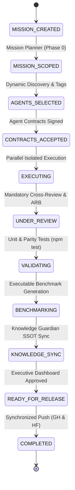

# ORCHESTRATOR STATE MACHINE & DECISION GRAPH

- **Domain**: Orchestration State Machine Engine & Decision Traceability
- **Scope**: Lifecycle management of multi-agent engineering missions.

---

## 1. STATE MACHINE LIFECYCLE MODEL

Every mission transitions through explicit, deterministic states:

---

## 2. DECISION GRAPH (REASONING TRACEABILITY)

Every architectural decision maps its complete reasoning path:

$$\text{Problem} \longrightarrow \text{Hypotheses} \longrightarrow \text{Experiments} \longrightarrow \text{Results} \longrightarrow \text{Decision} \longrightarrow \text{Implementation} \longrightarrow \text{Benchmark} \longrightarrow \text{Release}$$
