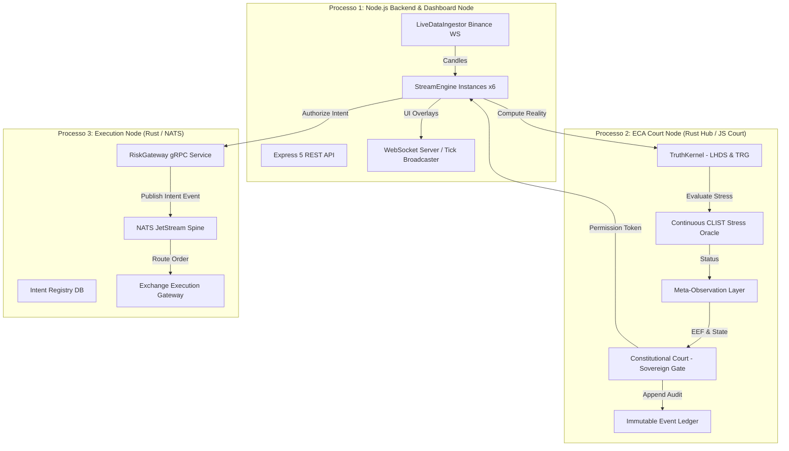

# Modelo Arquitetural — Lyzer Guardian

## 1. Topologia em 3 Processos Isolados

## 2. Pipeline Quantitativo de 7 Camadas

Toda proposta de execução deve obrigatoriamente transitar pelas 7 camadas em ordem estrita:

1. **Providers (V1/V2/V3)**: Geração de propostas de sinal (SMC, SnD, Momentum).
2. **ResidualizationLayer**: Destruição de consenso entre provedores para evitar viés de manada.
3. **ExecutionTriggerLayer**: Requisito de Tail Risk Geometry ($\text{TRG}$) $\ge \text{TRG\_THRESHOLD}$ ($0.4$).
4. **TruthKernel**: Veto se divergência de realidade dupla ($\text{LHDS}$) $> \text{LHDS\_VETO\_LIMIT}$ ($0.8$) ou colapso ontológico.
5. **C-CLIST**: Oráculo de estresse. Bloqueia se o acúmulo de iludibilidade atingir `lethalIllusionLimit` ($0.9$).
6. **MOL (Meta-Observation Layer)**: Requisito de $N$ ticks de estabilidade ($\text{SCL}$) para permitir saída de `RECOVERY`.
7. **Constitutional Court**: Gate soberano de emissão do `PermissionToken`.
