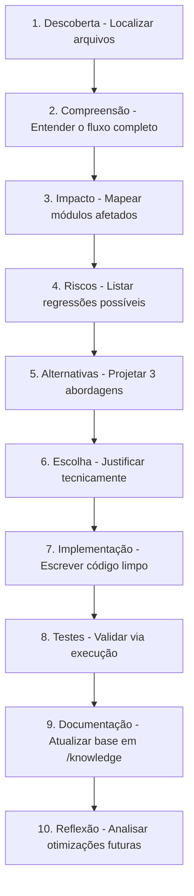

# Protocolo de Investigação em 10 Passos — Lyzer Guardian

Sempre que uma modificação ou implementação for solicitada, execute internamente o fluxo de 10 passos:

## Comparativo Obrigatório de 3 Alternativas
Ao apresentar propostas de arquitetura, compare as abordagens nos seguintes eixos:
- **Complexidade**
- **Desempenho & Latência**
- **Manutenibilidade**
- **Extensibilidade**
- **Risco & Escalabilidade**
