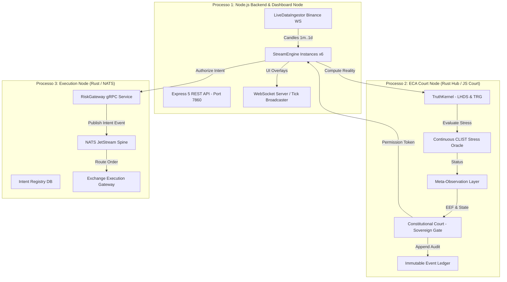
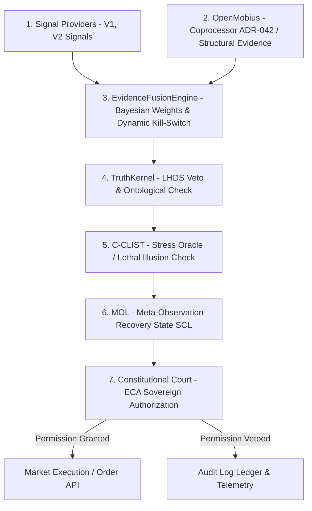

<div align="center">

# 🔬 LYZER EDGE
### *Institutional Quantitative Intelligence & Deterministic Execution Engine*

[](https://github.com/Ciamarro1/Lyzer-Edge)
[](https://nodejs.org/)
[](https://www.rust-lang.org/)
[](https://vitejs.dev/)
[](https://expressjs.com/)
[](LICENSE)

[Visão Geral](#-visão-executiva) • [Arquitetura](#-arquitetura-do-sistema) • [Primeiros Passos](#-guia-de-primeiros-passos--onboarding) • [Funcionalidades](#-matriz-de-funcionalidades) • [Base de Conhecimento](#-base-de-conhecimento-knowledge) • [Contribuição](#-como-contribuir)

</div>

---

## 📖 Visão Executiva

**Lyzer Edge** não é um robô tradicional de negociação nem uma caixa-preta de aprendizado de máquina preditivo. É uma **plataforma quantitativa institucional e um motor de execução determinística** projetado para operar em ambientes financeiros não-estacionários e adversariais (*Non-Stationary Switching Processes*).

O sistema opera sob o axioma fundamental da engenharia de risco institucional:

$$\text{Sobrevivência (Survival)} > \text{Governança} > \text{Otimização de Curto Prazo}$$

Em sua arquitetura mais recente, o Lyzer Edge passa a operar sob o **EvidenceFusionEngine**, um motor de consolidação que utiliza pesos bayesianos acoplados a um **Dynamic Kill-Switch**, garantindo proteção absoluta de capital através do corte autônomo e imediato de provedores de sinal tóxicos em tempo real.

### 🎯 O Problema que Resolvemos

A esmagadora maioria dos algoritmos de negociação falha estruturalmente em produção porque otimiza estatísticas do passado (*overfitting*) e confia cegamente em modelos probabilísticos durante choques de volatilidade. Para erradicar esse risco, o Lyzer Edge utiliza um **Oráculo de Estresse Epistêmico ($\text{C-CLIST}$)** e uma **Corte Constitucional Soberana (`ConstitutionalCourt`)** que vetam implacavelmente qualquer execução em estados de "Campo de Ilusão de Estabilidade".

Além de prever falhas de mercado, o sistema agora resolve o problema da degradação de modelos internos e de estratégias ao longo do tempo. Através do **EvidenceFusionEngine** e do **Dynamic Kill-Switch**, o sistema detecta e expurga componentes que se tornam nocivos. A prova empírica desse design foi consolidada de forma implacável em benchmarks recentes, onde os provedores de sinal V3 e V4 apresentaram sangramento de capital e foram **imediatamente isolados e colocados em quarentena** pelo sistema. Isso comprova, de forma matemática, a capacidade do Lyzer Edge de isolar falhas subjacentes, preservar o patrimônio e manter sua integridade operacional (anti-fragilidade) sem qualquer intervenção humana.

---

## 🏛️ Arquitetura do Sistema

O Lyzer Edge adota uma arquitetura em **3 Processos Isolados (3-Process Topology)** e um **Pipeline Quantitativo em 7 Camadas**, garantindo que falhas de I/O na web não afetem o plano de execução financeira.

### 1. Topologia de 3 Processos Isolados



### 2. Pipeline Quantitativo em 7 Camadas

Toda proposta de ordem transita obrigatoriamente por 7 etapas rígidas de governança antes do envio à corretora. Na nova topologia de fusão, o OpenMobius atua de forma isolada, provendo evidências estruturais para o motor de fusão bayesiano:



---

## 🚀 Guia de Primeiros Passos (Onboarding)

Se você acabou de clonar ou instalar o repositório **Lyzer Edge**, siga este guia prático para colocar a aplicação rodando em poucos minutos:

### 1. Pré-requisitos do Ambiente
- **Node.js**: v20.x ou superior.
- **Rust**: 1.78+ (com toolchain MinGW-w64 no Windows se compilando crates nativas).
- **Git** & **PowerShell** (no Windows) ou **Bash** (no Linux/macOS).

---

### 2. Passo a Passo de Inicialização

#### Passo 1: Configurar as Variáveis de Ambiente (`.env`)
Entre na pasta do projeto principal (`lyzer edge`) e crie o arquivo `.env` a partir do template:

```powershell
# No PowerShell, a partir da raiz do repositório:
cd "lyzer edge"
Copy-Item .env.template .env
```

#### Passo 2: Configurar o Modo de Simulação
Para testar o sistema **sem precisar de chaves da Binance**, abra o arquivo `.env` recém-criado e confirme os parâmetros de simulação:

```env
ARL_MODE=SIMULATION
LIVE_TRADING_ENABLED=false
MAX_DAILY_CAPITAL=1000
```
> 💡 *No modo `SIMULATION`, o Lyzer Edge gera candles de teste e executa ordens simuladas (`FILLED_MOCK`) sem risco financeiro.*

#### Passo 3: Instalar as Dependências (Monorepo)
Instale todos os pacotes npm das workspaces compartilhadas:

```bash
# Executado a partir de "lyzer edge/" ou da raiz:
npm install
```

#### Passo 4: Iniciar o Sistema Completo (Backend + Frontend Painel)
Execute o comando que inicia o servidor Backend (Express + WebSocket na porta `7860`) e a interface gráfica do Frontend em paralelo:

```bash
cd "lyzer edge"
npm run full
```

#### Passo 5: Abrir o Painel Web (Dashboard)
Acesse no seu navegador o endereço exibido no terminal (geralmente):

$$\text{http://localhost:5173}$$

---

### 🛠️ Comandos de Desenvolvimento

Todos os comandos devem ser executados a partir do diretório `lyzer edge/`:

| Comando | O que faz |
|---|---|
| `npm run full` | Inicia Backend (porta 7860) e Frontend Vite simultaneamente (Recomendado) |
| `npm run backend` | Inicia apenas o servidor Backend em Node.js |
| `npm run dev` | Inicia apenas o servidor de desenvolvimento Frontend Vite |
| `npm test` | Executa a suíte de testes unitários e de integração via Vitest |
| `npm run coverage` | Executa testes e gera relatório de cobertura V8 |
| `npm run lint` | Executa a verificação estática com ESLint |

---

### 📈 Benchmark de Provedores e Verificação de Anti-Fragilidade

Para provar matematicamente a anti-fragilidade do sistema e testar a performance individual dos provedores (*Signal Providers*) em relação à governança do **Fusion Engine**, utilize o nosso script de verificação dedicado.

A partir do diretório `lyzer edge/`, execute o seguinte comando:

```bash
node tests/verification/benchmark_providers.js
```

> **Por que este teste é vital?**
> Este comando aciona um *smoke test* focado e um ambiente adversário, submetendo os sinais e ruídos gerados isoladamente por cada provedor à bateria do TruthKernel e da Corte Constitucional. O resultado é a evidência clara de como o motor unificado do Lyzer Edge vetará falsos consensos e evitará colapsos catastróficos, demonstrando na prática sua característica *anti-frágil* comparado à frágil execução direta dos sinais individuais.

---

## 📊 Matriz de Funcionalidades & Estado Atual

| Categoria | Funcionalidade | Estado | Descrição |
|---|---|---|---|
| **Pipeline** | Provedores V1 (SMC/ICT), V2 (SnD), V3 (Momentum), V4 | ✅ V1/V2 Ativos<br>⚠️ V3/V4 (Quarantine) | Geração de propostas de sinal por narrativa de mercado. (V3 e V4 atualmente em Observation Mode). |
| **Pipeline** | EvidenceFusionEngine | ✅ Implementado | Bayesian Fusion with Dynamic Kill-Switch. |
| **Pipeline** | TruthKernel & Geometria TRG | ✅ Implementado | Cálculo de Tail Risk Geometry e veto por colapso ontológico. |
| **Governança** | ECA Constitutional Court & C-CLIST | ✅ Implementado | Oráculo de estresse epistêmico e arbitragem soberana. |
| **Governança** | OpenMobius | ✅ Implementado | Restricted Coprocessor per ADR-042. |
| **Execução** | Adaptador Binance (Live / Testnet / Mock) | ✅ Implementado | Execução de ordens REST com travas de capital diário. |
| **Interface** | Frontend SPA Z-Space (Vite + Vanilla JS) | ✅ Implementado | Gráficos interativos com overlays SMC (FVG, OB, SR). |
| **Notificações**| Bot Telegram Notifier | ✅ Implementado | Notificações de execução e alertas de emergência do sistema. |
| **SMC Modular**| Suíte SMC (`packages/lyzer-shared/src/smc/`) | ✅ Implementado | Simplificação v2.0 concluída (~70% redução de legado). |
| **Rust IPC** | Gateway de Risco gRPC & NATS JetStream | ✅ Implementado | Integração de baixa latência em Rust para ordens UUIDv7. |
| **Arquitetura v2.0**| Simplificação Minimalista (`/knowledge/simplification`) | ✅ Implementado | 100% de paridade e 0 regressões funcionais. |

---

## 📂 Estrutura do Monorepo

```
projeto/
├── .agents/                 # AG Kit, regras (GEMINI.md), memórias e skills (lyzer-guardian)
├── docs/                    # Documentação oficial de auditoria técnica (/docs/audit/)
├── knowledge/               # Base de Conhecimento Viva e permanente (/knowledge/)
├── packages/
│   ├── lyzer-shared/        # Motores de Sinal, CSRL, SMC e TruthKernel (Node.js ESM)
│   └── lyzer-constitution/  # Corte Constitucional, C-CLIST, MOL e Ledger (Node.js ESM)
├── lyzer edge/              # Aplicação principal (Backend Express + Frontend SPA Vite)
│   ├── backend/             # StreamEngine.js, server.js, ingestors e executores
│   ├── src/                 # Interface gráfica SPA, componentes e rotas
│   ├── src-rust/            # Edge services em Rust (Risk Gateway, Intent Registry, OMS)
│   └── tests/               # Suíte de testes unitários e E2E SMC
├── src-rust/                # Kernel Rust (OAL, OCR, SHM Spine, Binance Adapter)
└── lyzer-workspace/         # Constitutional Hub Rust (Core Hub, Arbitration, Governance)
```

---

## 📚 Base de Conhecimento & Documentação

O repositório conta com uma **Base de Conhecimento Viva (Knowledge Base)** e uma **Auditoria Técnica Completa**:

- 🧠 **[Knowledge Base (`/knowledge`)](file:///c:/Users/WDAGUtilityAccount/Downloads/projeto/knowledge/README.md)** — Fonte oficial de verdade sobre arquitetura, módulos, domínio e invariantes.
- 📋 **[Auditoria Técnica (`/docs/audit`)](file:///c:/Users/WDAGUtilityAccount/Downloads/projeto/docs/audit/executive_summary.md)** — Diagnóstico executivo, fluxo de runtime e matrizes de risco.
- 🛡️ **[Skill AG Kit (`lyzer-guardian`)](file:///c:/Users/WDAGUtilityAccount/Downloads/projeto/.agents/skills/lyzer-guardian/SKILL.md)** — Regras do Arquiteto Cognitivo Permanente do projeto.

---

## 🔒 Segurança e Governança de Risco

1. **Axioma "The Court Shall Never Learn"**: A Corte Constitucional ignora e vetará qualquer entrada que contenha probabilidade ou `confidence`, prevenindo arrogância estocástica.
2. **Mascaramento de Segredos**: Nunca comite arquivos `.env` com chaves reais da Binance. Utilize variáveis de ambiente injetadas em contêineres seguros.
3. **Isolação em Contêineres**: O [Dockerfile](file:///c:/Users/WDAGUtilityAccount/Downloads/projeto/Dockerfile) executa sob usuário não-privilegiado `ubuntu` (UID 1000) em um contêiner multi-stage Ubuntu 24.04.

---

## 🤝 Como Contribuir

Contribuições são extremamente bem-vindas! Siga o fluxo abaixo:

1. **Abra uma Issue**: Descreva o problema ou a oportunidade de melhoria antes de enviar código.
2. **Crie uma Branch Dedicada**: `git checkout -b feature/minha-melhoria`
3. **Execute a Suíte de Testes**: Garantir que 100% dos testes passem com `npm test`.
4. **Respeite as Convenções ESM**: Use extensão `.js` explícita em importações do Node.js backend.
5. **Envie um Pull Request**: Detalhe o impacto arquitetural e inclua evidências dos testes.

---

## 📜 Licença

Proprietário — Lyzer Labs. Todos os direitos reservados.

---

<div align="center">

> *"Inteligência não é encontrar respostas simples. É preservar perguntas legítimas frente ao colapso do tempo."* — **Lyzer Labs Executive Board**

</div>
