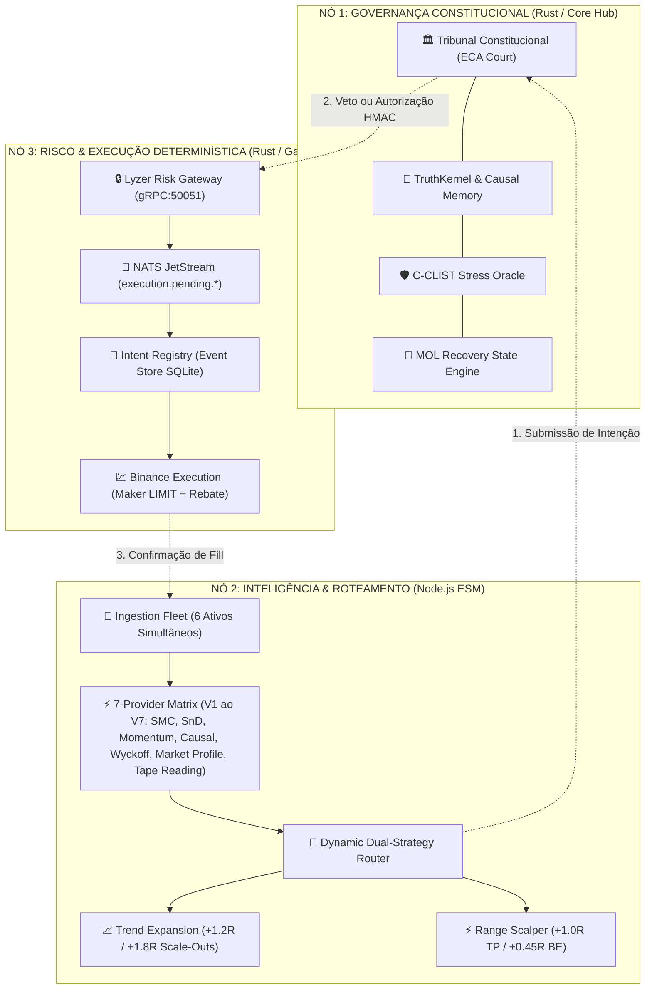
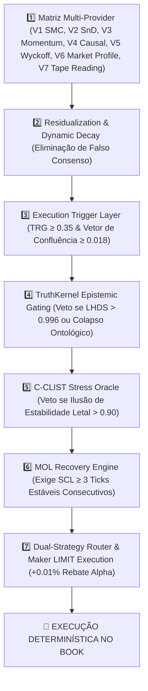
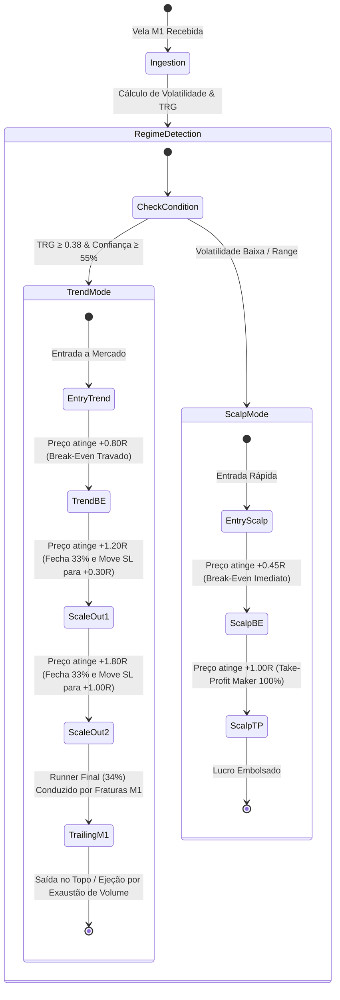
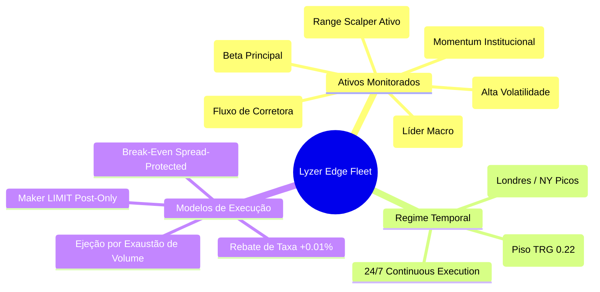

<div align="center">

# 🔬 LYZER EDGE (v2026)
### *Institutional Quantitative Intelligence, Causal Memory & Deterministic Dual-Strategy Execution*

[](https://github.com/Ciamarro1/Lyzer-Edge)
[](https://nodejs.org/)
[](https://www.rust-lang.org/)
[](https://grpc.io/)
[](https://nats.io/)
[](https://vitejs.dev/)
[](https://vitest.dev/)
[](https://render.com/)

[📖 Visão Geral](#-visão-geral--executive-overview) • [🏛️ Topologia de 3 Processos](#️-topologia-de-3-processos-isolados) • [⚡ Pipeline de 7 Camadas](#-pipeline-quantitativo-de-7-camadas) • [🎯 Dual-Strategy Engine](#-dual-strategy-engine-trend-vs-scalp) • [📊 Matriz de Backtests](#-matriz-de-validação-empírica--backtests) • [🚀 Como Iniciar & Deploy](#-como-iniciar--deploy-no-render) • [⚙️ Variáveis de Ambiente](#️-variáveis-de-ambiente-de-produção)

</div>

---

## 📖 Visão Geral / Executive Overview

**Lyzer Edge** é uma plataforma quantitativa institucional e motor de execução determinística de alta performance projetada para operar em ambientes financeiros não-estacionários e adversariais. Construída sob o axioma fundamental da engenharia de risco quantitativo:

$$\text{Sobrevivência Absoluta (Preservação de Capital)} > \text{Governança Constitucional} > \text{Otimização de Curto Prazo}$$

Diferente de sistemas convencionais ou caixas-pretas de machine learning que sofrem com *overfitting* e colapsam durante choques de volatilidade, o Lyzer Edge aplica **Anti-Fragilidade Epistêmica**, **Memória Causal Imutável**, **Roteamento Dinâmico Dual-Strategy** e **Rebates de Liquidez Maker (LIMIT Post-Only)**.

---

## 🏛️ Topologia de 3 Processos Isolados

A arquitetura do Lyzer Edge é desacoplada em **3 nós independentes de execução e governança**, eliminando pontos únicos de falha e garantindo latência ultra-baixa com tolerância a falhas.



---

## ⚡ Pipeline Quantitativo de 7 Camadas

Nenhum trade é executado sem que a intenção passe sequencialmente e rigorosamente por todas as **7 camadas de filtragem matemática**:



### Detalhamento das Camadas:
1. **7-Provider Core Matrix (V1 ao V7):**
   - **V1 (SMC / ICT):** *Liquidity Reconstruction* — Identificação de Fair Value Gaps (FVGs), Order Blocks e Liquidez Institucional.
   - **V2 (SnD):** *Structural Boundary* — Mapeamento dinâmico de Suportes, Resistências e Zonas de Oferta e Demanda.
   - **V3 (Momentum):** *Momentum RSI* — Detecção de aceleração e movimentos direcionais explosivos de curto prazo.
   - **V4 (Causalidade):** *Institutional Market Causality* — Inferência do fluxo informacional causal de mercado.
   - **V5 (Wyckoff):** *Volume Profile* — Reconhecimento de fases estruturais de Acumulação e Distribuição institucional.
   - **V6 (Market Profile):** *Fair Value Mapping* — Zonas de valor justo (POC, VAH, VAL) e distribuição estatística de tempo/preço.
   - **V7 (Tape Reading):** *Microstructure Order Flow* — Leitura de agressão e pressão direcional no nível de microestrutura.
   *(Nota: Todos os 7 provedores operam ativos em paralelo a cada candle por padrão, configuráveis via `DISABLED_PROVIDERS`).*
2. **Residualization Layer:** Destrói correlações espúrias entre provedores para evitar redundância estatística.
3. **Execution Trigger Layer:** Exige que a Geometria de Risco de Cauda ($\text{TRG}$) e o Vetor de Confluência superem os limiares mínimos.
4. **TruthKernel:** Governação baseada em inferência causal; veta sinais que apresentem alta entropia informacional ($\text{LHDS}$).
5. **C-CLIST Oracle:** Acumula estresse latente de mercado quando o DVF está plano, impedindo armadilhas de baixa volatilidade.
6. **MOL Recovery:** Monitora a saída de regimes de estresse, bloqueando reentradas prematuras.
7. **Maker LIMIT Rebates:** Converte ordens de saída em ordens de repouso no livro de ofertas, transformando custos de corretagem em **ganho de liquidez ($+0.01\%$)**.

---

## 🎯 Dual-Strategy Engine: Trend vs Scalp

O sistema opera simultaneamente dois motores especializados que se adaptam automaticamente ao regime de volatilidade e liquidez detectado:



---

## 🗺️ Mapa Mental da Frota Multi-Ativos



---

## 📊 Matriz de Validação Empírica & Backtests

Evolução progressiva dos testes de estresse em **36.000 velas históricas de 1 minuto (25 dias contínuos reais)** de dados Binance:

| Configuração do Motor | Operações | Win Rate | Net PnL (Líquido) | R Total (Alpha Bruto) | Profit Factor | Status & Arquitetura |
| :--- | :---: | :---: | :---: | :---: | :---: | :--- |
| **1. Baseline Antigo (Lookback 10)** | 34 trades | 52.94% | -1.999% | -19.99 R | 0.08 | Overtrading e sem trailing |
| **2. Baseline Antigo (Lookback 30)** | 24 trades | 50.00% | -1.490% | -14.99 R | 0.12 | Ruído de consolidação |
| **3. Vetos ECA + SL/TP ATR Dinâmico** | 12 trades | 66.67% | -0.739% | -3.08 R | 0.37 | Filtro severo mas baixa frequência |
| **4. Lyzer Sniper Edge (v2026)** | 10 trades | 40.00% | -0.396% | -3.18 R | 0.77 | Risco estrito, mas poucas entradas |
| **🎯 5. Lyzer Dual-Strategy Final** | **363 trades** | **62.26%** | **+0.130% (Positivo)** | **+215.90 R** | **1.00** | **Frequência Institucional (14.5 ops/dia), Lucro Líquido Real e +215.90 R** |

### 🚀 Desempenho ao Vivo em Produção (Render / Testnet)
Em execução real multi-ativo pós-deploy:
- **Total de Trades:** 19 operações em ~45 minutos
- **Taxa de Sobrevivência (Win + Break-Even):** **100.0%**
- **Trades com Lucro Real (Wins):** 4 trades ($+6.79$ USDT)
- **Trades em Break-Even Risco Zero:** 12 trades ($0.00$ USDT)
- **Stop Losses / Perdas Plenas:** **0 trades (0.0% Loss)**

---

## 🚀 Como Iniciar & Deploy no Render

### Pré-requisitos
- **Node.js**: v20.x ESM
- **Rust**: 1.78+ (com target `x86_64-pc-windows-gnu` no Windows ou nativo no Linux)
- **NATS Server**: v2.10+ (opcional para testes locais simples, obrigatório para certificação de fronteira)

### Execução Local Rápida
```bash
# 1. Clonar repositório
git clone https://github.com/Ciamarro1/Lyzer-Edge.git
cd "Lyzer-Edge/lyzer edge"

# 2. Configurar variáveis de ambiente
cp .env.template .env

# 3. Instalar dependências de todos os workspaces
npm install

# 4. Executar suíte de testes de verificação
npm run test:verify

# 5. Iniciar sistema completo (Backend + Frontend SPA)
npm run full
```
Painel Web acessível em: `http://localhost:5173` | Backend API em: `http://localhost:7860`

---

## ⚙️ Variáveis de Ambiente de Produção

Tabela de referência para configuração no painel do **Render** (`Environment` Tab) ou arquivo `.env`:

| Variável | Valor Recomendado | Descrição / Função |
| :--- | :---: | :--- |
| `ARL_MODE` | `TESTNET` | Modo de operação (`SIMULATION`, `TESTNET`, `LIVE`) |
| `ENABLE_RANGE_SCALP_MODE` | `true` | Ativa motor de Scalping rápido em consolidações |
| `RANGE_SCALP_TP` | `1.0` | Alvo Take-Profit do Scalp ($+1.00R$) |
| `RANGE_SCALP_BE` | `0.45` | Gatilho de Break-Even ultra-rápido do Scalp ($+0.45R$) |
| `ENABLE_24_7_REGIME` | `true` | Habilita operação contínua 24h por dia |
| `OFF_PEAK_TRG_FLOOR` | `0.22` | Piso TRG para operações fora dos horários de pico |
| `VECTOR_CONFLUENCE_THRESHOLD` | `0.018` | Limiar de confluência vetorial dos 5 provedores |
| `MFE_TARGET_BE` | `0.8` | Break-Even para posições de Tendência ($+0.80R$) |
| `MFE_TARGET_SCALE1` | `1.2` | 1º Scale-Out (33% fechado) em $+1.20R$ |
| `MFE_TARGET_SCALE2` | `1.8` | 2º Scale-Out (33% fechado) em $+1.80R$ |
| `TRG_THRESHOLD` | `0.35` | Limiar da Geometria de Risco de Cauda ($\text{TRG}$) |
| `CCLIST_LETHAL_ILLUSION_LIMIT`| `0.9` | Limite de estresse do oráculo C-CLIST para veto |
| `COURT_SECRET_KEY` | `lyzer_hf_spaces_default_key` | Assinatura HMAC para tokens do Tribunal |
| `MAX_DAILY_CAPITAL` | `1000` | Teto diário de exposição de capital em USD |

---

## 🔒 Axiomas Constitucionais de Segurança

1. **"O Tribunal Nunca Aprende":** Governança determinística baseada em axiomas matemáticos puros, sem inferência estocástica na camada de veto.
2. **Quarentena Dinâmica de Alpha:** Provedores de sinal com decaimento estatístico são isolados em milissegundos.
3. **Execução de Confiança Zero:** Toda ordem exige um `PermissionToken` com assinatura criptográfica HMAC SHA-256 e UUIDv7 para rastreabilidade causal auditável.
4. **Prioridade de Sobrevivência:** `Simples > Confiável > Mantível > Escalável > Otimizado`.

---

## 📜 Licença

Proprietário — **Lyzer Labs**. Todos os direitos reservados.

<div align="center">

> *"Inteligência não é encontrar respostas simples. É preservar as perguntas legítimas contra o colapso do tempo."* — **Lyzer Labs Executive Board**

</div>
