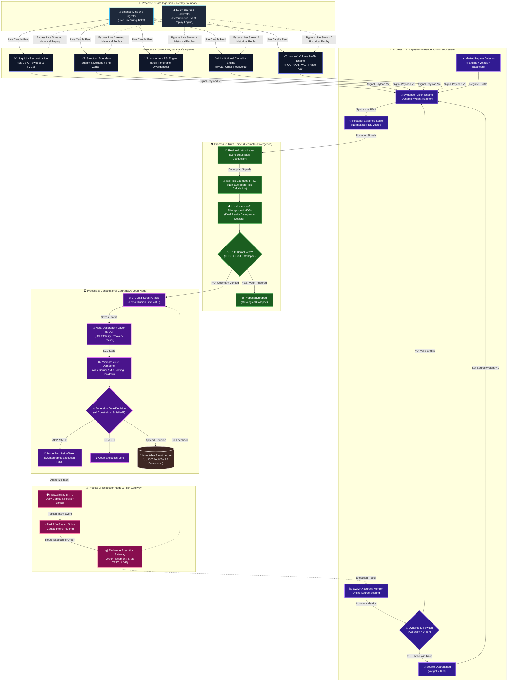

# 🏛️ V5 Quantitative Pipeline & System Architecture

> **Lyzer Edge Architectural Specification**  
> **Status**: APPROVED & PROMOTED TO PRODUCTION  
> **Classification**: Core Architectural Reference (V5.0)

---

## 1. Executive Summary

The **Lyzer Edge V5 Architecture** represents a institutional-grade, multi-engine quantitative intelligence pipeline built around **3-Process Isolation**, **Bayesian Evidence Fusion**, **Geometric Divergence Filtering**, and **Constitutional Governance**.

### Key Architecture Highlights
- **5-Engine Quantitative Pipeline**: Parallel feature extraction engines ($V1 \dots V5$) spanning SMC/ICT, SnD/SnR, Momentum RSI, Institutional Market Causality (IMCE), and Wyckoff Volume Profiling.
- **Dual Data Ingestion Path**: Real-time WebSocket streaming alongside an **Event Sourced Backtester** (Replay Engine) that bypasses live streams for deterministic historical simulation.
- **Evidence Fusion Engine with Dynamic Kill-Switch**: Bayesian Model Averaging (BMA) + EWMA online accuracy learning. Automatically quarantines toxic engines ($Accuracy < 0.45$) via an instantaneous weight zeroing kill-switch.
- **Truth Kernel (Geometric Divergence)**: Non-Euclidean Tail Risk Geometry ($\text{TRG}$) assessment, consensus residualization, and Local Hausdorff Divergence Score ($\text{LHDS}$) vetoing for reality-gap protection.
- **Constitutional Court**: Sovereign execution gate enforcing C-CLIST stress limits, Meta-Observation Layer ($\text{MOL}$) stability recovery, Microstructure Dampening, and UUIDv7 immutable event logging.

---

## 2. High-Level Architecture Diagram

The following Mermaid diagram maps the complete data flow, governance gates, isolated process boundaries, and feedback loops from raw market data ingestion down to exchange order execution.



---

## 3. Subsystem Breakdown & Technical Details

### 3.1 Dual Data Ingestion & Event Sourced Replay
The architecture cleanly separates live operation from backtesting simulations while guaranteeing that the exact same quantitative pipeline is executed in both modes:
1. **Live Stream Ingestor (`LiveDataIngestor`)**: Connects to exchange WebSockets (e.g. Binance Kline WS) and broadcasts live market ticks.
2. **Event Sourced Backtester (`ReplayEngine`)**: Reads historical event logs or candle feeds and replays events deterministically. It **bypasses the live WebSocket ingestor**, injecting events directly into the 5-Engine quantitative pipeline to allow zero-drift historical validation and simulation.

---

### 3.2 The 5-Engine Quantitative Pipeline (V1 to V5)
Each provider operates independently, analyzing candle windows across multiple timeframes ($1m, 5m, 15m, 1h, 4h, 1d$):

| Engine | Name | Primary Mechanics | Key Outputs |
| :--- | :--- | :--- | :--- |
| **V1** | **Liquidity Reconstruction** | SMC / ICT Liquidity Pools, Fair Value Gaps (FVG), BPR, Liquidity Sweeps | `liquiditySweep`, `fvgGapSize`, `poolDepth` |
| **V2** | **Structural Boundary** | Supply & Demand (SnD), Support & Resistance (SnR), Zone Retests | `boundaryStrength`, `zoneType`, `distanceToBoundary` |
| **V3** | **Momentum RSI Engine** | Multi-timeframe RSI, Bullish/Bearish Divergences, Oversold/Overbought | `rsiValue`, `divergenceType`, `momentumSlope` |
| **V4** | **Institutional Market Causality (IMCE)** | Order Flow Imbalance, Cumulative Delta Volume, Microstructure Causality | `orderFlowDelta`, `imbalanceRatio`, `causalStrength` |
| **V5** | **Wyckoff Volume Profile** | Wyckoff Accumulation/Distribution Phases, POC, VAH, VAL, Volume Clusters | `wyckoffPhase`, `pocDistance`, `volumeNodeConfluence` |

---

### 3.3 Bayesian Evidence Fusion Engine & Dynamic Kill-Switch
Located prior to Truth Kernel evaluation, the `EvidenceFusionEngine` fuses signals using **Bayesian Model Averaging (BMA)** and updates provider weights using **Exponentially Weighted Moving Average (EWMA)** accuracy tracking:

#### 1. Regime-Aware Weight Adaptation
Weights dynamically adapt based on detected market regime:
- **Ranging / Consolidation**: Prioritizes SMC Structure ($V1/V4$) and Liquidity ($0.40 / 0.30$).
- **High Volatility / Breakout**: Prioritizes Volatility and Macro Regime ($0.35 / 0.30$).
- **Balanced**: Uniform Bayesian weighting across all active engines.

#### 2. Dynamic Kill-Switch Protocol
The EWMA accuracy score ($Acc_t$) for each engine is updated after trade outcomes:
$$\text{Acc}_t = (1 - \alpha) \cdot \text{Acc}_{t-1} + \alpha \cdot \text{Score}_{\text{trade}}$$
If an engine's rolling performance falls below **$0.45$**, the **Dynamic Kill-Switch** triggers:
$$\text{Acc}_t < 0.45 \implies w_i = 0 \quad (\text{Quarantined})$$
This isolates degrading or toxic strategies immediately without restarting system processes.

---

### 3.4 Truth Kernel (Geometric Divergence)
The `TruthKernel` serves as the objective reality monitor. Proposals must pass three strict mathematical filters:

1. **Residualization Layer**: Destroys pairwise correlation and consensus bias between providers to prevent herd mentality artifacts:
   $$\text{Consensus}(V_i, V_j) > \text{consensusLimit} \implies \text{Residualize Signals}$$
2. **Tail Risk Geometry ($\text{TRG}$)**: Computes non-Euclidean tail risk geometry. Requires:
   $$\text{TRG} \ge \text{TRG\_THRESHOLD} \quad (\text{default: } 0.15 \dots 0.40)$$
3. **Local Hausdorff Divergence Score ($\text{LHDS}$)**: Quantifies reality gap divergence between projected state space and empirical market state space:
   $$\text{LHDS} > \text{LHDS\_VETO\_LIMIT} \ (0.8) \implies \text{VETO (Ontological Collapse)}$$

---

### 3.5 Constitutional Court, Dampeners & Ledger
The `ConstitutionalCourt` acts as the sovereign final gate:

- **C-CLIST (Continuous Stress Oracle)**: Monitors cumulative market stress and DVF flatlines. Halts execution if stress hits `lethalIllusionLimit` ($0.9$).
- **Meta-Observation Layer ($\text{MOL}$)**: Governs state transitions (`NORMAL`, `RECOVERY`, `HALTED`). Requires $N$ consecutive stable ticks ($\text{SCL}$) before exiting recovery mode.
- **Microstructure Dampener**: Applies physical market constraints:
  - Minimum holding period (e.g., $5$ candles).
  - Volatility-adjusted ATR barriers ($1.2 \times \text{ATR}$).
  - Cooldown periods and minimum Risk-to-Reward limits ($RR \ge 0.8$).
- **Sovereign Gate**: Emits a single-use `PermissionToken` upon unanimous rule pass.
- **Immutable Event Ledger**: Records every decision, parameter snapshot, and veto reason into an append-only ledger with UUIDv7 causal traceability.

---

## 4. 3-Process Isolation Topology

To ensure fault isolation, resource protection, and institutional compliance, the runtime is split across 3 isolated OS processes:

```
+-----------------------------------------------------------------------+
| Process 1: Node.js Backend & Dashboard Node                           |
|  - Express 5 REST API & WebSockets                                    |
|  - Binance Live Data Ingestor & Event Sourced Backtester              |
|  - 5-Engine Quantitative Pipeline (V1, V2, V3, V4, V5)                |
|  - Evidence Fusion Engine (BMA / EWMA / Kill-Switch)                  |
+-----------------------------------------------------------------------+
                                   | (IPC / gRPC / Events)
                                   v
+-----------------------------------------------------------------------+
| Process 2: ECA Court Node (Rust Hub / JS Constitutional Court)        |
|  - Truth Kernel (LHDS & TRG Computation)                              |
|  - C-CLIST Stress Oracle & MOL Recovery Tracking                      |
|  - Microstructure Dampener Enforcer                                   |
|  - Sovereign Gate & Immutable Event Ledger                            |
+-----------------------------------------------------------------------+
                                   | (Cryptographic PermissionToken)
                                   v
+-----------------------------------------------------------------------+
| Process 3: Execution Node (Rust / NATS JetStream)                     |
|  - RiskGateway gRPC Service (Daily Capital & Exposure Auditing)        |
|  - NATS JetStream Spine (Causal Intent Routing)                       |
|  - Exchange Execution Gateway (OMS)                                   |
+-----------------------------------------------------------------------+
```

---

## 5. Summary of System Invariants

1. **Pipeline Ordering**: $V1..V5 \longrightarrow \text{Fusion} \longrightarrow \text{TruthKernel} \longrightarrow \text{C-CLIST} \longrightarrow \text{MOL} \longrightarrow \text{ConstitutionalCourt} \longrightarrow \text{RiskGateway}$.
2. **Replay Determinism**: The Event Sourced Backtester produces bit-identical signals to live execution given the same candle stream.
3. **Kill-Switch Instantaneity**: Any provider with $\text{Acc} < 0.45$ is zero-weighted on the exact tick of breach.
4. **Zero Unsafe Execution**: No order reaches the exchange without a valid `PermissionToken` issued by Process 2 and authorized by Process 3.
