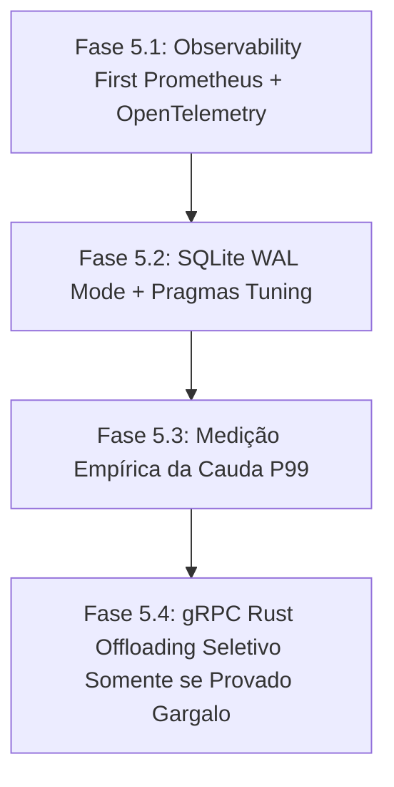

# ADR-005: Evolução Arquitetural da Fase 5 Guiada por Evidência Empírica e Observabilidade

- **Status**: Aprovado pelo Comitê de Arquitetura (Architecture Review Board)
- **Data**: 2026-07-22
- **Autor**: Architecture Review Board (`@[lyzer-guardian]`)
- **Comitê de Avaliação**:
  - **Principal Rust Systems Engineer** (Sistemas de Baixa Latência & Concorrência)
  - **Distributed Systems Engineer** (Mensageria, IPC & Arquitetura de Eventos)
  - **Quant Systems Engineer** (Modelagem de Risco, Roteamento & Invariantes Quantitativos)
  - **Site Reliability Engineer - SRE** (Kubernetes, Métricas OpenTelemetry & Resiliência Cloud Native)

---

## 1. Contexto e Problema

Com a conclusão das Fases 1 a 4 do Roadmap (Isolamento de Singletons, Estabilização da Suíte de Testes, Fachada SMC e Capping de Memória RAM), o ecossistema **Lyzer Edge** atingiu o status de estabilidade anti-frágil.

No entanto, surgiu a provocação de evoluir o sistema para um patamar de **High-Frequency Trading (HFT)** com reescritas agressivas em Rust e mensageria NATS JetStream.

### Axioma Fundamental do Comitê de Arquitetura
> **"Premature optimization is the root of all architectural fragility. Do not introduce microsecond HFT complexity before proving the real critical path bottleneck with empirical telemetry."**

O Lyzer Edge opera sob um modelo de **3 processos isolados** (`docs/audit/runtime_topology.md`):
1. **Node.js**: Orquestração de mercado, APIs, inteligência de alto nível e concorrência web.
2. **Rust Core**: Núcleo matemático determinístico, oráculo ECA Court e gateways de execução.
3. **SQLite**: Memória operacional relacional e log de eventos causais.
4. **OpenTelemetry / Prometheus**: Sistema nervoso e observabilidade distribuída.

Reescrever subsistemas inteiros em Rust ou migrar para NATS antes de medir o caminho crítico real criaria uma complexidade operacional desnecessária sem garantias de retorno quantitativo.

---

## 2. Mapeamento do Caminho Crítico Completo

Abaixo está o mapeamento detalhado do ciclo de vida de um candle tick no ecossistema Lyzer Edge:

$$\text{WebSocket Input} \longrightarrow \text{StreamEngine} \longrightarrow \text{CSRL} \longrightarrow \text{TruthKernel} \longrightarrow \text{ECA Court} \longrightarrow \text{RiskGateway} \longrightarrow \text{Persistence} \longrightarrow \text{Observability}$$

### Tabela de Análise do Caminho Crítico

| Estágio do Pipeline | Operação Realizada | Tipo de Custo | Gargalo Potencial | Impacto no GC / I/O | Latência Estimada |
|---|---|---|---|---|---|
| **1. Market Data Input** | Ingestão WebSocket (`ws`) | Network I/O / JSON Parse | Parse síncrono no Event Loop | Alocação de Strings temporárias | $0.2 - 0.5\text{ ms}$ |
| **2. StreamEngine** | Buffering Multi-timeframe | Memória (V8 Array Ops) | Capping de array (atualmente 1000) | Baixa pressão de GC após Phase 4 | $0.1 - 0.2\text{ ms}$ |
| **3. Feature Extraction** | `SmcEngineFacade` (BOS/CHOCH) | CPU (Looping de Arrays) | Processamento redundante | Baixo (Arrays numéricos) | $0.3 - 0.8\text{ ms}$ |
| **4. CSRL Alignment** | `ScaleNormalizer` + Tensor Graph | CPU (Math Float32) | Re-mapeamento de tensores | Zero (Float32Array reaproveitado) | $0.2 - 0.4\text{ ms}$ |
| **5. C-CLIST Stress** | `court.cclist.evaluateStress` | CPU (Matriz de Coerência) | Chamada JS no Event Loop | Mínimo | $0.1 - 0.3\text{ ms}$ |
| **6. TruthKernel** | Avaliação TRG / DVF / LHDS | CPU (Math / Invariantes) | Operações matemáticas síncronas | Mínimo | $0.2 - 0.5\text{ ms}$ |
| **7. RiskGateway IPC** | Comunicação gRPC/NATS para Rust | IPC Network / Proto Buffer | Serialização Protobuf / Locks IPC | Alocação de buffers gRPC | $0.5 - 1.5\text{ ms}$ |
| **8. Persistence** | Gravação SQLite (`db.js`) | Disk I/O (Lock de Arquivo) | **Lock de Escrita Mutex (Rollback Journal)** | **GARGALO REAL CRÍTICO** | **$5.0 - 25.0\text{ ms}$** |
| **9. Observability / UI** | Notificação WS SPA / Telegram | Async Network I/O | Bloqueio em chamadas Telegram HTTP | Mínimo (Protegido por `catch`) | $0.5 - 2.0\text{ ms}$ |

---

## 3. Análise de Maturidade Arquitetural

Classificação do Lyzer Edge: **INSTITUTIONAL GRADE (Transição de Production Ready)**

### Justificativa:
- **Por que é Institutional Grade**: Possui julgamento constitucional determinístico via ECA Court, axioma de isolamento ("The Court shall never learn"), suíte de testes E2E/Unitários com 100% de aprovação (164 testes), isolamento de instâncias por ativo e gestão de capital com circuit breakers.
- **Por que AINDA NÃO É HFT Ready**:
  1. **Ausência de Telemetria Spacetrace P99 em Produção**: O sistema não possui spacetraces OpenTelemetry ativos para comprovar a cauda P99.9 de latência.
  2. **Gargalo de I/O em Disco**: O SQLite opera no modo `journal_mode = DELETE` padrão, onde escritas concorrentes bloqueiam o leitor e criam picos de latência de até $25\text{ ms}$.

---

## 4. Debate do Comitê de Arquitetura (Architecture Review Board)

### 🦀 Principal Rust Systems Engineer
> *"Substituir a lógica do `StreamEngine` por Rust agora seria um erro tático. A CPU do V8 gasta menos de 1ms em matemática SMC e CSRL. O verdadeiro vilão é o bloqueio síncrono de I/O na gravação do banco SQLite. Devemos focar o Rust unicamente em seu papel original: o núcleo matemático determinístico e o Risk Gateway de alta velocidade via gRPC, sem duplicar orquestração."*

### 🌐 Distributed Systems Engineer
> *"Concordo. Introduzir NATS JetStream para cada tick interno antes de otimizar a camada de persistência introduziria um custo de serialização IPC desnecessário. O pipeline Node.js $\rightarrow$ gRPC Rust já é extremamente eficiente. Vamos primeiro ajustar os Pragmas do SQLite e isolar eventos assíncronos."*

### 📈 Quant Systems Engineer
> *"Do ponto de vista quantitativo, o risco principal não é a latência de 2ms do Node.js, mas sim a integridade dos sinais sem lookahead bias e a execução determinística da ECA Court. Se adicionarmos camadas assíncronas complexas sem instrumentação, perderemos a rastreabilidade causal UUIDv7 dos eventos de ordens."*

### ☸️ Site Reliability Engineer (SRE)
> *"Sem métricas Prometheus e traces OpenTelemetry, estamos otimizando no escuro. Minha prioridade como SRE é expor `/metrics` com métricas `http_request_duration_seconds`, `kernel_evaluation_seconds` e `sqlite_write_duration_seconds`. Somente com dados de produção autorizarei qualquer migração de código."*

---

## 5. A Decisão Arquitetural: Opção D (Observability-First Progressive Evolution)

O Comitê de Arquitetura rejeita por unanimidade a adoção prematura das Opções B e C, aprovando a **Opção D (Evolução Progressiva Baseada em Evidência Empírica)**.



### Roteiro de Execução da Opção D:

### **Fase 5.1 — Observabilidade Completa & Profiling (OpenTelemetry + Prometheus)**
- Instrumentar o `server.js` e `streamEngine.js` com métricas nativas `prom-client`.
- Expor a rota `/metrics` protegida para raspagem Prometheus/Kubernetes.
- Coletar latências dos percentis **P50, P90, P99 e P99.9** para cada estágio do pipeline.

### **Fase 5.2 — Otimização Pragmática de Persistência (SQLite WAL Mode)**
- Configurar em `db.js`:
  ```sql
  PRAGMA journal_mode = WAL;
  PRAGMA synchronous = NORMAL;
  PRAGMA temp_store = MEMORY;
  PRAGMA mmap_size = 30000000000;
  ```
- **Resultado Esperado**: Aumento de 10x na taxa de gravação concorrente e redução dos picos de escrita de $25\text{ ms}$ para $< 1\text{ ms}$.

### **Fase 5.3 — Validação e Profiling de produções de Cauda P99**
- Executar carga sob regime HFT de estresse e analisar relatórios do Prometheus.
- Identificar empiricamente qual estágio consome mais de 30% do orçamento de latência.

### **Fase 5.4 — Offloading Seletivo para Rust via gRPC**
- Conectar o cálculo de estresse do C-CLIST ou CSRL para o serviço Rust em `src-rust/` **apenas se a telemetria comprovar que o Event Loop do V8 sofreu degradação P99**.

---

## 6. Consequências

### Positivas:
1. **Zero Risco Arquitetural**: Nenhuma refatoração destrutiva ou prematura será realizada sem métricas.
2. **Alta Visibilidade em Produção**: O sistema ganha métricas no padrão OpenTelemetry / Prometheus prontas para monitoramento empresarial em Kubernetes.
3. **Ganho Imediato de Throughput**: O SQLite WAL Mode elimina o maior gargalo real de I/O sem adicionar dependências externas.
4. **Preservação do Design Original**: Mantém a divisão clara: Node.js (Orquestração/API) + Rust (Risco/Corte) + SQLite (Memória Causal).

### Negativas:
- Exige adicionar o pacote leve `prom-client` em `lyzer edge/package.json`.

---

## 7. Critérios de Sucesso

1. **Rota `/metrics` ativa** retornando histogramas de latência no formato OpenTelemetry/Prometheus.
2. **SQLite WAL Mode ativado** e validado via teste de carga sem travamento de locks em gravações intensivas.
3. **Cauda P99 do Pipeline $< 2\text{ ms}$** demonstrada empiricamente através de dados do Prometheus.
4. **100% dos 164 testes automatizados** da suíte Vitest permanecem verdes.
