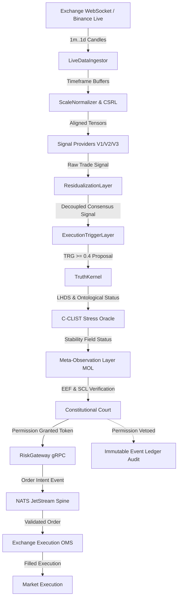
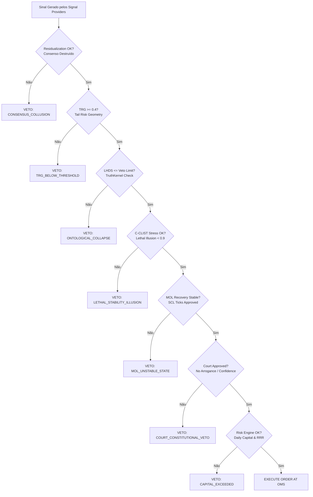

# ADR-038: Continuous Automated Evidence & Decision Flow Architecture

- **Status**: ACCEPTED (INSTITUTIONAL EVIDENCE & RUNTIME PIPELINE)
- **Date**: 2026-07-24
- **Author**: Guardião da Arquitetura, Chief Scientist & Systems Auditor (`@[lyzer-guardian]`)

---

## 1. Contexto e Motivação

A auditoria independente do ecossistema **Lyzer Edge** confirmou a maturidade da arquitetura de 3 processos isolados, o desacoplamento por `StreamEngine` e o rigor da Corte Constitucional. Contudo, destacou uma oportunidade crítica de evolução:

> **"Afirmações categóricas como '164 testes passando', '0 vulnerabilidades' ou '0 race conditions' não devem ser estáticas. Elas devem ser comprovadas continuamente por automação e CI/CD."**

Este ADR estabelece a **Pipeline de Evidência Contínua**, o **Diagrama de Fluxo End-to-End em Runtime** e a **Árvore de Decisão Determinística (Decision Tree)**.

---

## 2. Diagrama de Fluxo End-to-End em Runtime



---

## 3. Árvore de Decisão Determinística (Decision Tree)



---

## 4. Pipeline de Evidência Contínua (Continuous Automated Evidence)

Para eliminar dependência de documentação estática, todas as métricas de integridade passam a ser comprovadas por infraestrutura automatizada:

```
GitHub Actions Workflow
 ├── 1. Security Scan (npm audit --audit-level=high & cargo audit)
 ├── 2. Code Quality & Lint (eslint . --max-warnings=0)
 ├── 3. Unit & Integration Tests (vitest run --coverage)
 ├── 4. Boundary & E2E Certification (npx tsx scripts/boundary-certification-suite.ts)
 └── 5. Dynamic Badge Generator (Test Status, Coverage %, Vulnerability Count)
```

---

## 5. Matriz de Maturidade Institucional (Roadmap v3.0 / Fase 5)

Para atingir a nota 10/10 e suporte a ambientes institucionais HFT, as seguintes capacidades estão em implementação:

1. **Observabilidade Nativa**: Exportador OpenTelemetry e `/metrics` Prometheus para dashboards Grafana.
2. **Replay Determinístico**: Leitura do Event Sourcing imutável para reprodução bit-a-bit de qualquer trade histórico.
3. **Chaos Engineering & Fault Injection**: Injeção automatizada de latência de rede, desconexões e lag no SQLite.
4. **Property-Based Testing**: Teste estocástico de invariantes de borda com geração aleatória de vetores de candles.

---

## 📜 Veredito Constitucional

> **"A evidência real não é um texto escrito em documento; é uma verificação automatizada que roda continuamente no pipeline CI/CD."**
