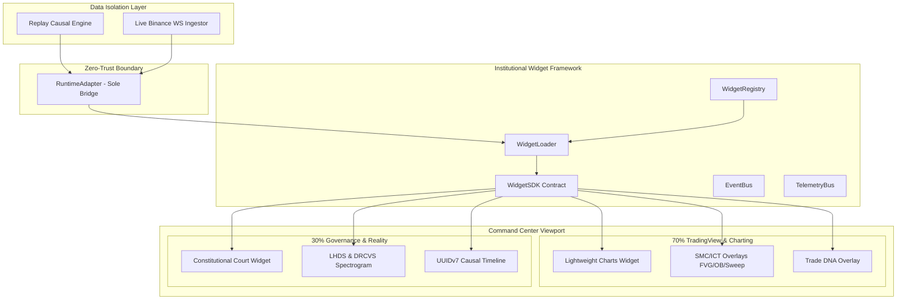

# ADR-040: Institutional Dual-Pane Command Center & Plugin Widget Architecture

## 1. Contexto & Motivação

O **Lyzer Edge** evoluiu de uma ferramenta analítica para uma plataforma quantitativa autônoma de classe institucional com isolamento de 3 processos e governança constitucional. Para refletir essa maturidade no frontend, é necessário transformar a interface do usuário em um **Cockpit Institucional Dual-Pane** totalmente orientado a plugins, onde a visualização do gráfico de mercado atua lado a lado com a explicabilidade em tempo real do raciocínio da Corte Constitucional.

---

## 2. Decisões Arquiteturais

### Decisão 1: Layout Dual-Pane Assimétrico (70% / 30%)
- **Painel Esquerdo (≈70% da viewport)**:
  - Motor gráfico primário: **TradingView Lightweight Charts** (`_mountLWC`).
  - Camadas visuais ativas: Candlesticks em tempo real, linhas nativas de `ENTRY` (laranja), `SL` (vermelho), `TP` (verde), Fair Value Gaps (FVG), Order Blocks (OB), Liquidity Sweeps e marcadores de Trade DNA.
- **Painel Direito (≈30% da viewport)**:
  - Telemetria de governança da **Corte Constitucional**: Estado dos Observadores, Matriz de Veto, Risk Engine, LHDS Spectrogram, AIR (Alpha Integrity Ratio), Surprise Score, DRCVS e Timeline Causal UUIDv7.

### Decisão 2: Arquitetura Dual Data-Source no RuntimeAdapter
- O `RuntimeAdapter` é mantido como a **única fronteira autorizada (Single Point of Truth & Zero-Trust Boundary)** para acesso a dados na UI.
- **Modos de Operação**:
  1. **Replay Causal Determinístico Engine**: Playback, pausa e inspeção passo-a-passo da memória causal.
  2. **Streaming Binance Live Engine**: WebSocket streaming de ticks e klines da Binance em tempo real.
  3. **Alternância Dinâmica Transparente**: Todos os widgets da UI consomem snapshots abstraídos do `RuntimeAdapter` e permanecem 100% agnósticos da origem real dos dados (`source: 'REPLAY' | 'LIVE'`).

### Decisão 3: Institutional Widget Framework & Arquitetura Baseada em Plugins
Em vez de desenvolver widgets isolados, cria-se o **Institutional Widget Framework**:
- `WidgetSDK`: Contrato padronizado com ciclo de vida (`mount`, `unmount`, `onSnapshot`, `onEvent`, `exportTelemetry`).
- `WidgetRegistry`: Registro central dinâmico de plugins com validação de tipagem e integridade.
- `WidgetLoader`: Carregamento dinâmico e renderização em contêineres isolados (Zero-Trust sandbox).
- `StateStore`: Estado local imutável por widget.
- `EventBus` & `TelemetryBus`: Canais desacoplados para escuta de eventos causais e emissão de telemetria.

---

## 3. Diagrama da Arquitetura Alvo (Target Architecture)

---

## 4. Matriz de Riscos & Controles

| ID | Risco | Severidade | Mitigação Arquitetural |
| :--- | :--- | :--- | :--- |
| **R-01** | Vazamento de estado no modo Replay | Média | Snapshots imutáveis isolados (`Object.freeze`) emitidos pelo `RuntimeAdapter` |
| **R-02** | Latência excessiva no renderizador 60 FPS | Média | Throttle de atualização no DOM e uso de `requestAnimationFrame` |
| **R-03** | Acoplamento direto entre Widgets e Binance WS | Alta | Proibição estrita via ESLint & Code Review (`DASHBOARD_CONTROL_VETO`) |
| **R-04** | Falha de carregamento de plugin/widget | Baixa | Fallback gracioso com `Error Boundary` por widget no `WidgetLoader` |

---

## 5. Plano de Implementação em 4 Fases

1. **Fase 1 — Institutional Widget SDK & Registry Core**:
   - Construção do `WidgetSDK.js`, `WidgetRegistry.js`, `WidgetLoader.js` e `StateStore.js`.
2. **Fase 2 — Dual Data-Source RuntimeAdapter**:
   - Implementação da abstração de Replay Causal vs Live Binance no `RuntimeAdapter`.
3. **Fase 3 — Dual-Pane Cockpit Layout & Widgets Primários**:
   - Implementação do layout 70%/30% e integração dos widgets no `Left Pane` e `Right Pane`.
4. **Fase 4 — Certificação E2E & Testes de Carga**:
   - Validação da suíte Vitest e verificação do Purple Ban + Zero-Trust boundaries.
