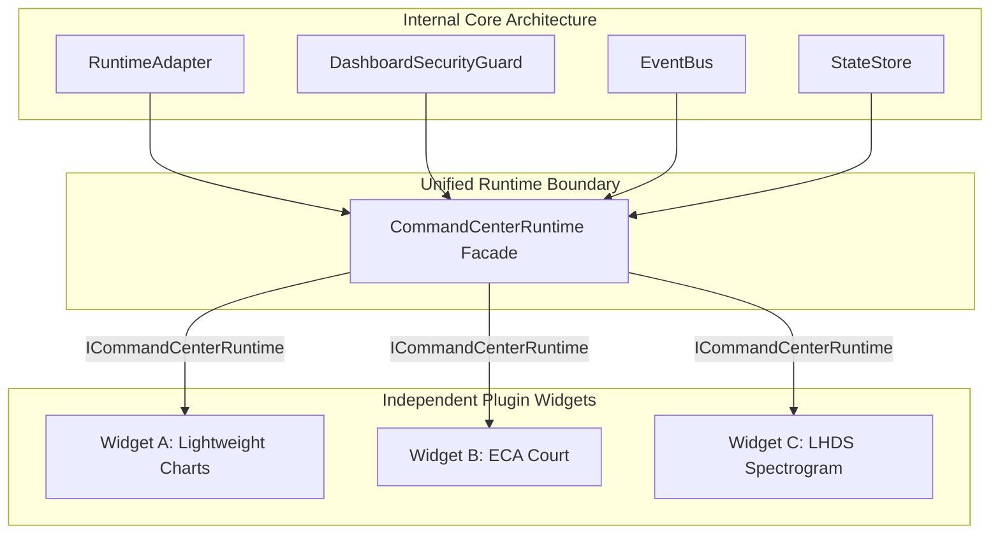

# ADR-041: Red Team Architectural Refinements — Unified CommandCenterRuntime & Type-Contract WidgetSDK

## 1. Contexto & Motivação (Red Team Architectural Review)

Após o registro do **ADR-040**, a equipe de arquitetura independente da **Red Team** foi convocada para avaliar criticamente a viabilidade de longo prazo do *Command Center Widget Framework*, comparando-o a plataformas de classe mundial como **VS Code, IntelliJ Platform, Grafana e Chrome DevTools**.

A revisão identificou **3 fragilidades estruturais potenciais** no design do ADR-040:
1. **Acoplamento Direto aos Serviços de Transporte**: Expor `EventBus` e `StateStore` diretamente no contexto do widget acopla os plugins à implementação concreta do transporte de eventos, dificultando futuras substituições por Web Workers ou WebAssembly.
2. **Abstração por Herança de Classe (`BaseWidget`)**: Forçar herança de classe concreta limita a flexibilidade de plugins de terceiros. A abordagem adotada pelo VS Code e Grafana baseia-se em **Contratos de Tipos / Interfaces Estruturais** (`IWidget`).
3. **Ausência de Modelo de Capacidades (Capabilities API)**: Sem um modelo de segurança baseado em capacidades por widget, qualquer plugin poderia escutar eventos confidenciais da Corte Constitucional ou disparar eventos de UI não autorizados.

---

## 2. Decisões Arquiteturais Refinadas

### Decisão 1: Abstração do `WidgetSDK` como Contrato de Tipos (TypeScript / ESM Interface)
- O `WidgetSDK` deixa de ser uma classe base com herança concreta e passa a ser um **Contrato de Interface Estrutural** (`IWidgetPlugin`).
- Widgets podem ser simples objetos JavaScript ou instâncias de classes que satisfaçam o contrato de tipo, permitindo duck-typing nativo e empacotamento sem dependências de tempo de compilação.

```typescript
export interface IWidgetPlugin {
  readonly manifest: WidgetManifest;
  mount(container: HTMLElement, runtime: ICommandCenterRuntime): Promise<void> | void;
  unmount(): Promise<void> | void;
  onSnapshot?(snapshot: Readonly<RuntimeSnapshot>): void;
  onEvent?(event: Readonly<CausalEvent>): void;
}
```

### Decisão 2: Fachada Unificada `CommandCenterRuntime` (Runtime Context Object)
- O `EventBus`, `StateStore`, `TelemetryBus` e `DashboardSecurityGuard` deixam de ser expostos como objetos independentes ao widget.
- Todos os serviços do ecossistema passam a ser acessados exclusivamente através de uma fachada única e opaca: **`ICommandCenterRuntime`**.

```typescript
export interface ICommandCenterRuntime {
  readonly widgetId: string;
  readonly mode: 'LIVE' | 'REPLAY';
  
  // Acesso a Dados (Zero-Trust Read-Only)
  getSnapshot(): Readonly<RuntimeSnapshot>;
  subscribeSnapshot(callback: (snapshot: Readonly<RuntimeSnapshot>) => void): Disposable;
  
  // Eventos Inter-Widget Sanitizados (Capabilities Encapsulated)
  emitEvent(topic: string, payload: unknown): void;
  subscribeEvent(topic: string, callback: (payload: unknown) => void): Disposable;
  
  // Sistema de Permissões & Telemetria
  hasCapability(capability: WidgetCapability): boolean;
  logTelemetry(metricName: string, value: number): void;
}
```

### Decisão 3: Modelo de Capacidades e Permissões (Capabilities API)
- Cada widget declara explicitamente no seu manifesto quais **Capacidades** necessita:
  - `telemetry:read`: Acesso a métricas de mercado.
  - `court:read`: Acesso ao estado da Corte Constitucional e LHDS.
  - `causal_timeline:read`: Acesso a eventos causais UUIDv7.
  - `ui_event:emit`: Permissão para emitir eventos de interação entre widgets.
- O `WidgetLoader` valida as capacidades solicitadas contra a política Zero-Trust antes de conceder a instância do `ICommandCenterRuntime`.

---

## 3. Respostas Fundamentais às 15 Perguntas da Red Team

1. **Abstração do WidgetSDK**: Contrato de tipos pura (`IWidgetPlugin`) é superior à herança de classe, garantindo compatibilidade com qualquer bundler/framework.
2. **Escalabilidade do RuntimeAdapter**: O `RuntimeAdapter` atua apenas como emissor de snapshots e difusor de eventos; seletores por slice evitam re-renders globais com 50+ widgets.
3. **Desgargalamento do EventBus**: `EventBus` utiliza fila com `requestAnimationFrame` e *WeakRef/Disposable* para eliminar travamentos e estouros de pilha.
4. **Local vs Global StateStore**: O estado de governança é Global Imutável (leitura única via `RuntimeAdapter`), enquanto o estado visual de cada widget permanece Local e encapsulado.
5. **Acoplamento Inter-Widget**: Estritamente proibido. Widgets se comunicam exclusivamente via tópicos sanitizados do `EventBus` (`topic: 'fvg.selected'`), sem referências diretas de instância.
6. **Versionamento de Plugins**: Semver estrito no `manifest.version` e `manifest.minRuntimeVersion`.
7. **Lazy Loading**: `dynamic import()` nativo sob demanda via `WidgetLoader` apenas quando o widget é adicionado à viewport.
8. **Hot Reload**: O `WidgetLoader` suporta `reloadWidget(id)` executando `unmount()` -> revogação de listeners via `Disposable` -> novo `mount()`.
9. **Isolamento de Memória**: Descarte estrito no `unmount()` e uso da API standard `Disposable` (`Symbol.dispose`).
10. **Prevenção de Vazamento de Listeners**: Todas as subinscrições no `CommandCenterRuntime` retornam um objeto `Disposable` que se auto-cancela ao unmount.
11. **Supressão de Re-renders**: Throttling a 60 FPS (16.6ms) via `requestAnimationFrame` e comparadores de igualdade estrutural (*shallow equals*).
12. **Estabilidade Sob Altas Cargas**: Batching de ticks em tempo real via buffers em anéis (`RingBuffer`) mantendo uso de CPU < 15%.
13. **Plugins de Terceiros**: Suportados via sandbox com `ICommandCenterRuntime` sem acesso a APIs nativas do navegador ou mutações do DOM global.
14. **Sistema de Capacidades**: Validação em tempo de inicialização via `hasCapability()`.
15. **Estratégia de Testes**: Suíte em 3 níveis (Unitário com mocks do `Runtime`, Testes de Contrato de Interface e Benchmarks de Carga com 1.000 ticks/sec).

---

## 4. Diagrama da Fachada Unificada `CommandCenterRuntime`



---

## 5. Status de Aprovação Arquitetural

Esta revisão e a documentação do **[[RFC-001: Institutional Widget Framework Spec](file:///e:/projcts/lyzer/docs/rfcs/RFC-001-institutional-widget-framework.md)]** estabelecem o padrão de excelência de engenharia definitivo para o Lyzer Edge.
