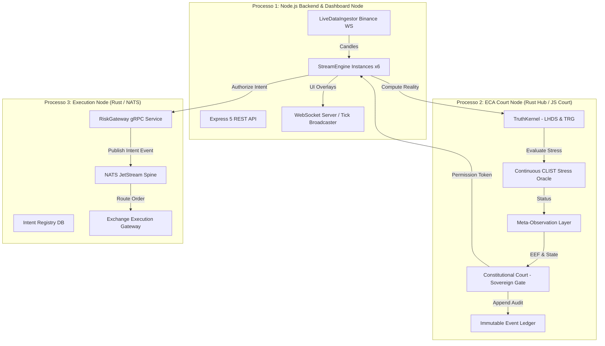

# Auditoria Técnica — Architecture Overview
**Projeto**: Lyzer Edge  
**Arquivo**: `docs/audit/architecture_overview.md`

---

## 1. Visão Geral da Arquitetura do Sistema

O Lyzer Edge adota uma arquitetura em 3 processos isolados para garantir a soberania constitucional da tomada de decisão quantitativa contra falhas de runtime e manipulação de estado.



---

## 2. Invariantes Arquiteturais Fundamentais

1. **Axioma "The Court Shall Never Learn"**:
   - A Corte Constitucional (`ConstitutionalCourt` em [court.js](file:///c:/Users/WDAGUtilityAccount/Downloads/projeto/packages/lyzer-constitution/src/eca/court.js#L41)) recusa estritamente qualquer entrada que contenha `confidence` ou `prediction`.
   - Se dados probabilísticos forem passados ao método `requestPermission()`, o token emitido é marcado com `VETO_CONFIDENCE_ARROGANCE`.

2. **Hierarquia de Soberania em 7 Camadas**:
   - Para que uma intenção de execução seja emitida, ela deve obrigatoriamente transitar pelas 7 etapas em sequência:
     $$\text{Providers (V1/V2/V3)} \rightarrow \text{Residualization} \rightarrow \text{ExecutionTrigger} \rightarrow \text{TruthKernel} \rightarrow \text{C-CLIST} \rightarrow \text{MOL} \rightarrow \text{ECA Court}$$

3. **Traceabilidade Causal com UUIDv7**:
   - Toda ordem no barramento gRPC / NATS carrega obrigatoriamente `execution_intent_id`, `correlation_id` e `causation_id`, definidos no Protobuf [lyzer.proto](file:///c:/Users/WDAGUtilityAccount/Downloads/projeto/lyzer%20edge/src-proto/lyzer.proto#L7-L9).

---

## 3. Divisão de Workspaces e Pacotes

```
projeto/
├── packages/
│   ├── lyzer-shared/       # Motores de Sinal (V1, V2, V3), CSRL, SMC e TruthKernel
│   └── lyzer-constitution/ # Corte Constitucional, C-CLIST, MOL e Ledger Imutável
├── lyzer edge/             # Aplicação Principal Node.js, Frontend SPA e backend server.js
├── src-rust/               # Kernel Rust (OAL, OCR, SHM Spine, Binance Adapter)
├── lyzer-workspace/        # Constitutional Hub Rust (Core Hub, Arbitration, Governance)
└── lyzer edge/src-rust/    # Edge Services Rust (Risk Gateway, Intent Registry, OMS)
```

---

## 4. Avaliação das Camadas

- **Camada de Ingestão**: Resiliente contra desconexões com mecanismo de fallback simulado.
- **Camada de Decisão (Kernel/Court)**: Excepcionalmente determinística e isolada contra ruído de mercado.
- **Camada de Execução**: Suporta simulador de execução (`FILLED_MOCK`) ou chamadas reais à Binance com validações de capital diário.
