# Auditoria Técnica — Data Flow
**Projeto**: Lyzer Edge  
**Arquivo**: `docs/audit/data_flow.md`

---

## 1. Fluxo End-to-End do Dado financeiro

O dado trafega desde a sua ingestão no mercado em tempo real até a mutação do saldo/posição e emissão de telemetria.

```mermaid
flowchart LR
    A[Market Candle WS / Binance] -->|1m Kline| B[LiveDataIngestor]
    B -->|Candle Object| C[StreamEngine.updateMtfCandles]
    C -->|MTF Arrays| D[CSRL ScaleNormalizer & TensorGraph]
    C -->|MTF Arrays| E[Providers V1 / V2 / V3]
    D -->|Invariants & Divergence| F[TruthKernel.evaluate]
    E -->|Narrative Signals| F
    F -->|KernelResult EEF, TRG, DVF| G[court.requestPermission]
    G -->|PermissionToken| H{Granted?}
    H -->|Yes| I[ExchangeExecution / Order API]
    H -->|No| J[Log Veto Reason to Ledger]
    I -->|Fill/Mock| K[Active Position Manager & Trade History]
    K -->|Emit Event| L[WebSocket Server Broadcast to UI]
    K -->|Alert| M[Telegram Bot]
```



---

## 2. Estrutura dos Dados Centrais (Data Contracts)

### Contract 1: Candle Object
```json
{
  "openTime": 1774218000000,
  "open": 60000.0,
  "high": 60150.0,
  "low": 59900.0,
  "close": 60100.0,
  "volume": 145.2,
  "closed": true
}
```

### Contract 2: Kernel Result (`TruthKernel`)
```json
{
  "eef": true,
  "trg": 0.58,
  "dvf": 0.04,
  "signal": "go",
  "confidence": 82.5,
  "reason_codes": ["TAIL_RISK_GEOMETRY_PASSED"],
  "epistemic_authority": "HIGH"
}
```

### Contract 3: Permission Token (`ConstitutionalCourt`)
```json
{
  "action": "EXECUTE_TRADE",
  "granted": true,
  "reason": "",
  "timestamp": 1774218005000
}
```

### Contract 4: Execution Intent (Protobuf gRPC)
- Mapeado no Protobuf [lyzer.proto](file:///c:/Users/WDAGUtilityAccount/Downloads/projeto/lyzer%20edge/src-proto/lyzer.proto#L6-L18).
- Todos os IDs (`execution_intent_id`, `correlation_id`, `causation_id`) são obrigatoriamente formatados como UUIDv7 para auditabilidade temporal estrita.
