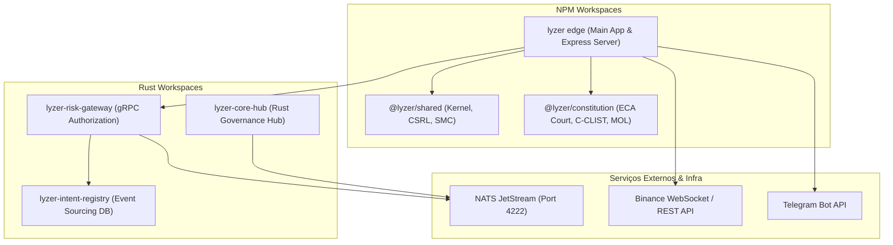

# Auditoria Técnica — Dependency Graph
**Projeto**: Lyzer Edge  
**Arquivo**: `docs/audit/dependency_graph.md`

---

## 1. Mapeamento de Dependências Inter-Pacotes

O repositório opera como um monorepo npm e múltiplos workspaces Cargo (Rust). A estrutura de dependências inter-módulos é apresentada a seguir:

---

## 2. Dependências de Produção (npm `package.json`)

### `lyzer edge/package.json`
- `express`: ^5.0.0 (Web server REST)
- `ws`: ^8.18.0 (WebSocket client/server)
- `dotenv`: ^16.4.5 (Gestão de variáveis de ambiente)
- `@lyzer/shared`: workspace:*
- `@lyzer/constitution`: workspace:*

### `@lyzer/shared/package.json`
- Módulo ESM puro (`"type": "module"`), sem dependências externas de terceiros para garantir a máxima portabilidade.

### `@lyzer/constitution/package.json`
- Módulo ESM puro (`"type": "module"`), zero dependências de terceiros.

---

## 3. Dependências de Desenvolvimento e Testes

- `vite`: ^5.4.0 (Dev server e bundler frontend)
- `vitest`: ^2.0.0 (Runner de testes unitários e de integração em ambiente `jsdom`)
- `@vitest/coverage-v8`: ^2.0.0 (Relatórios de cobertura)
- `eslint`: ^9.0.0 (Linter estático)
