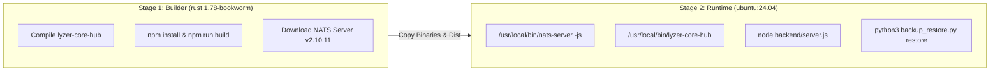

# Auditoria Técnica — Infrastructure Review
**Projeto**: Lyzer Edge  
**Arquivo**: `docs/audit/infrastructure.md`

---

## 1. Visão Geral da Infraestrutura e Containerização

O projeto utiliza um contêiner Docker multi-stage construído para implantação em plataformas PaaS/SaaS (como Hugging Face Spaces `docker` SDK) ou instâncias VPS dedicadas.

---

## 2. Análise do Dockerfile ([Dockerfile](file:///c:/Users/WDAGUtilityAccount/Downloads/projeto/Dockerfile))

- **Base Image Stage 1**: `rust:1.78-bookworm` (instala Node.js 20.x, unzip e compila crates Rust em `--release`).
- **Base Image Stage 2**: `ubuntu:24.04` (instala Python 3, Node.js 20.x e `huggingface_hub`).
- **Usuário Privilegiado**: Executa sob usuário não-privilegiado `ubuntu` (UID 1000), garantindo conformidade de segurança nos contêineres Hugging Face.
- **Ordem de Inicialização (CMD)**:
  `python3 backup_restore.py restore; nats-server -js & lyzer-core-hub & node backend/server.js`

---

## 3. Automação de Deploy Multi-Instância ([deploy-experiments.ps1](file:///c:/Users/WDAGUtilityAccount/Downloads/projeto/deploy-experiments.ps1))

O script PowerShell automatiza o deploy de 4 instâncias no Hugging Face Spaces (`exp-a`, `exp-b`, `exp-c`, `exp-d`), aplicando diferentes níveis de relaxamento de parâmetros (`TRG_THRESHOLD`, `RESIDUAL_CONSENSUS_LIMIT`, etc.) via arquivos de ambiente `.env.exp-*`.
