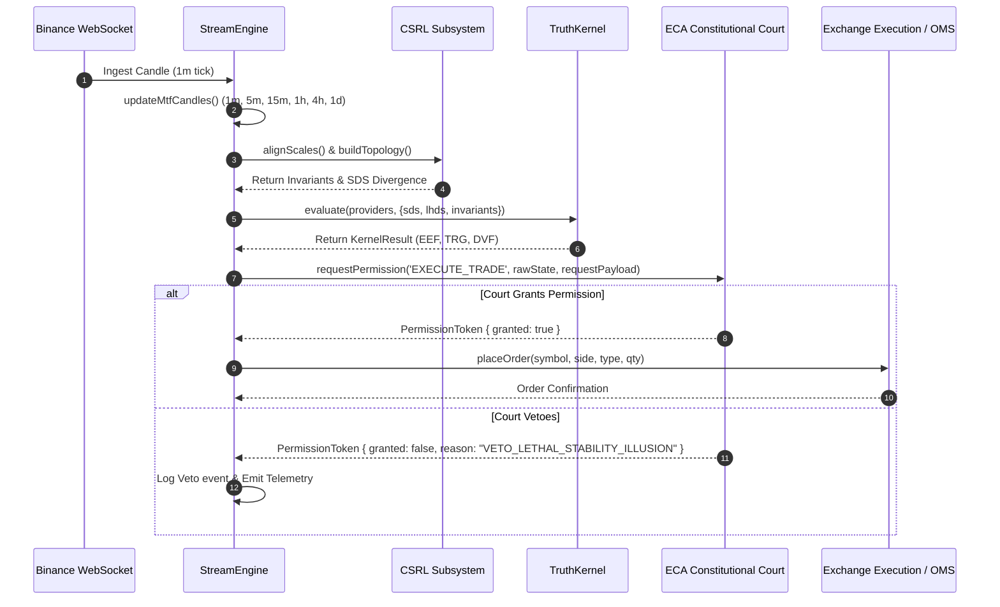

# Auditoria Técnica — Runtime Flow
**Projeto**: Lyzer Edge  
**Arquivo**: `docs/audit/runtime_flow.md`

---

## 1. Ciclo de Vida da Aplicação

### 1. Inicialização e Startup (`server.js`)
```
[Node.js Boot]
   │
   ├── Load .env config
   ├── Forced ARL_MODE = 'TESTNET' (if unset)
   ├── Create Express app & WebSocketServer (port 7860)
   ├── Instantiate 6 StreamEngine instances (BTC, ETH, SOL, BNB, XRP, ADA)
   ├── Load persisted state from db via statePersistence.js
   └── Start HTTP server & listen on WSS
```

### 2. Fluxo por Tick de Candle (`streamEngine.js -> processCandle`)



---

## 2. Detalhes das Fases de Runtime

### Fase 1: Aquecimento (Warmup)
- Em modo `SIMULATION`, `warmupSyntheticCandles()` gera 110 candles sintéticos retroativos.
- Em modo `LIVE` ou `TESTNET`, `startLiveMode()` executa requisições HTTP REST para a Binance buscando os últimos candles fechados para todas as escalas (`1m` até `1d`).

### Fase 2: Processamento CSRL & Divergência Dupla
- `scaleNormalizer.alignScales(this.mtfCandles)` alinha temporalmente os vetores de cada escala.
- `dualMonitor.calculateDivergence()` afere a divergência de realidade entre o stream local e fontes externas.

### Fase 3: Avaliação Constitucional
- O método `court.requestPermission()` checa o estado estático do `C-CLIST` acumulado.
- Se `stress.isLethalIllusion` for verdadeiro, o trade é imediatamente bloqueado, independente de ter um sinal forte dos providers.

### Fase 4: Encerramento e Shutdown
- O backend monitora sinais de terminação e salva o estado da memória dos 6 motores via `saveEngineState(engines)`.
