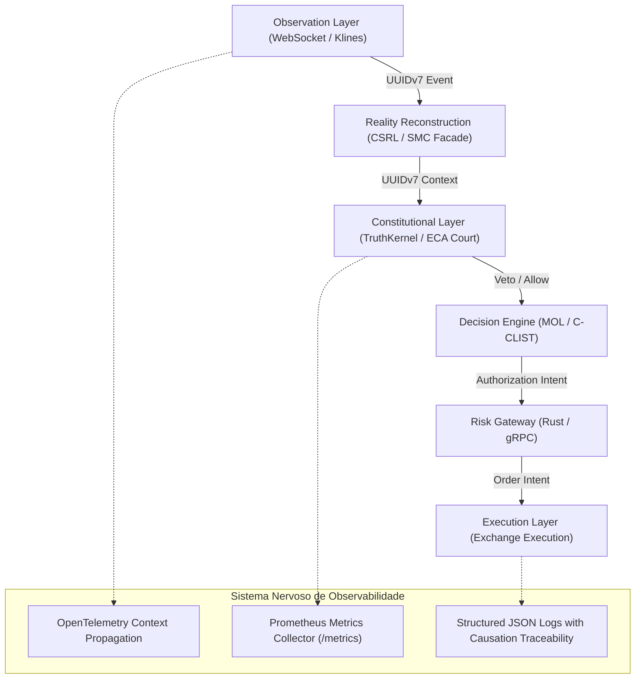

# Arquitetura de Observabilidade Institucional — Lyzer Edge

- **Status**: Aprovado pelo Comitê de Observabilidade & SRE
- **Data**: 2026-07-22
- **Autor**: Principal SRE Engineer & Observability Architect (`@[lyzer-guardian]`)

---

## 1. Princípio Fundamental de Causalidade vs Velocidade

> **"A integridade causal rastreável por UUIDv7 possui prioridade absoluta sobre a velocidade bruta de microsegundos. Em um sistema de decisão adaptativo e constitucional, preservar a ordenação temporal exata dos eventos (Observation $\rightarrow$ Reality Reconstruction $\rightarrow$ Constitutional Court $\rightarrow$ Risk Gateway $\rightarrow$ Execution) é a única garantia contra ilusão de estabilidade e desalinhamento epistêmico."**



---

## 2. Inventário de Componentes e Pontos de Emissão de Telemetria

### 2.1 Servidores HTTP & Ingestores Node.js
- **`lyzer edge/backend/server.js`**: Ponto de entrada Express 5. Ponto de montagem da rota protegida `/metrics` e interceptor de latência HTTP.
- **`lyzer edge/backend/streamEngine.js`**: Motor síncrono de tick por candle. Ponto de emissão de métricas do pipeline (`ticks_received_total`, `csrl_processing_duration_seconds`, `cclist_evaluation_duration_seconds`).

### 2.2 Subsistemas de Decisão e Julgamento
- **`packages/lyzer-shared/src/engine/kernel.js` (TruthKernel)**: Emissão de métricas de autoridade epistêmica (`OBSERVED`, `INFERRED`, `VETO`).
- **`packages/lyzer-constitution/src/eca/court.js` (Constitutional Court)**: Emissão de estatísticas de estresse C-CLIST e vetos constitucionais (`VETO_NO_SURVIVAL_NECESSITY`, `VETO_MOL_RECOVERY_PENDING`).

### 2.3 Serviços em Rust (IPC & Risk Gateway)
- **`src-rust/` & `lyzer edge/src-rust/`**: Gateway gRPC e NATS JetStream. Ponto de emissão de latência gRPC e verificação de autorização de risco.

### 2.4 Camada de Persistência
- **`lyzer edge/backend/db.js` (SQLite)**: Métricas de escrita em banco relacional (`sqlite_write_duration_seconds`, `sqlite_lock_wait_seconds`).

---

## 3. Pilares da Arquitetura de Observabilidade

### 3.1 Métricas (Prometheus via `prom-client`)
- Coleta de baixo overhead no Event Loop do Node.js.
- Exposição do endpoint `/metrics` com suporte a autenticação por Bearer Token / API Key (`ADMIN_API_KEY`).
- Histogramas com buckets exponencialmente espaçados para captura precisa de percentis ($P_{50}, P_{95}, P_{99}, P_{99.9}$).

### 3.2 Tracing Distribuído (OpenTelemetry SDK)
- Propagação estrita de contexto contendo:
  - `execution_intent_id`: UUIDv7 único gerado na identificação da intenção.
  - `correlation_id`: UUIDv7 que agrupa ticks do mesmo ciclo de mercado.
  - `causation_id`: UUIDv7 do evento imediatamente anterior que causou a ação.

### 3.3 Structured Logging (Pino / JSON Formatted)
- Saída estritamente em formato JSON estruturado para ingestão por Grafana Loki / FluentBit / Datadog.
- Campos obrigatórios em todo log:
  ```json
  {
    "timestamp": "2026-07-22T21:38:00.000Z",
    "level": "info",
    "service": "lyzer-edge-stream",
    "symbol": "BTCUSDT",
    "intent_id": "0190c3d4-7f12-789a-b123-456789abcdef",
    "message": "Constitutional judgment completed",
    "decision": "ALLOW",
    "trg": 0.52,
    "duration_ms": 1.24
  }
  ```

---

## 4. Segurança da Observabilidade

1. **Proteção da Rota `/metrics`**:
   - A rota `/metrics` **NÃO** deve ser pública. Exige cabeçalho `Authorization: Bearer <ADMIN_API_KEY>` ou acesso restrito a IPs do pod CIDR do Kubernetes.
2. **Sanitização de Dados Sensíveis**:
   - Nunca expor chaves de API da Binance (`BINANCE_API_KEY`), tokens de bot do Telegram (`TELEGRAM_BOT_TOKEN`) ou segredos de banco em métricas ou logs.
3. **Carga no Event Loop**:
   - As métricas do `prom-client` usam timers assíncronos leves para não adicionar mais de $50\ \mu\text{s}$ ao ciclo do Event Loop.
