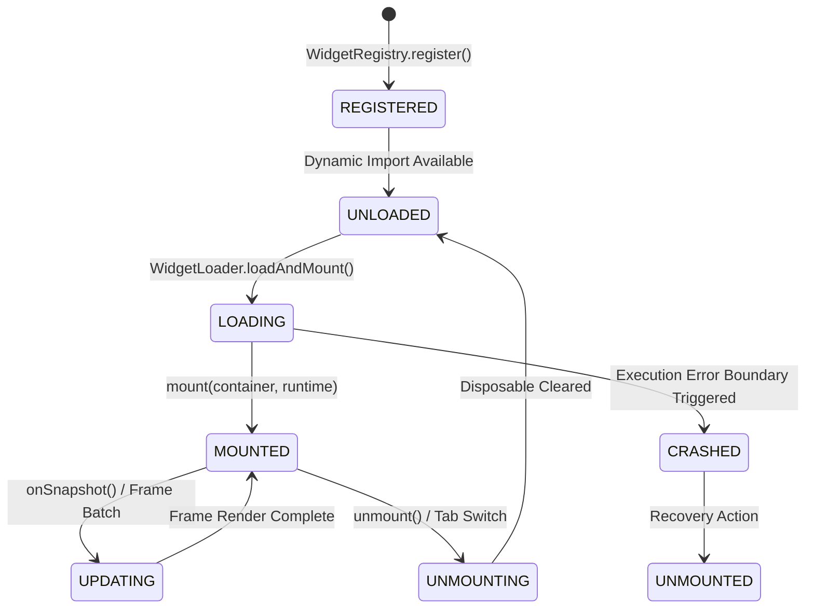
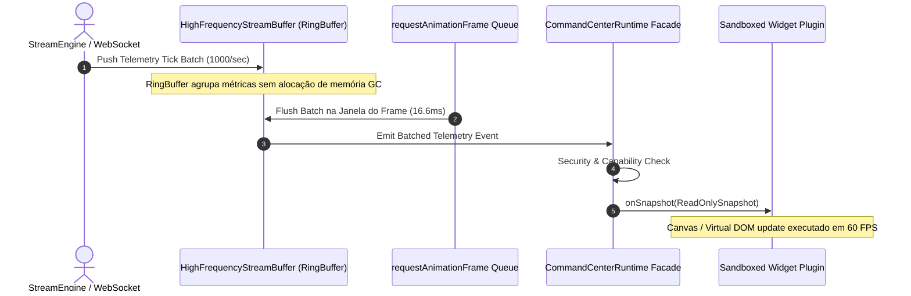

# RFC-001: Institutional Widget Framework & Extension Specification

## 1. Objetivo & Visão Geral

Esta RFC especifica o **Institutional Widget Framework** do **Lyzer Edge Command Center**, projetado com um nível de rigor técnico comparável a ecossistemas maduros como **VS Code, IntelliJ Platform, Grafana e Chrome DevTools**.

O framework estabelece um ecossistema de extensões altamente modular, seguro, observável e desacoplado, imune a congelamentos de renderização sob tráfego HFT (1.000+ ticks/segundo).

---

## 2. Contrato do Widget & Especificação do Manifesto

### 2.1 Manifesto do Widget (`WidgetManifest`)

```typescript
export type WidgetCapability = 
  | 'telemetry:read'
  | 'court:read'
  | 'causal_timeline:read'
  | 'ui_event:emit'
  | 'ui_event:listen';

export interface WidgetManifest {
  readonly id: string;
  readonly name: string;
  readonly version: string;
  readonly minRuntimeVersion: string;
  readonly targetPane: 'LEFT_PANE' | 'RIGHT_PANE';
  readonly capabilities: ReadonlyArray<WidgetCapability>;
  readonly realityTag: 'OBSERVED_REALITY' | 'SYNTHETIC_REALITY';
}
```

### 2.2 Especificação de Interface (`IWidgetPlugin`)

```typescript
export interface Disposable {
  dispose(): void;
}

export interface IWidgetPlugin {
  readonly manifest: WidgetManifest;
  
  /** Inicializa e monta o widget dentro do contêiner fornecido */
  mount(container: HTMLElement, runtime: ICommandCenterRuntime): Promise<void> | void;
  
  /** Desmonta o widget, limpando listeners, timers e referências DOM */
  unmount(): Promise<void> | void;
  
  /** Callback opcional reativo acionado ao receber novos snapshots */
  onSnapshot?(snapshot: Readonly<RuntimeSnapshot>): void;
}
```

---

## 3. Ciclo de Vida do Widget & Diagrama de Estados



---

## 4. Diagrama de Sequência de Ingestão e Renderização em 60 FPS



---

## 5. Matriz de Riscos & Mecanismos de Controle

| ID | Risco Arquitetural | Severidade | Mecanismo de Controle Arquitetural |
| :--- | :--- | :--- | :--- |
| **R-01** | Vazamento de Listeners no EventBus | **CRITICAL** | Subinscrições retornam `Disposable` canceladas obrigatoriamente no `unmount()`. |
| **R-02** | Bloqueio de Thread Principal por Ticks | **CRITICAL** | StreamBuffer com `RingBuffer` debocado a 60 FPS via `requestAnimationFrame`. |
| **R-03** | Violação Zero-Trust por Plugin de Terceiros | **HIGH** | Verificação estrita de `Capabilities` e bloqueio pelo `DashboardSecurityGuard`. |
| **R-04** | Exceção Não Tratada em Widget | **HIGH** | `WidgetErrorBoundary` isola a falha exibindo um painel de diagnóstico localizado. |
| **R-05** | Contaminação de Realidade (Mixed Reality) | **HIGH** | Ingestão validada por `RealityTagValidator` bloqueando mistura de sintético e observado. |

---

## 6. Plano de Migração & Compatibilidade Futura

1. **Abstração Transparente**: O novo `CommandCenterRuntime` encapsula os serviços existentes (`dashboardRuntimeAdapter`, `dashboardSecurityGuard`) sem quebrar a suíte de testes legada.
2. **Backward Compatibility**: Componentes V2 existentes (`ExecutiveOverview`, `RealityObservatory`) serão envelopados como plugins usando um `LegacyWidgetAdapter`.
3. **Versões de API**: O manifesto exige `minRuntimeVersion: "3.4.0"`, permitindo evolução contínua das capacidades do framework.
