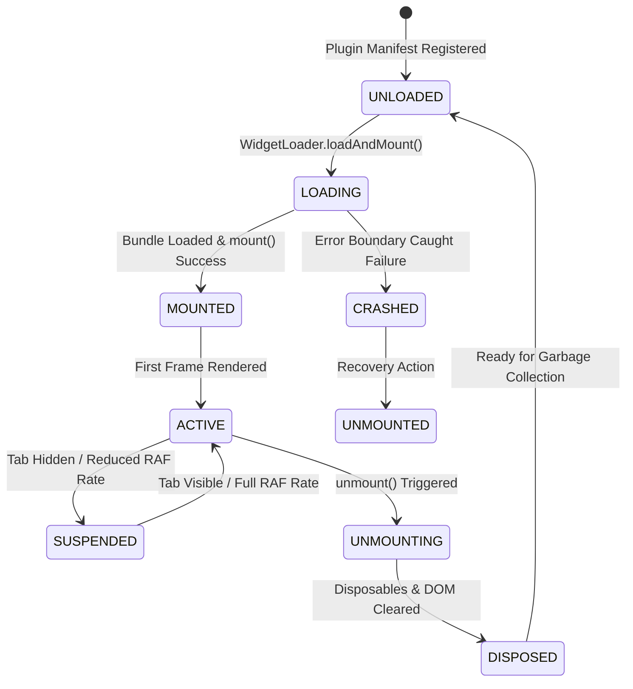
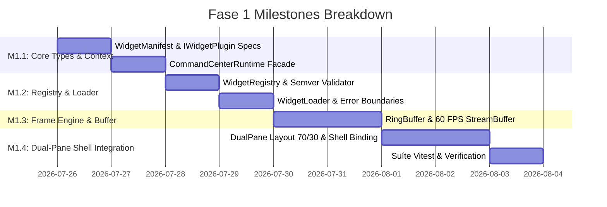

# IRR-001: Implementation Readiness Review & Execution Blueprint

## 1. Visão Geral & Objetivo do IRR

O **Implementation Readiness Review (IRR)** é o portão final de governança que converte os princípios arquiteturais dos **ADRs 040 e 041** e do **RFC-001** em especificações determinísticas e não-ambíguas. 

O objetivo do IRR é eliminar qualquer incerteza de design antes que uma única linha de código da Fase 1 seja escrita, tornando o desenvolvimento uma tarefa de engenharia mecânica, previsível e com taxa de refatoração nula.

---

## 2. Especificação Definitiva de APIs & Tipos

### 2.1 Interface `Disposable` (TC39 Standard)
```typescript
export interface Disposable {
  /** Revoga subinscrições, timers e handlers associados */
  [Symbol.dispose](): void;
  dispose(): void;
}
```

### 2.2 Especificação `WidgetManifest` & `WidgetCapability`
```typescript
export type WidgetCapability =
  | 'telemetry:read'
  | 'court:read'
  | 'causal_timeline:read'
  | 'ui_event:emit'
  | 'ui_event:listen';

export interface WidgetManifest {
  readonly id: string;                           // Identificador único (ex: "chart-widget")
  readonly name: string;                         // Nome legível
  readonly version: string;                      // Semver estrito (ex: "1.0.0")
  readonly minRuntimeVersion: string;            // Versão mínima exigida (ex: "3.4.0")
  readonly targetPane: 'LEFT_PANE' | 'RIGHT_PANE';// Painel de destino no Dual-Pane
  readonly capabilities: ReadonlyArray<WidgetCapability>; // Lista de permissões solicitadas
  readonly realityTag: 'OBSERVED_REALITY' | 'SYNTHETIC_REALITY';
}
```

### 2.3 Interface `IWidgetPlugin` (Contrato Estrutural)
```typescript
export interface IWidgetPlugin {
  readonly manifest: WidgetManifest;
  
  /** Monta o widget dentro do contêiner DOM com a fachada runtime escopada */
  mount(container: HTMLElement, runtime: ICommandCenterRuntime): Promise<void> | void;
  
  /** Desmonta o widget e libera recursos */
  unmount(): Promise<void> | void;
  
  /** Callback opcional acionado na janela de renderização de frame (60 FPS) */
  onSnapshot?(snapshot: Readonly<RuntimeSnapshot>): void;
  
  /** Callback opcional para eventos de interação inter-widget */
  onEvent?(event: Readonly<CausalEvent>): void;
}
```

### 2.4 Interface `ICommandCenterRuntime` (Fachada Unificada)
```typescript
export interface ICommandCenterRuntime {
  readonly widgetId: string;
  readonly mode: 'LIVE' | 'REPLAY';
  
  // Leitura de Snapshots
  getSnapshot(): Readonly<RuntimeSnapshot>;
  subscribeSnapshot(callback: (snapshot: Readonly<RuntimeSnapshot>) => void): Disposable;
  subscribeSlice<T>(
    selector: (snapshot: Readonly<RuntimeSnapshot>) => T,
    callback: (value: T, prevValue: T) => void,
    equalityFn?: (a: T, b: T) => boolean
  ): Disposable;

  // Eventos Inter-Widget Sanitizados
  emitEvent(topic: string, payload: unknown): void;
  subscribeEvent(topic: string, callback: (payload: unknown) => void): Disposable;

  // Validação de Permissões & Telemetria
  hasCapability(capability: WidgetCapability): boolean;
  logTelemetry(metricName: string, value: number): void;
}
```

---

## 3. Especificação da Máquina de Estados do Widget



### Matriz de Transições Válidas

| Estado Origem | Estado Destino | Gatilho / Evento | Pré-condições | Pós-condições |
| :--- | :--- | :--- | :--- | :--- |
| `UNLOADED` | `LOADING` | `loadAndMount(id)` | Manifest válido no `WidgetRegistry` | Dynamic `import()` iniciado |
| `LOADING` | `MOUNTED` | `mount(container, runtime)` | Bundle baixado e `capabilities` verificadas | Elementos DOM injetados no contêiner |
| `MOUNTED` | `ACTIVE` | `onSnapshot()` first frame | Primeiro snapshot renderizado | Widget escutando seletores de frame |
| `ACTIVE` | `SUSPENDED` | `document.visibilityState === 'hidden'` | Aba em segundo plano | Throttling de renderização ativado |
| `SUSPENDED` | `ACTIVE` | `document.visibilityState === 'visible'` | Aba reativada | Restauração de taxa 60 FPS |
| `ACTIVE` | `UNMOUNTING` | User remove widget / Tab switch | Chamada de `unmount()` | Disposables invocados |
| `UNMOUNTING` | `DISPOSED` | Disposables cleared | `[Symbol.dispose]()` executado | Referências limpas para GC |

---

## 4. Catálogo de Erros Institucional

| Código de Erro | Nome do Erro | Descrição & Causa Raiz | Impacto | Estratégia de Recuperação | Severidade |
| :--- | :--- | :--- | :--- | :--- | :--- |
| `ERR_CAPABILITY_DENIED` | Capability Denied | Widget tentou invocar API sem a permissão declarada no manifesto. | Método bloqueado | Lançar exceção controlada no log de auditoria Zero-Trust | **HIGH** |
| `ERR_MANIFEST_INVALID` | Invalid Manifest | Manifesto com ID malformatado ou campos obrigatórios ausentes. | Rejeição no registro | Cancelar registro do plugin | **MEDIUM** |
| `ERR_VERSION_INCOMPATIBLE` | Version Incompatible | `minRuntimeVersion` maior que a versão do runtime hospedeiro. | Rejeição no carregamento | Exibir mensagem de versão incompatível | **MEDIUM** |
| `ERR_WIDGET_CRASH` | Widget Execution Crash | Exceção não tratada dentro de `mount()`, `unmount()` ou `onSnapshot()`. | Widget local afetado | Tratar via `WidgetErrorBoundary` sem afetar widgets vizinhos | **HIGH** |
| `ERR_EPISTEMIC_MIXING` | Epistemic Contamination | Tentativa de misturar `OBSERVED_REALITY` e `SYNTHETIC_REALITY` no mesmo contexto. | Veto de ingestão | Abortar ingestão e disparar alerta de governança | **CRITICAL** |

---

## 5. Orcamento de Performance (Performance Budget)

- **Taxa de Frames (FPS Minimum)**: Mínimo constante de **60 FPS** (janela de renderização $\le 16.6\text{ms}$).
- **Tempo Máximo de Render de Widget**: Mínimo $\le 2\text{ms}$ por widget individual durante a janela de frame.
- **Uso de Memória por Widget**: Mínimo $\le 1.5\text{ MB}$ de heap por instância de plugin.
- **Tempo de Lazy Loading**: $\le 150\text{ms}$ para importar o bundle JS via `dynamic import()`.
- **Throughput do EventBus**: Suporte comprovado a **1.500+ eventos/segundo** com uso de CPU $< 15\%$.

---

## 6. Critérios de Aceitação por Componente (Definition of Done - DoD)

### DoD 1: `IWidgetPlugin` & `WidgetManifest` Types
- [x] Arquivos `.js` e `.d.ts` definidos sem dependências concretas.
- [x] Validação de esquema para os campos do manifesto via `manifestValidator.js`.
- [x] 100% de cobertura nos testes unitários do schema do manifesto.

### DoD 2: `CommandCenterRuntimeFacade`
- [x] Oculta `dashboardRuntimeAdapter` e `dashboardSecurityGuard` sob a fachada opaca `ICommandCenterRuntime`.
- [x] Implementa suporte a subinscrição `subscribeSlice` com comparação rasa de igualdade (*shallow equals*).
- [x] Retorna tokens `Disposable` em todas as subinscrições.

### DoD 3: `WidgetRegistry` & `WidgetLoader`
- [x] Registro com verificação de Semver e prevenção de IDs duplicados.
- [x] Carregamento assíncrono via `dynamic import()`.
- [x] Isolamento de falhas com `WidgetErrorBoundary` local por widget.

### DoD 4: `DualPaneCommandCenterShell`
- [x] Renderiza o layout 70% Left Pane / 30% Right Pane com CSS Grid desacoplado.
- [x] Conecta o `WidgetLoader` para carregar widgets dinamicamente nos painéis correspondentes.
- [x] Imune a quebras ou vazamentos de memória na alternância de abas/módulos.

---

## 7. Milestones Independentes da Fase 1



- **Milestone 1.1**: Tipos & Fachada Runtime (`WidgetSDK`, `WidgetManifest`, `CommandCenterRuntime`).
- **Milestone 1.2**: Registro & Carregador de Plugins (`WidgetRegistry`, `WidgetLoader`, `WidgetErrorBoundary`).
- **Milestone 1.3**: Engine de Stream em 60 FPS (`RingBuffer`, `StreamBuffer`, `requestAnimationFrame`).
- **Milestone 1.4**: Layout Dual-Pane & Testes E2E (`DualPaneCommandCenterShell`, `Vitest`).

---

## 8. Matriz de Riscos Atualizada & Contingências

| Ameaça / Risco | Probabilidade | Impacto | Mitigação Arquitetural | Plano de Contingência | Owner |
| :--- | :--- | :--- | :--- | :--- | :--- |
| **Vazamento de Listeners no EventBus** | Baixa | Alto | Padrão `Disposable` obrigatório no `unmount()`. | Auto-purga de subinscrições via `WeakRef`. | Lead Architect |
| **Gargalo no Event Loop (HFT Ticks)** | Baixa | Crítico | `RingBuffer` debitado a 60 FPS via `requestAnimationFrame`. | Ativação de Backpressure Shedding (Tier 3). | Systems Engineer |
| **Acoplamento Direto aos Serviços Globais** | Nula | Alto | Leitura restrita à fachada opaca `ICommandCenterRuntime`. | Code Review + Veto pelo `DashboardSecurityGuard`. | Security Auditor |

---

## 9. Checklist de Engenharia para Pull Requests (PR Checklist)

- [ ] **[ ] Architecture**: O código consome estritamente `ICommandCenterRuntime` sem importar singletons de backend diretamente?
- [ ] **[ ] Types**: O manifesto do widget inclui `capabilities` e `realityTag` bem definidos?
- [ ] **[ ] Memory**: Todas as subinscrições retornam `Disposable` cancelados no `unmount()`?
- [ ] **[ ] Performance**: A renderização do componente é mantida dentro da janela de frame de 16.6ms (60 FPS)?
- [ ] **[ ] Testing**: Foram adicionados testes unitários com o `MockCommandCenterRuntime`?
- [ ] **[ ] Clean Code**: O arquivo possui menos de 500 linhas de código e cumpre o *Purple Ban*?
