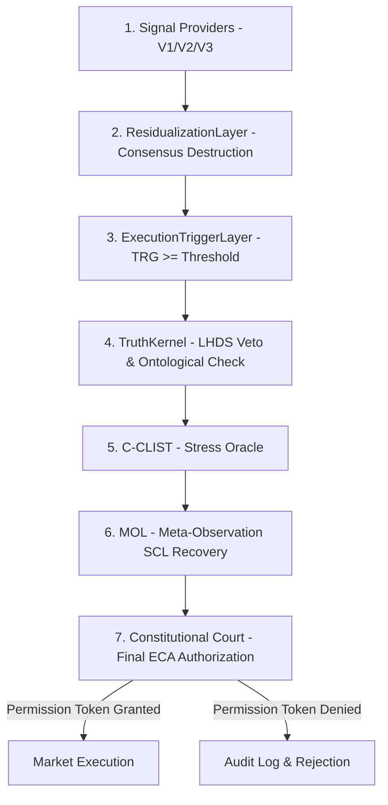

# Pipeline de Decisão Quantitativa (7 Camadas)

Para que uma ordem chegue ao mercado, ela deve obrigatoriamente satisfazer todas as 7 camadas de governança em ordem estrita:

## Resumo das Camadas

1. **Providers (V1/V2/V3)**: Geram propostas de sinal a partir de SMC, SnD e Momentum/RSI.
2. **ResidualizationLayer**: Destrói consensos acidentais entre os provedores para evitar o efeito manada.
3. **ExecutionTriggerLayer**: Exige que a Tail Risk Geometry ($\text{TRG}$) atinja o limiar mínimo (padrão 0.4).
4. **TruthKernel**: Interrompe o fluxo se a divergência de realidade dupla ($\text{LHDS}$) ultrapassar o limite (padrão 0.8) ou se houver colapso ontológico.
5. **C-CLIST**: Acumula estresse de iludibilidade quando a divergência de vetor de liquidez ($\text{DVF}$) estabiliza em níveis rasos, vetando ordens se o acúmulo atingir o `lethalIllusionLimit` (0.9).
6. **MOL (Meta-Observation Layer)**: Exige $N$ ticks consecutivos de estabilidade ($\text{SCL}$) para permitir a transição fora do estado de recuperação (`RECOVERY`).
7. **Constitutional Court**: Gate soberano. Verifica o axioma "The Court shall never learn", valida EEF e emite o `PermissionToken` com o resultado final.
