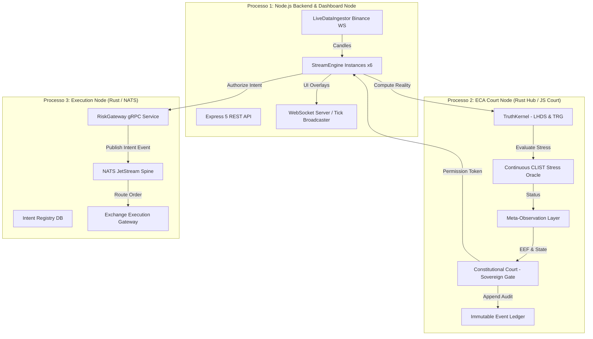

# Visão Geral da Arquitetura — Lyzer Edge

O Lyzer Edge é projetado em torno do princípio da **isolamento de responsabilidades em 3 processos autônomos**, garantindo que a execução financeira nunca seja corrompida por problemas no event loop de I/O ou no painel de controle.

## Descrição dos 3 Processos

1. **Dashboard Node (`Processo 1`)**: Responsável por manter a API REST (porta 7860), orquestrar as instâncias `StreamEngine`, alimentar o WebSocket do frontend e prover a interface visual.
2. **ECA Court Node (`Processo 2`)**: O oráculo de julgamento constitucional. Avalia a Tail Risk Geometry ($\text{TRG}$) e o estresse de iludibilidade ($\text{C-CLIST}$). Opera com independência para vetar qualquer ordem que viole o axioma constitucional.
3. **Execution Node (`Processo 3`)**: O plano de execução de baixa latência em Rust, impulsionado por NATS JetStream e gRPC (`RiskGateway`, `IntentRegistry`).
