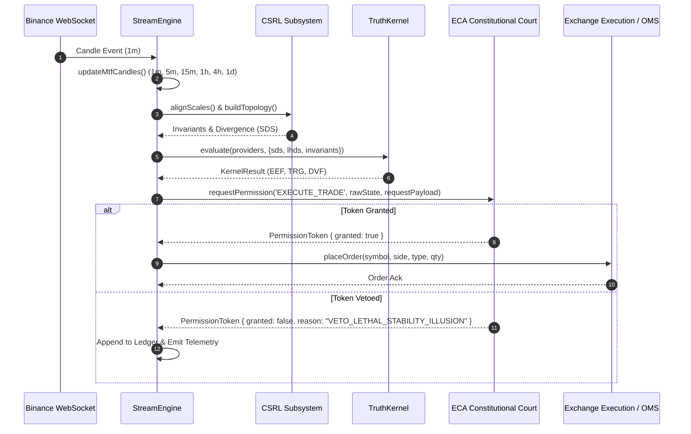

# Diagramas de Sequência — Lyzer Edge

## 1. Fluxo de Processamento de Tick (`processCandle`)

```mermaid
sequenceDiagram
    autonumber
    participant WS as Binance WebSocket
    participant SE as StreamEngine
    participant CSRL as CSRL Subsystem
    participant TK as TruthKernel
    participant COURT as ECA Constitutional Court
    participant EXEC as Exchange Execution / OMS

    WS->>SE: Candle Event (1m)
    SE->>SE: updateMtfCandles() (1m, 5m, 15m, 1h, 4h, 1d)
    SE->>CSRL: alignScales() & buildTopology()
    CSRL-->>SE: Invariants & Divergence (SDS)
    SE->>TK: evaluate(providers, {sds, lhds, invariants})
    TK-->>SE: KernelResult (EEF, TRG, DVF)
    SE->>COURT: requestPermission('EXECUTE_TRADE', rawState, requestPayload)
    alt Token Granted
        COURT-->>SE: PermissionToken { granted: true }
        SE->>EXEC: placeOrder(symbol, side, type, qty)
        EXEC-->>SE: Order Ack
    else Token Vetoed
        COURT-->>SE: PermissionToken { granted: false, reason: "VETO_LETHAL_STABILITY_ILLUSION" }
        SE->>SE: Append to Ledger & Emit Telemetry
    end
```
