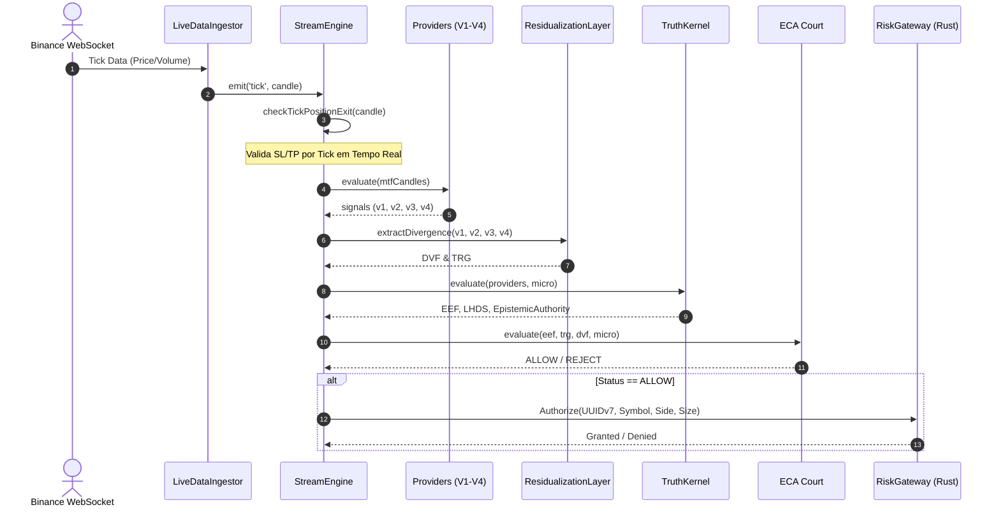

# ⚡ Lyzer Edge — Fluxo de Execução

## 🔄 Ciclo de Vida do Tick ao Sinal de Execução

---

## 🔗 Links Relacionados
- 🏗️ [Arquitetura](architecture.md)
- 🔄 [Ciclo de Vida do Sistema](system-lifecycle.md)
