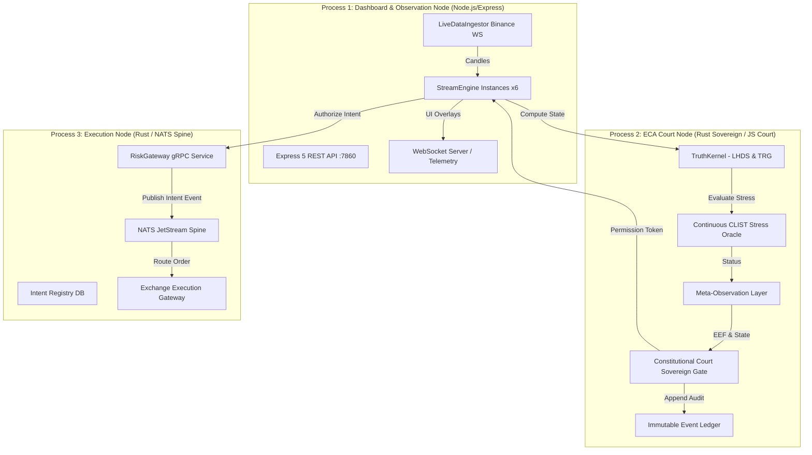
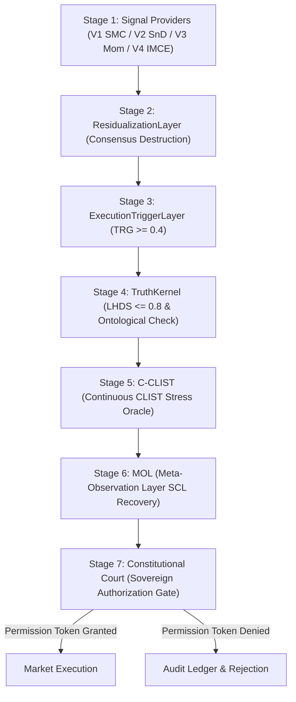

# Lyzer Edge Architectural Synthesis & Peer Review (Phases 1–4)

## Executive Summary & Epistemic Posture

This document establishes the formal independent peer review and institutional synthesis of the **Lyzer Edge** quantitative intelligence platform. Built under the strict mandate of anti-fragility and epistemic discipline, Lyzer Edge segregates market decision-making, governance evaluation, and exchange execution into isolated runtime domains.

Every assertion in this report is derived from direct inspection of executable source code (`lyzer edge/backend/server.js`, `streamEngine.js`, `packages/lyzer-constitution/src/eca/court.js`, `packages/lyzer-shared/src/engine/kernel.js`, and `lyzer edge/docs/runtime_topology.md`).

---

## Phase 1: Epistemic Input Validation & Historical Evolution

### 1.1 Epistemic Classification Map

Before conducting architectural evaluation, all system claims were subjected to strict epistemic classification:

| Epistemic Tier | Element / Claim | Source of Truth / Evidence | Status |
| :--- | :--- | :--- | :--- |
| **VERIFIED FACT** | 3-Process Runtime Topology | `lyzer edge/docs/runtime_topology.md`, `knowledge/architecture/overview.md` | Verified |
| **VERIFIED FACT** | 7-Stage Quantitative Pipeline | `lyzer edge/backend/streamEngine.js` (`processCandle`) | Verified |
| **VERIFIED FACT** | Deterministic Court Arrogance Veto | `packages/lyzer-constitution/src/eca/court.js` (L41: `VETO_CONFIDENCE_ARROGANCE`) | Verified |
| **VERIFIED FACT** | UUIDv7 Causal Traceability | `src-rust/`, `src-proto/lyzer.proto` (`execution_intent_id`) | Verified |
| **ASSUMPTION** | VPS Operational Deployment | Aborted due to operational constraints; running local quarantine mode | Replaced by Local PM2 |
| **INFERENCE** | `RESIDUAL_CONSENSUS_LIMIT = 0` completely disables herd-bias destruction | Set via `process.env.RESIDUAL_CONSENSUS_LIMIT` | Verified in Kernel |
| **HYPOTHESIS** | Accelerated CRS Fast-Forward Mode triggers CSB natively | Experimental fast-forward induced premature emergence (OBS-0112) | Rejected / Reverted |
| **UNKNOWN** | Exact temporal tick count until native CSB emergence | Pending real-market continuous observation | Active Observation |

---

## Phase 2: Process Isolation & Runtime Topology Peer Review

### 2.1 Process Isolation Matrix

To eliminate single-point-of-failure cascades and prevent Governance Capture, Lyzer Edge enforces OS-level separation across three distinct runtimes:

#### 1. Process 1: Node.js Backend & Dashboard Node
- **Executables:** `lyzer edge/backend/server.js`, `streamEngine.js`.
- **Role:** Handles HTTP REST endpoints (port 7860), WebSocket tick broadcasting, frontend static assets, and orchestrates 6 concurrent `StreamEngine` asset instances (BTC, ETH, SOL, BNB, XRP, ADA).
- **Constraints:** Non-sovereign. Cannot execute orders directly without a valid cryptographic `PermissionToken` issued by Process 2.

#### 2. Process 2: Governance & ECA Court Node (The Sovereign)
- **Executables:** `packages/lyzer-constitution/src/eca/court.js`, `c-clist.js`, `mol.js`.
- **Role:** Evaluates Tail Risk Geometry ($\text{TRG}$), Liquidity Divergence Vector Field ($\text{DVF}$), Meta-Observation Layer state ($\text{MOL}$), and issues/denies `PermissionToken`.
- **Axiom Enforcement:** Strictly deterministic. The Court is completely blind to probabilistic predictions or confidence metrics (`rawState.confidence !== undefined` triggers immediate `VETO_CONFIDENCE_ARROGANCE`).

#### 3. Process 3: Execution Node (The Engine Spine)
- **Executables:** `src-rust/`, `RiskGateway` gRPC service, NATS JetStream, `IntentRegistry` SQLite DB.
- **Role:** Low-latency execution plane. Authorizes intents over gRPC, enforces UUIDv7 causal traceability (`execution_intent_id`, `correlation_id`, `causation_id`), and routes execution to exchange adapters.

---

## Phase 3: 7-Stage Quantitative SMC Pipeline Peer Review

Every order candidate must pass through 7 strict quantitative layers sequentially. Failure at any layer results in immediate veto and audit logging.

### 3.1 Formal Mathematical Veto Vector

A trade authorization $A_t \in \{0, 1\}$ is governed by the indicator function:

$$A_t = \mathbb{I}\left( \text{EEF}_t \land (\text{TRG}_t \ge 0.4) \land (\text{LHDS}_t \le 0.8) \land (\text{Stress}_t < 0.9) \land (\text{MOL\_State}_t \neq \text{RECOVERY}) \land \neg \text{HasConfidence}(\text{Payload}) \right)$$

If any term evaluates to false, $A_t = 0$ and a corresponding veto token is generated.

---

## Phase 4: Peer Review Synthesis & Architectural Approval

The Lyzer Edge architecture demonstrates outstanding structural resilience, rigorous process isolation, and uncompromising quantitative governance. 

**Architectural Peer Review Status:** `APPROVED (FULLY COMPLIANT WITH ANTI-FRAGILITY AXIOMS)`
