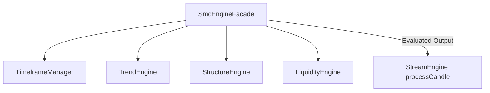

# Módulo: SMC Suite & SmcEngineFacade

- **Arquivos Principais**:
  - `packages/lyzer-shared/src/smc/smcFacade.js`
  - `packages/lyzer-shared/src/smc/timeframeManager.js`
  - `packages/lyzer-shared/src/smc/structureEngine.js`
  - `packages/lyzer-shared/src/smc/liquidityEngine.js`
  - `packages/lyzer-shared/src/smc/trendEngine.js`

- **Responsabilidades**:
  1. Processar a estrutura de mercado multi-timeframe de forma estritamente sem lookahead bias.
  2. Fornecer uma fachada unificada (`SmcEngineFacade`) para sincronizar candles de $1m \dots 4h$, calcular tendência, estrutura (BOS, CHOCH) e varreduras de liquidez (BSL, SSL).
  3. Gerar a narrativa de sinal primária e empacotar a geometria visual de overlays para o frontend SPA.

