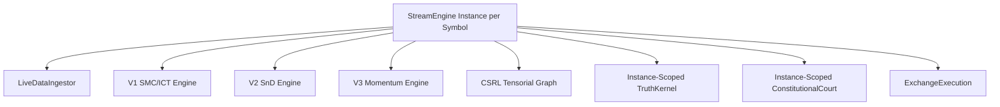

# Módulo: StreamEngine

- **Arquivo Principal**: [streamEngine.js](file:///c:/Users/WDAGUtilityAccount/Downloads/projeto/lyzer%20edge/backend/streamEngine.js)
- **Tamanho**: 763 linhas de código.
- **Responsabilidades**:
  1. Ingerir klines via WebSocket ou simulação sintética.
  2. Manter buffers multi-timeframe de candles (`1m` até `1d`).
  3. Acionar reconstruções de sinal de provedores V1/V2/V3.
  4. Invocar o subsistema CSRL para alinhar tensores.
  5. Solicitar decisão ao `TruthKernel` escopado da instância e permissão à sua `ConstitutionalCourt` isolada.
  6. Orquestrar entradas, parciais e saídas via `ExchangeExecution`.
  7. Prevenir corridas no loop simulado via flag `isFallbackActive`.
  8. Disparar atualizações em tempo real para a UI e alertas do Telegram.

## Configurações de Variáveis de Ambiente
- `ARL_MODE`: `SIMULATION` | `TESTNET` | `LIVE`
- `TRG_THRESHOLD`: Limiar de Tail Risk (default 0.4)
- `RESIDUAL_CONSENSUS_LIMIT`: Limite de destruição de consenso (default 0.1)
- `LHDS_VETO_LIMIT`: Limite de veto por divergência dupla (default 0.8)
- `ADMIN_API_KEY`: Chave de API para autenticação de requisições administrativas HTTP em `server.js`.
