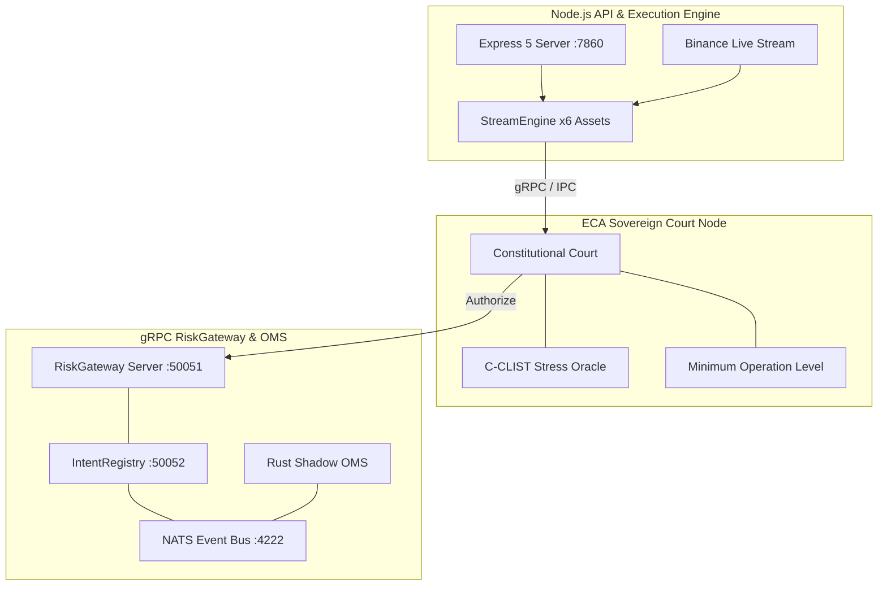

# 🌐 Lyzer Edge — Overview do Sistema

O **Lyzer Edge** é uma plataforma quantitativa de inteligência de mercado, execução algorítmica e governança constitucional adaptativa de classe institucional. O sistema opera sob um modelo de **3 processos isolados** e um pipeline de execução quantitativa em **7 camadas**, projetado com o princípio fundamental da **anti-fragilidade**.

---

## 🎯 Objetivos do Sistema

1. **Destruição da Falsa Estabilidade**: Nullificação de consenso falso entre provedores através do *Streaming Consensus Residualization* (SCD) e extração de *Divergence Vector Field* (DVF).
2. **Soberania Epistêmica**: Avaliação contínua da realidade via *Dual Reality Monitoring* e *Local Topological Divergence Score* (LHDS).
3. **Governança Constitucional**: Filtragem de ordens por regras invioláveis no *ECA Court* (C-CLIST e MOL) e validação final via *RiskGateway* gRPC.
4. **Execução de Baixa Latência**: Processamento determinístico com isolamento entre ingestão de mercado, decisão algorítmica e observabilidade.

---

## 🏛️ Topologia em 3 Processos Isolados

---

## 🔗 Links Relacionados
- 🏗️ [Arquitetura](architecture.md)
- 🗺️ [Mapa do Projeto](project-map.md)
- ⚡ [Fluxo de Execução](execution-flow.md)
- 📊 [Snapshot](snapshot.md)
