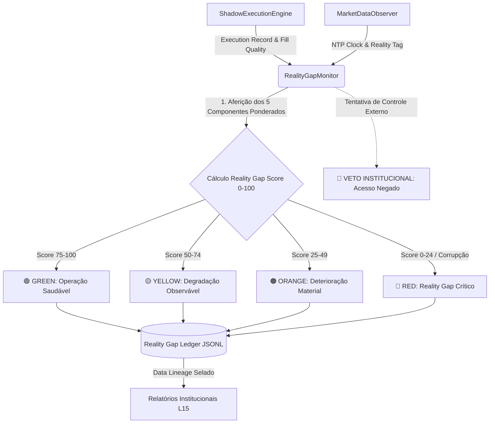

# 🏛️ REALITY GAP MONITOR — ARCHITECTURE & DOCTRINE (L15 FASE 3)

**Autoridade Fiduciária:** Lyzer Orchestrator (CIO/CRO) & Lyzer Guardian (SRE/Principal Architect)  
**Escopo:** Camada institucional de aferição da degradação e divergência microestrutural do Lyzer Edge L15.

---

## 1. Doutrina Institucional (O Sensor Invariante)
O `RealityGapMonitor` atua perante uma premissa fundamental: no mundo financeiro institucional, a degradação de performance em produção quase nunca advém da "perda repentina de Alpha", mas sim do aumento gradual da **fricção microestrutural** entre a teoria matemática do modelo e a física mecânica da bolsa.
O objetivo deste módulo é responder contínua e inegociavelmente:
> *"A distância entre aquilo que o sistema esperava teoricamente e aquilo que o mundo físico entregou está aumentando?"*

Sob a **Lei Suprema do Alpha Freeze**:
- O Reality Gap Monitor é um **SENSOR**. Ele observa, mede e documenta. Ele **NÃO** controla.
- É categoricamente proibido criar laços de retroalimentação (feedback loops) entre o Reality Gap e os parâmetros internos do Alpha Core (`TruthKernel`, `V4 IMCE`, `SMC Engine`, `Regime Engine`).

---

## 2. Diagrama Arquitetural e Fluxo de Dados

---

## 3. Fórmulas Ponderadas do Reality Gap Score (0-100)
O escore final é uma combinação linear ponderada de 5 sensores independentes de fricção física:

\[
\text{RealityGapScore} = (C_1 \times 0.30) + (C_2 \times 0.25) + (C_3 \times 0.20) + (C_4 \times 0.15) + (C_5 \times 0.10)
\]

Onde:
1. **$C_1$ — Execution Quality Deviation (30%):** Aderência direta do fill simulado face à ordem hipotética. Rejeições mecânicas (spread abusivo ou falta de liquidez) zeram este componente.
2. **$C_2$ — Slippage Divergence (25%):** Penalização quadrática sobre o slippage extra em relação ao limiar teórico de 0.10%. Cada 1% de desvio corta 50 pontos deste índice.
3. **$C_3$ — Liquidity Degradation (20%):** Avalia a profundidade do livro e o impacto quadrático de mercado absorvido pela ordem.
4. **$C_4$ — Latency Impact (15%):** Penaliza atrasos de propagação de rede acima de 50ms (cortando 1 ponto a cada 10ms adicionais).
5. **$C_5$ — Data Integrity (10%):** Mede a confiabilidade do NTP e a sincronia temporal via `ClockIntegrityMonitor`. Em caso de relógio no futuro (`HALT`), este índice é 0, forçando o semáforo geral para `RED`.

---

## 4. Separação Observação vs. Decisão
Para garantir que o Lyzer Edge não caia na armadilha de "overfitting em produção" (ajustar heurísticas para esconder custos de transação), o módulo implementa barreiras arquiteturais de **VETO**:
- Quaisquer métodos como `changeCapitalAllocation()` ou `modifyAlpha()` lançam exceções fatais:  
  `"🚨 [REALITY GAP VETO] Reality Gap Monitor possui permissão exclusivamente observacional."`
- Nenhuma ação automática de corte ou remanejamento de portfólio é executada pelo monitor. Ele entrega a telemetria pura ao Comitê Executivo e aos relatórios de auditoria.

---

## 5. Limitações Conhecidas
1. **Natureza Discreta dos Snapshots:** Como a aferição depende da amostragem periódica de snapshots do `MarketDataObserver`, eventos de *flash crash* ou evaporação ultrarrápida de liquidez intra-snapshot (<10ms) podem ser computados no evento subsequente.
2. **Dependência do Motor Sombra:** O cálculo de impacto de mercado depende da acurácia contábil do `ShadowExecutionEngine`. Se a exchange alterar as regras de tick size ou taxas de corretagem sem aviso no feed, haverá um gap temporário até a atualização dos schemas de observação.
