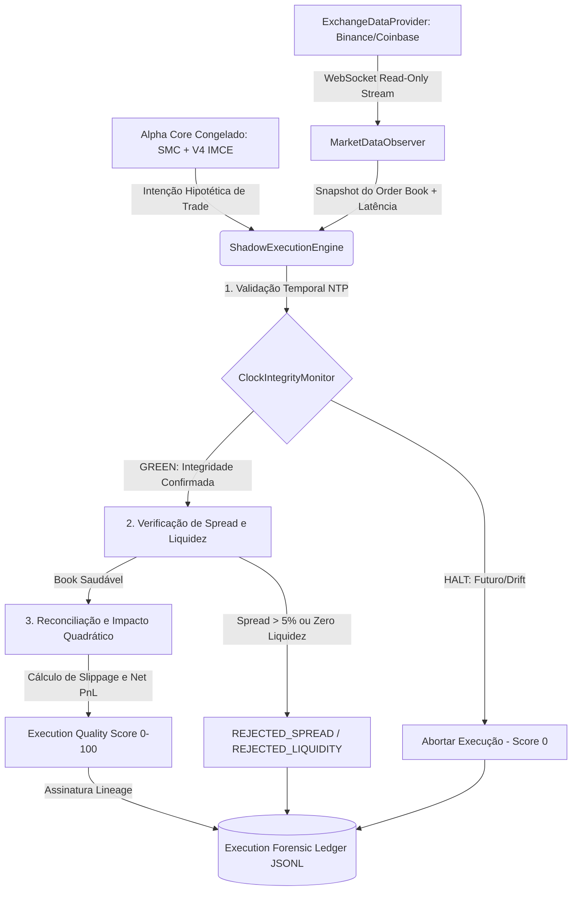

# 🕶️ SHADOW EXECUTION ENGINE — ARCHITECTURE & DOCTRINE (L15 FASE 2)

**Autoridade Fiduciária:** Lyzer Orchestrator (CIO/CRO) & Lyzer Guardian (SRE/Principal Architect)  
**Escopo:** Camada de reconciliação microestrutural observacional para simulação contábil em tempo real do Lyzer Edge L15.

---

## 1. Doutrina do Motor (O Fosso Epistemológico)
O `ShadowExecutionEngine` foi projetado para responder a uma única pergunta com honestidade matemática e sem ilusões de laboratório:
> *"Se o Alpha tivesse enviado esta ordem no mundo real neste instante, qual teria sido o resultado líquido após todas as fricções físicas de spread, liquidez, impacto e latência?"*

O motor atua sob a **Lei Suprema do Alpha Freeze**: ele observa a microestrutura viva consumida pelo `MarketDataObserver` e calcula as fricções hipotéticas, mas possui **zero capacidade física de envio de ordens** e **zero permissão para mutar, otimizar ou alimentar de volta o Alpha Core**.

---

## 2. Fluxo de Dados Observacional

---

## 3. Isolamento do Alpha Core (The Alpha Observation Firewall)
A maior causa de falha em sistemas que avançam para simulações ao vivo é o *feedback loop ilícito*: o modelo percebe o slippage ou a latência observada e altera seus pesos internos ou limiares de confiança para se adaptar ao mercado em tempo real durante a certificação.
No Lyzer Edge L15:
- Todo acesso ao Alpha é empacotado em um Proxy via `AlphaObservationFirewall`.
- O motor de execução sombra é consumidor passivo de intenções hipotéticas (`evaluateSignal`).
- Qualquer tentativa de invocação de métodos como `updateWeights()`, `setParameter()` ou mutação de estado dispara uma exceção de VETO institucional e alarme forense.
- **Doutrina:** *"O sistema pode observar. O sistema pode medir. O sistema pode simular execução. O sistema NÃO pode aprender."*

---

## 4. Diferença Entre Simulação de Laboratório (L14) e Execução Sombra (L15)

| Dimensão | Simulação L14 (Laboratório) | Execução Sombra L15 (Live Shadow) |
| :--- | :--- | :--- |
| **Origem dos Preços** | Geradores estocásticos (`sin waves`, random walk) | Streams WebSocket 24/7 físicos (`BinanceProvider`, `CoinbaseProvider`) |
| **Slippage & Impacto** | Percentual estático ou linear (1% a 3%) | Reconciliação contra *Order Book Snapshot* físico (Volume Bid/Ask vs Tamanho da Ordem) |
| **Integridade do Relógio** | Relógio simulado monótono e sem desvios | Validação NTP contínua via `ClockIntegrityMonitor` (corte falha-fechada para drift >1000ms ou futuro >100ms) |
| **Tag Regimental** | `[SOURCE: SYNTHETIC_REALITY]` | **`[SOURCE: OBSERVED_REALITY]`** |
| **Gestão de Rejeições** | Rara (assumindo liquidez infinita no preço do bar) | Realista (`REJECTED_LIQUIDITY`, `REJECTED_SPREAD`, `HALTED_CLOCK`) |

---

## 5. Limitações Conhecidas e Escopo Fiduciário
1. **Ausência de Queue Position Real:** Em um order book real, ordens limitadas dependem da sua posição na fila FIFO. Como o Live Shadow não envia ordens físicas ao livro da exchange, o motor calcula o preenchimento assumindo agressão a mercado (ordens a mercado / taker) ou avaliando a liquidez visível na primeira camada do livro para ordens limitadas.
2. **Latência de Retorno de Confirmação:** No mundo físico, há latência de ida da ordem até o match engine da bolsa e latência de volta do aviso de preenchimento. O motor estima essa fricção através da latência de recepção do feed (`latencyCostMs`) multiplicada por um fator de segurança 2x.
3. **Não-Atuação Exclusiva:** O **Execution Quality Score (0-100)** gerado a cada execução serve exclusivamente para relatórios e acionamento de alertas de degradação da microestrutura. Ele **não controla alocação de capital financeiro físico** nem abre posições reais.
