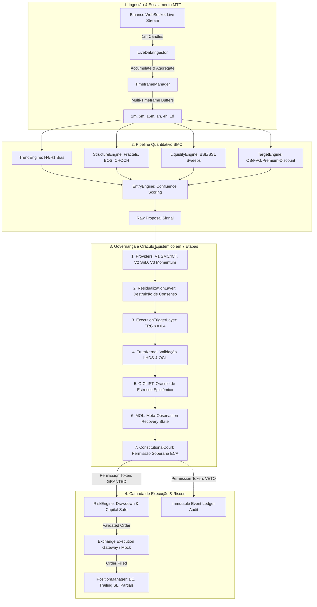

# Etapa 1 & 4 — Mapeamento da Arquitetura Runtime Real e Verificação de Microestrutura

- **Projeto**: Lyzer Edge
- **Auditor**: Guardião da Arquitetura & Principal Quant Auditor (`@[lyzer-guardian]`)
- **Data da Auditoria**: 2026-07-24
- **Modo Ativo**: `TESTNET` / `SIMULATION` (Configurado em `lyzer edge/.env`)

---

## 1. Mapeamento da Arquitetura Real em Runtime

Diferente do diagrama conceitual genérico, a inspeção empírica do código executável (`server.js`, `streamEngine.js`, `kernel.js`, `court.js`) revela o fluxo real executado por tick:

---

## 2. Inventário de Componentes e Feature Flags

| Componente | Arquivo de Código | Estado em Runtime | Escopo |
|---|---|---|---|
| **StreamEngine** | `lyzer edge/backend/streamEngine.js` | ATIVO | 6 Instâncias Isoladas (BTC, ETH, SOL, BNB, XRP, ADA) |
| **TimeframeManager** | `packages/lyzer-shared/src/smc/timeframeManager.js` | ATIVO | Timeframes: `1m`, `5m`, `15m`, `1h`, `4h`, `1d` |
| **TrendEngine** | `packages/lyzer-shared/src/smc/trendEngine.js` | ATIVO | Consenso H4/H1 Bias |
| **StructureEngine** | `packages/lyzer-shared/src/smc/structureEngine.js` | ATIVO | Estrutura de Mercado: Swing Highs/Lows, BOS, CHOCH |
| **LiquidityEngine** | `packages/lyzer-shared/src/smc/liquidityEngine.js` | ATIVO | Zonas BSL/SSL, Sweeps, EQH/EQL |
| **TruthKernel** | `packages/lyzer-shared/src/engine/kernel.js` | ATIVO | Instanciado por `StreamEngine` |
| **ConstitutionalCourt** | `packages/lyzer-constitution/src/eca/court.js` | ATIVO | Instanciado por `StreamEngine` |
| **CausalMemoryDB** | `lyzer edge/backend/db.js` | ATIVO | SQLite WAL Mode (`historical_causal_memory.db`) |
| **RiskGateway** | `lyzer edge/src-rust/` (gRPC) | EM MODALIDADE SIMULADA | Chamadas via gateway local/mock |

---

## 3. Resposta de Verificação de Granularidade Temporal (Etapa 4)

- **Pergunta**: *Qual timeframe REAL o sistema utiliza em runtime? Ticks? 5 segundos? 1 minuto?*
- **Evidência do Código (`StreamEngine.js` & `liveDataIngestor.js`)**:
  - O gatilho primário de execução (`processCandle`) é acionado a **cada fechamento de candle de 1 minuto (`1m`)** vindo do WebSocket da Binance (`@kline_1m`).
  - O sistema agrupa dinamicamente os candles de `1m` nos buffers sintéticos de `5m`, `15m`, `1h`, `4h` e `1d` via `TimeframeManager`.
  - **Conclusão**: O sistema opera em **frequência de 1 minuto (`1m`) com análise multi-timeframe sincronizada sem lookahead bias**, e **não em alta frequência sub-segundo (HFT de microsegundos)** na camada JavaScript.
