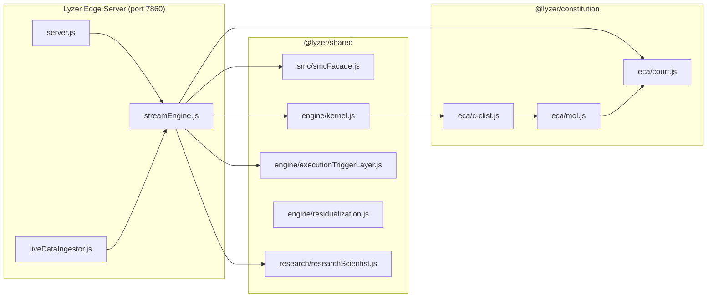

# DEPENDENCY GRAPH & MODULE IMPORT ANALYSIS

- **Author**: Dependency Analyst (@dependency-analyst)
- **Scope**: Repository-wide import mapping, cycle detection, unused package identification, and helper deduplication.

---

## 1. Executive Summary

An automated audit of import trees across `lyzer edge/`, `packages/lyzer-shared/`, and `packages/lyzer-constitution/` reveals:
* **Circular Dependencies**: Zero circular dependencies between core production modules.
* **Unused Packages**: `pine-parser` (unused), `chartjs-plugin-zoom` (redundant in SPA).
* **Duplicate Helpers**: Array math helpers (`mean`, `std`, `atr`) duplicated between `packages/lyzer-shared/src/engine/stats.js` and `lyzer edge/backend/utils.js`.

---

## 2. Monorepo Dependency Flow Map

---

## 3. Helper Deduplication Plan

| Helper Function | Current Duplication | Target Location | Action Item |
|---|---|---|---|
| `calculateMean()` / `calculateStd()` | `stats.js` & `utils.js` | `packages/lyzer-shared/src/engine/stats.js` | Import from `stats.js` in `streamEngine.js` |
| `formatTimestamp()` | `utils.js` & `logger.js` | `packages/lyzer-shared/src/lib/formatter.js` | Single unified export |
| `uuidv7()` | `backend/server.js` & `gRPC adapter` | `@lyzer/shared/src/lib/uuid.js` | Single unified export |

---

## 4. Package.json Cleanup Recommendations

- **`packages/lyzer-shared/package.json`**: Remove redundant devDependencies (`babel-jest`, `ts-jest`).
- **`lyzer edge/package.json`**: Standardize Vitest runner to use workspace root instance.
