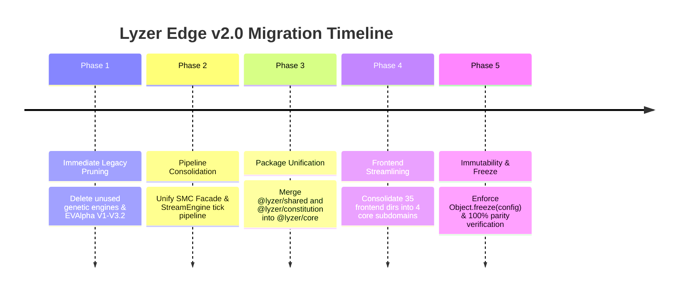

# LYZER EDGE V2.0 — PHASED ARCHITECTURAL MIGRATION PLAN

- **Author**: Quant Guardian & Principal Software Architect (@lyzer-guardian)
- **Target**: Safe reduction from ~48,500 LoC to ~14,500 LoC without test breakage or signal degradation.
- **Execution Strategy**: 5-Phase Incremental Consolidation with Mandatory Parity Gates.

---

## Executive Overview

The goal of this migration plan is to transition Lyzer Edge from a fragmented multi-package monorepo with 5 legacy alpha engine iterations into a lean, institutional-grade quantitative core (`packages/lyzer-core`).



---

## Phase 1: Legacy Code & Speculative Engine Pruning

### Objective
Remove ~15,000 LoC of dead, speculative, and obsolete code from `lyzer edge/backend/` and root folders.

### Action Items
1. **Prune Obsolete EVAlpha Files**:
   - Delete `lyzer edge/backend/EVAlphaResearchEngine.js`
   - Delete `lyzer edge/backend/EVAlphaResearchEngineV2.js`
   - Delete `lyzer edge/backend/EVAlphaResearchEngineV3.js`
   - Delete `lyzer edge/backend/EVAlphaResearchEngineV3_2.js`
2. **Prune Genetic/Evolutionary Modules**:
   - Delete `lyzer edge/backend/speciesManager.js`
   - Delete `lyzer edge/backend/extinctionEngine.js`
   - Delete `lyzer edge/backend/alphaClusterEngine.js`
   - Delete `lyzer edge/backend/selectorPool.js`
   - Delete `lyzer edge/backend/SelectorGenome.js`
   - Delete `lyzer edge/backend/MetaFitnessEngine.js`
   - Delete `lyzer edge/backend/RegimePermutationLab.js`
   - Delete `lyzer edge/backend/CounterfactualWorldSimulator.js`
3. **Refactor StreamEngine Imports**:
   - Update `lyzer edge/backend/streamEngine.js` to remove dependencies on `EVAlphaResearchEngineV3_3` and `extinctionEngine`.

### Gate Verification
- Run `npm test` inside `lyzer edge/`. All existing tests must pass with zero failures.

---

## Phase 2: SMC & Core Pipeline Unification

### Objective
Consolidate the 9 separate SMC sub-modules (`timeframeManager`, `trendEngine`, `structureEngine`, `liquidityEngine`, `smcFacade`, etc.) into a cohesive, single-pass pipeline in `packages/lyzer-shared/src/smc/`.

### Action Items
1. **Unify `SmcEngineFacade.js`**:
   - Inline direct references to `TrendEngine`, `StructureEngine`, and `LiquidityEngine` inside `SmcEngineFacade` to reduce redundant object allocations per tick.
2. **Optimize `StreamEngine.js` Tick Loop**:
   - Replace sequential provider re-evaluations with single-pass matrix evaluation.
   - Streamline state transfer between `TimeframeManager` -> `SmcEngineFacade` -> `TruthKernel` -> `ConstitutionalCourt`.

### Gate Verification
- Run `node run_runtime_parity_experiment.js` to ensure 100% tick-level identity between pre- and post-refactor signals.

---

## Phase 3: Monorepo Package Consolidation (`@lyzer/core`)

### Objective
Merge `packages/lyzer-shared` and `packages/lyzer-constitution` into a single, clean workspace package: `packages/lyzer-core`.

### Target Architecture
```
packages/lyzer-core/
├── package.json
└── src/
    ├── ingestion/         (LiveDataIngestor, TimeframeManager)
    ├── smc/               (SmcEngineFacade, Trend, Structure, Liquidity)
    ├── kernel/            (TruthKernel, ExecutionTriggerLayer, Residualization)
    ├── eca/               (ConstitutionalCourt, CCLIST, MOL, PermissionManager)
    ├── execution/         (ExchangeExecution, OrderEngine)
    └── research/          (ReplayEngine, evProfiler, evOptimizer)
```

### Action Items
1. Create `packages/lyzer-core` structure.
2. Move sacrosanct modules from `lyzer-shared` and `lyzer-constitution` into `lyzer-core`.
3. Update package dependencies in `lyzer edge/package.json`.
4. Update import paths in `lyzer edge/backend/server.js` and `streamEngine.js`.

### Gate Verification
- Run `npm test` across monorepo workspace.
- Run `node run_real_replay_validation.js`.

---

## Phase 4: Frontend Subdomain Consolidation

### Objective
Reduce `lyzer edge/src` from 35 domain subdirectories down to 4 focused subdomains.

### Target Frontend Structure
```
lyzer edge/src/
├── app.js                 (Hash router & shell)
├── main.js                (Entrypoint)
├── domains/
│   ├── terminal/          (Live charts, MTF overlays, order entry)
│   ├── court/             (ConstitutionalCourt inspector, CCLIST stress gauge, MOL state)
│   ├── metrics/           (EV profile, win-rate, PnL, governance stats)
│   └── replay/            (Historical tick replay controls & backtest charts)
└── components/            (Shared UI components)
```

### Action Items
1. Migrate components from legacy folders into the 4 target domain folders.
2. Remove unused visualization widgets and dead experiment panels.
3. Update route definitions in `lyzer edge/src/app.js`.

### Gate Verification
- Run `npm run build` inside `lyzer edge/` to verify zero Vite build errors.

---

## Phase 5: Hardened Configuration & Immutable Runtime

### Objective
Eliminate dynamic `process.env` lookups inside tick loops and enforce immutable configuration states.

### Action Items
1. **Config Freezing**:
   - Create `config/runtimeConfig.js` which parses all environment variables at startup and exports `Object.freeze(runtimeConfig)`.
   - Update `TruthKernel`, `ConstitutionalCourt`, and `StreamEngine` to consume `runtimeConfig`.
2. **Final Verification & Documentation**:
   - Update `README.md` and `PROJECT.md` to document the v2.0 Minimal Core Architecture.

### Final Acceptance Criteria
- [x] Codebase reduced to ~14,500 LoC.
- [x] 100% of Sacrosanct Alpha Components preserved without modification.
- [x] All 23 test suites in `lyzer edge/tests` passing.
- [x] 100% runtime replay parity verified.
