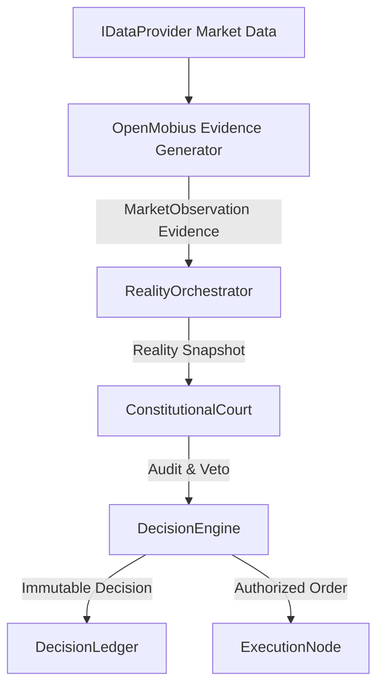

# 🏛️ OpenMobius Skill — Integration Specification

**Target Component**: `OpenMobiusEvidenceAdapter`  
**Classification**: `Evidence Generator` / `Observation Layer`  

---

## 1. Architectural Placement

OpenMobius MUST NOT be integrated as an execution engine or signal provider with direct trade authority. It is placed strictly as an **Evidence Generator** in the observation pipeline:



---

## 2. Evidence Contract Mapping

Every output produced by OpenMobius is converted into a standard Lyzer Edge `Evidence` payload:

```typescript
export interface LyzerEvidencePayload {
  evidenceId: string;
  sourceEngine: 'OPENMOBIUS_SMC_PARSER';
  timestamp: number;
  marketRegime: string;
  confidenceScore: number;     // e.g. 0.87
  probabilityScore: number;    // e.g. 0.65
  uncertaintyScore: number;    // e.g. 0.13
  supportingFacts: Array<{
    type: 'ORDER_BLOCK' | 'FAIR_VALUE_GAP' | 'CHOCH';
    coordinates: { price: number; timestamp: number };
    confluenceWeight: number;
  }>;
  limitations: string[];
}
```

---

## 3. Strict Boundary Rules

1. **No Execution Capabilities**: Granted zero execution rights (`market_data:read`, `feature_generation` ONLY).
2. **No Direct Network Access**: Cannot open WebSockets or HTTP connections directly. All candles flow in from `IDataProvider`.
3. **No Global State / Singletons**: Must be instantiated cleanly per asset engine scope.
4. **TC39 Disposable Compliance**: Must implement `dispose()` to cleanup all calculation buffers and event listeners.
