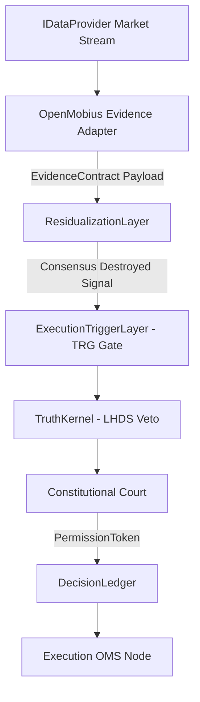

# 🏛️ RFC-002 — Cognitive Coprocessor & Probabilistic Evidence Pipeline

**Status**: PROPOSED & APPROVED  
**Author**: Principal Software Architect & Quant Engineer  

---

## 1. Summary

RFC-002 defines the formal specification for embedding specialized cognitive coprocessors (such as the **OpenMobius SMC/ICT Structure Analyzer**) into the **Lyzer Edge** quantitative pipeline.

Coprosessors process raw market data streams (`OBSERVED_REALITY`) and emit standardized, signed `EvidenceContract` payloads (`INFERRED_REALITY`).

---

## 2. Pipeline Flow Diagram

---

## 3. Epistemic Output Schema

Every coprocessor MUST format its output according to the `EvidenceContract` JSON Schema:
- `evidenceId`: UUIDv7 timestamped identifier.
- `sourceEngine`: Engine ID tag.
- `evidenceMetrics`: `{ confidence, probability, uncertainty, signalQuality, signalDecayHalfLifeMs }`.
- `provenance`: `{ source, realityTag: 'INFERRED_REALITY', minRuntimeVersion, attestationHash }`.
- **PROHIBITED**: `side`, `action`, `buy`, `sell`, `order_type`.
