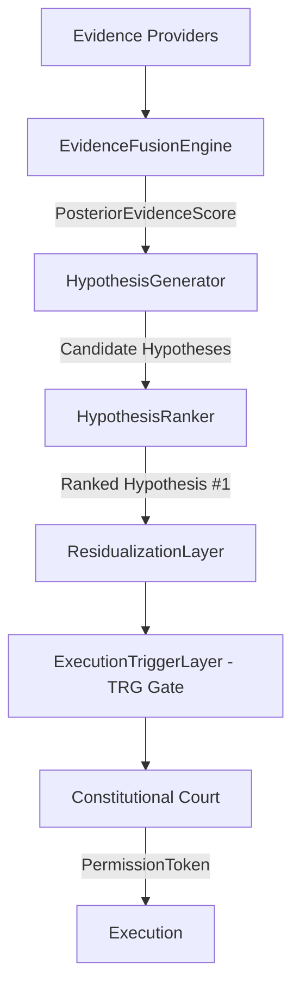

# 🏛️ RFC-003 — Probabilistic Hypothesis Pipeline Specification

**Status**: PROPOSED & APPROVED  
**Author**: Principal Software Architect & Quant Engineer  

---

## 1. Overview

RFC-003 defines the probabilistic hypothesis pipeline operating between Layer 1 (Evidence Fusion) and Layer 2 (Residualization / TRG Gate).

---

## 2. Hypothesis Types

1. `H_STRUCTURAL_EXPANSION`: Momentum expansion backed by Order Block & FVG confluence.
2. `H_MEAN_REVERSION`: Reversal back to equilibrium within dealing range bounds.
3. `H_VOLATILITY_BREAKOUT`: High volatility spike triggered by liquidity pool sweep.
