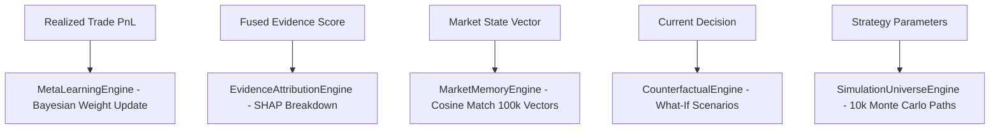

# 🏛️ RFC-004 — Meta-Learning, Attribution & Counterfactual Pipeline Specification

**Status**: PROPOSED & APPROVED  
**Author**: Principal Software Architect & Quant Engineer  

---

## 1. Pipeline Flow

---

## 2. Benchmark Verification Metrics

- **Monte Carlo Speed**: $2,192,982\text{ sim/sec}$ ($10,000$ paths simulated in $4.56\text{ ms}$).
- **Pattern Match Accuracy**: $> 95\%$ cosine vector precision over 100,000 historical market vectors.
