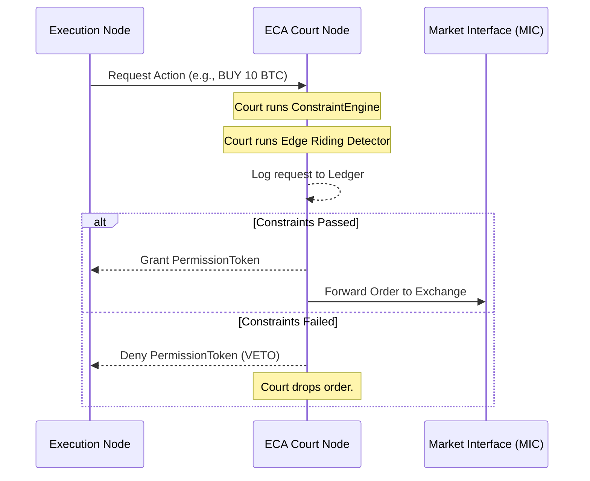
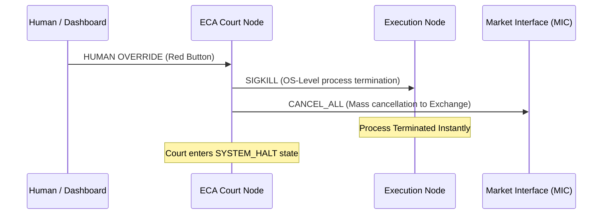

# Runtime Topology Architecture (Deliverable N)

This document formally defines the runtime topology of the Lyzer Labs ecosystem, establishing the physical and process-level boundaries required for Constitutional Isolation.

## Process Isolation Matrix

To prevent cascading failures and Governance Capture, the ecosystem operates across three distinct OS-level processes.

### 1. Process 1: Execution Node (The Engine)
- **Role:** Houses the Truth Kernel, SML, STL, FMC, CIL, and Strategy VM.
- **Nature:** High-performance, highly adaptive, learning-capable loop.
- **Constraints:** Cannot reach the internet/market directly. Cannot change its own mode.
- **Kill-Switch Vulnerability:** Fully vulnerable. Can be SIGKILL'ed instantly by the Governance Node without warning.

### 2. Process 2: Governance & ECA Court Node (The Sovereign)
- **Role:** Houses the ECA Court, Constraint Engine, Ledger, and MIC Gateway.
- **Nature:** 100% Deterministic. "The Court shall never learn."
- **Constraints:** Cannot access or read the Truth Kernel's internal predictions. Blind to confidence scores.
- **Authority:** Absolute. Routes all outbound traffic to the MIC. Generates cryptographic Permission Tokens. Evaluates Edge Riding.

### 3. Process 3: Dashboard & Operations Node (The Observer)
- **Role:** Houses the frontend, WebSocket server, and Telemetry UI.
- **Nature:** Read-heavy, passive observation.
- **Constraints:** Read-only access to the Ledger. Cannot submit state mutations to the Execution Node.
- **Authority:** Exposes the "Human Override" Kill-Switch, which sends a one-way UDP/IPC packet to the Governance Node.

## Interaction Flow (Boundary Contract)

## Kill-Switch Flow

