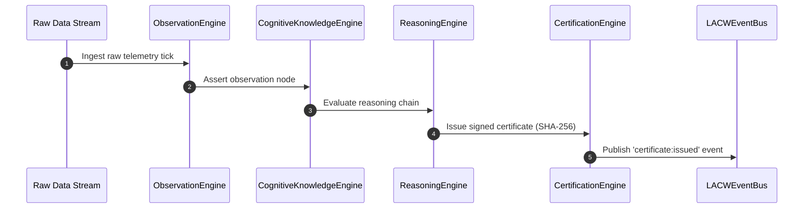

# LACW — Cognitive Flow & Decision Sequence Diagram

```mermaid
sequenceDiagram
    autonumber
    participant Data as Raw Data Stream
    participant Obs as ObservationEngine
    participant Know as CognitiveKnowledgeEngine
    participant Reason as ReasoningEngine
    participant Cert as CertificationEngine
    participant Bus as LACWEventBus

    Data->>Obs: Ingest raw telemetry tick
    Obs->>Know: Assert observation node
    Know->>Reason: Evaluate reasoning chain
    Reason->>Cert: Issue signed certificate (SHA-256)
    Cert->>Bus: Publish 'certificate:issued' event
```
