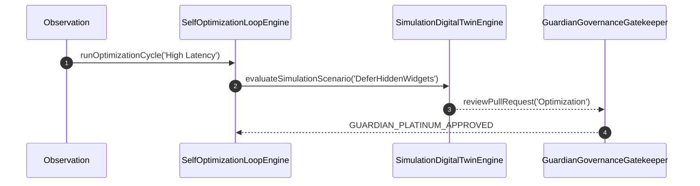

# LACW — Self-Optimization Loop Sequence Diagram

```mermaid
sequenceDiagram
    autonumber
    participant Obs as Observation
    participant Detect as SelfOptimizationLoopEngine
    participant Sim as SimulationDigitalTwinEngine
    participant Guard as GuardianGovernanceGatekeeper

    Obs->>Detect: runOptimizationCycle('High Latency')
    Detect->>Sim: evaluateSimulationScenario('DeferHiddenWidgets')
    Sim-->>Guard: reviewPullRequest('Optimization')
    Guard-->>Detect: GUARDIAN_PLATINUM_APPROVED
```
