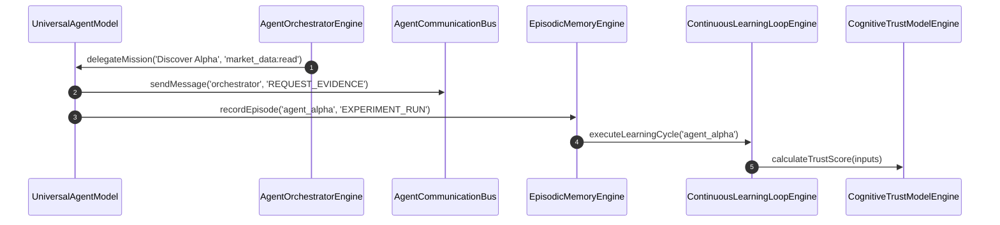

# LACW — Cognitive Agent Architecture & Learning Flow

```mermaid
sequenceDiagram
    autonumber
    participant Agent as UniversalAgentModel
    participant Orch as AgentOrchestratorEngine
    participant Comm as AgentCommunicationBus
    participant EpMem as EpisodicMemoryEngine
    participant Learn as ContinuousLearningLoopEngine
    participant Trust as CognitiveTrustModelEngine

    Orch->>Agent: delegateMission('Discover Alpha', 'market_data:read')
    Agent->>Comm: sendMessage('orchestrator', 'REQUEST_EVIDENCE')
    Agent->>EpMem: recordEpisode('agent_alpha', 'EXPERIMENT_RUN')
    EpMem->>Learn: executeLearningCycle('agent_alpha')
    Learn->>Trust: calculateTrustScore(inputs)
```
