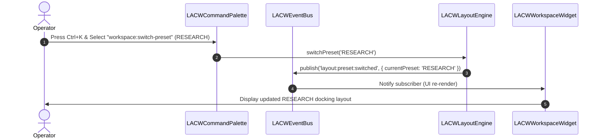

# LACW — Architectural Topology & Sequence Diagrams

## Sequence Diagram: Command Execution & Layout Preset Switch

```mermaid
sequenceDiagram
    autonumber
    actor Operator
    participant CmdPalette as LACWCommandPalette
    participant EventBus as LACWEventBus
    participant LayoutEng as LACWLayoutEngine
    participant UI as LACWWorkspaceWidget

    Operator->>CmdPalette: Press Ctrl+K & Select "workspace:switch-preset" (RESEARCH)
    CmdPalette->>LayoutEng: switchPreset('RESEARCH')
    LayoutEng->>EventBus: publish('layout:preset:switched', { currentPreset: 'RESEARCH' })
    EventBus->>UI: Notify subscriber (UI re-render)
    UI->>Operator: Display updated RESEARCH docking layout
```
