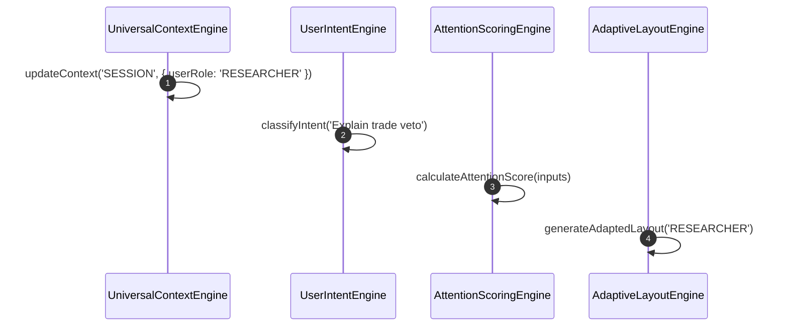

# LACW — Context Processing & Layout Adaptation Sequence Diagram

```mermaid
sequenceDiagram
    autonumber
    participant Context as UniversalContextEngine
    participant Intent as UserIntentEngine
    participant Attn as AttentionScoringEngine
    participant Layout as AdaptiveLayoutEngine

    Context->>Context: updateContext('SESSION', { userRole: 'RESEARCHER' })
    Intent->>Intent: classifyIntent('Explain trade veto')
    Attn->>Attn: calculateAttentionScore(inputs)
    Layout->>Layout: generateAdaptedLayout('RESEARCHER')
```
