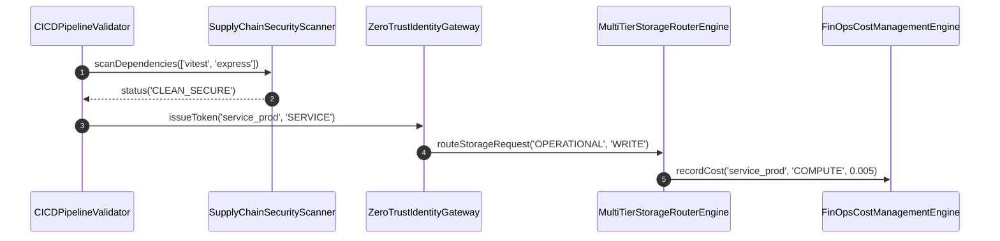

# LACW — Deployment Topology & Infrastructure Sequence

```mermaid
sequenceDiagram
    autonumber
    participant CICD as CICDPipelineValidator
    participant Sec as SupplyChainSecurityScanner
    participant Gateway as ZeroTrustIdentityGateway
    participant Storage as MultiTierStorageRouterEngine
    participant FinOps as FinOpsCostManagementEngine

    CICD->>Sec: scanDependencies(['vitest', 'express'])
    Sec-->>CICD: status('CLEAN_SECURE')
    CICD->>Gateway: issueToken('service_prod', 'SERVICE')
    Gateway->>Storage: routeStorageRequest('OPERATIONAL', 'WRITE')
    Storage->>FinOps: recordCost('service_prod', 'COMPUTE', 0.005)
```
