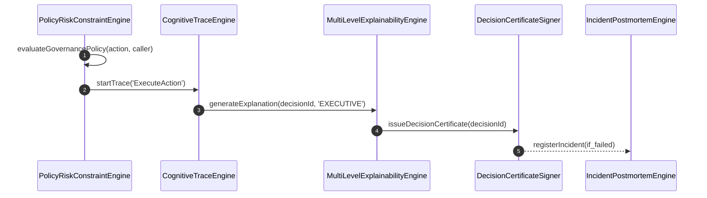

# LACW — Observability & Governance Sequence Diagram

```mermaid
sequenceDiagram
    autonumber
    participant Policy as PolicyRiskConstraintEngine
    participant Trace as CognitiveTraceEngine
    participant Explain as MultiLevelExplainabilityEngine
    participant Cert as DecisionCertificateSigner
    participant Inc as IncidentPostmortemEngine

    Policy->>Policy: evaluateGovernancePolicy(action, caller)
    Policy->>Trace: startTrace('ExecuteAction')
    Trace->>Explain: generateExplanation(decisionId, 'EXECUTIVE')
    Explain->>Cert: issueDecisionCertificate(decisionId)
    Cert-->>Inc: registerIncident(if_failed)
```
