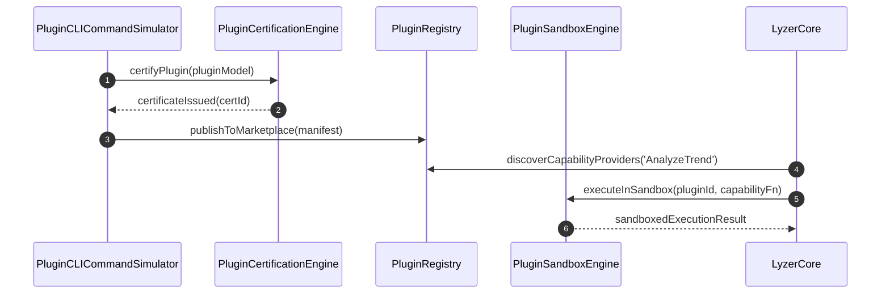

# LACW — Plugin Installation & Sandboxed Execution Sequence

```mermaid
sequenceDiagram
    autonumber
    participant CLI as PluginCLICommandSimulator
    participant Cert as PluginCertificationEngine
    participant Reg as PluginRegistry
    participant Sandbox as PluginSandboxEngine
    participant Core as LyzerCore

    CLI->>Cert: certifyPlugin(pluginModel)
    Cert-->>CLI: certificateIssued(certId)
    CLI->>Reg: publishToMarketplace(manifest)
    Core->>Reg: discoverCapabilityProviders('AnalyzeTrend')
    Core->>Sandbox: executeInSandbox(pluginId, capabilityFn)
    Sandbox-->>Core: sandboxedExecutionResult
```
