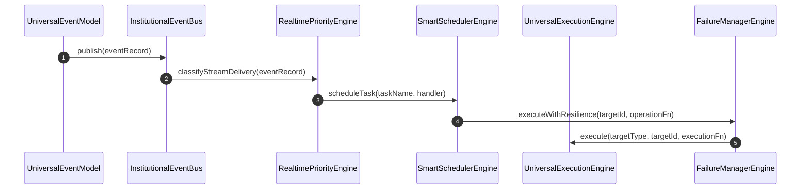

# LACW — Cognitive Runtime Sequence Diagram

```mermaid
sequenceDiagram
    autonumber
    participant Event as UniversalEventModel
    participant Bus as InstitutionalEventBus
    participant Priority as RealtimePriorityEngine
    participant Sched as SmartSchedulerEngine
    participant Exec as UniversalExecutionEngine
    participant Failure as FailureManagerEngine

    Event->>Bus: publish(eventRecord)
    Bus->>Priority: classifyStreamDelivery(eventRecord)
    Priority->>Sched: scheduleTask(taskName, handler)
    Sched->>Failure: executeWithResilience(targetId, operationFn)
    Failure->>Exec: execute(targetType, targetId, executionFn)
```
