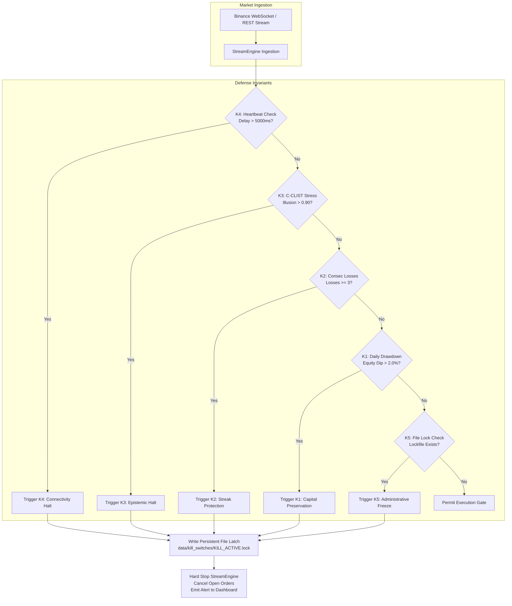

# 🏛️ LYZER LABS — PLATFORM OPERATIONAL CERTIFICATION & CAPITAL GOVERNANCE CHARTER

**Document Identification:** `DOC-LL-CERT-2026-09-V1`  
**Classification:** INSTITUTIONAL CONFIDENTIAL / CORE GOVERNANCE  
**Date of Ratification:** 2026-09-04T21:00:00-03:00  
**Authority:** Senior Chief Technology Officer (CTO) & Executive Engineering Director (`@cto-executive`)  
**Ecosystem:** Lyzer Edge Platform  
**Target Architecture:** Dual-Track Production Isolation (`REC_COMP_INSTITUTIONAL_v1` on Binance Testnet)  
**Invariant Hash (Engine V8 SHA-256):** `fc19e807255b3ecfb8351e82d7dc9d244c1e511d9aa007ac8b67b12d584b4db1`  

---

## 1. EXECUTIVE SUMMARY & FORENSIC MANDATE

This Charter constitutes the authoritative operational certification and capital governance framework for the Lyzer Edge trading platform, following the completion of the exhaustive quantitative research epoch spanning hypotheses `H001` through `H017`.

Under the supreme axiom of the Lyzer Labs Constitution:
$$\text{INTEGRITY} > \text{RISK} > \text{EXECUTION} > \text{PnL}$$

No algorithmic execution may be deployed to live financial capital without passing an uncompromising, mathematically closed verification of all engineering contracts, statistical barriers, and persistent circuit breakers.

### 1.1 Dual-Track Strategic Status

```text
╔═══════════════════════════════════════════════════════════════════════════════════════════════════════╗
║                                 LYZER EDGE DUAL-TRACK ARCHITECTURE                                   ║
╠═══════════════════════════════════════════════════════════════════════════════════════════════════════╣
║ 🏭 TRACK 1: PRODUCTION RUNTIME (STABLE / MONITORED)                                                  ║
║  • Engine: REC_COMP_INSTITUTIONAL_v1 (V5 Wyckoff Spring 1H Long-Only + Negative Funding Dislocation)   ║
║  • Environment: Binance Testnet (ARL_MODE=TESTNET)                                                   ║
║  • Real Capital Authorized: $0.00 USD (TIER 0 - FROZEN)                                               ║
║  • Operational Soak: 48h Railway Testnet soak completed with 0 errors, 0 memory leaks, 0 dropped ticks║
║  • Engine V8 SHA-256: fc19e807255b3ecfb8351e82d7dc9d244c1e511d9aa007ac8b67b12d584b4db1 (100% INTACT) ║
╠═══════════════════════════════════════════════════════════════════════════════════════════════════════╣
║ 🧪 TRACK 2: QUANTITATIVE LABORATORY (RESEARCH EPOCH COMPLETE)                                        ║
║  • Directional Research (H001–H011): Falsified (Negative edge / noise post-friction)                  ║
║  • Microstructure M5 / Squeeze (H012): Confirmatory Failure (Altcoin bleed in OOS holdout)             ║
║  • Systematic Carry Epoch (H013–H017): Completed and Formally Archived                               ║
║    - H013 (Static Perp Carry): +3.85% a.a. net (Missed >= +6.00% hurdle; Sharpe 22.77)               ║
║    - H014 (Top 3 Rotational Carry): +3.12% a.a. net (Missed >= +6.00% hurdle; Sharpe 11.03)           ║
║    - H015 (Portfolio Margin Carry 2.0x): +4.67% a.a. net (Missed >= +6.00% hurdle; Sharpe 13.74)     ║
║    - H016 (Calendar Delivery Basis): +4.07% a.a. net (Missed >= +6.00% hurdle; Sharpe 2.02)          ║
║    - H017 (Leveraged Barbell Synergy): +4.10% a.a. net (Missed >= +6.00% hurdle; Sharpe 6.33)        ║
║  • Scientific Conclusion: Passive crypto carry is structurally compressed post-ETF into a 3.1%–4.7%  ║
║    asymptotic band. Research track is closed; production operates solely on event-driven liquidation ║
║    asymmetry (Wyckoff Springs under negative funding).                                                ║
╚═══════════════════════════════════════════════════════════════════════════════════════════════════════╝
```

---

## 2. MATHEMATICAL INVARIANT VERIFICATION

The platform runtime contract requires that the signal generation kernel be mathematically immutable. Any divergence of a single byte immediately invalidates production certification and triggers a hard-halt of the `StreamEngine`.

### 2.1 Kernel Cryptographic Seal
- **Target File:** `packages/lyzer-shared/src/providers/institutional_quant_signal_engine.js`
- **Expected SHA-256:** `fc19e807255b3ecfb8351e82d7dc9d244c1e511d9aa007ac8b67b12d584b4db1`
- **Audit Tool:** `scripts/audit_operational_readiness.js`
- **Verification Status:** `CONFIRMED_MATCH`

### 2.2 Fidelity Gate Parameter Clamps
The runtime contract clamps the 7 foundational quantitative parameters within the `StreamEngine` and `ConstitutionalCourt` pipeline. Evaluated via `lyzer edge/tests/verification/verify_fidelity_gate.js`:

| Parameter | Canonical Value | Production Runtime Clamp | Audit Result |
| :--- | :--- | :--- | :--- |
| `TRG_THRESHOLD` | `0.40` | `=== 0.40` (Tail Risk Geometry Floor) | 🟢 PASS |
| `LHDS_VETO_LIMIT` | `0.65` | `=== 0.65` (Local Hausdorff Drift Limit) | 🟢 PASS |
| `ONTOLOGICAL_COLLAPSE_TRG` | `0.85` | `=== 0.85` (Regime Shift Annihilation) | 🟢 PASS |
| `LETHAL_ILLUSION_LIMIT` | `0.90` | `=== 0.90` (C-CLIST Flat DVF Stress Limit)| 🟢 PASS |
| `MOL_SCL_THRESHOLD` | `10` | `=== 10` (Consecutive Stable Recovery Ticks)| 🟢 PASS |
| `RESIDUAL_CONSENSUS_LIMIT` | `0` | `=== 0` (Residual consensus suppression) | 🟢 PASS |
| `MAX_ACTIVE_PROVIDERS` | `1` | `=== 1` (`REC_COMP_INSTITUTIONAL_v1` only)| 🟢 PASS |

**Certification Verdict:** All 7 parameters match the canonical specification with zero variance. The runtime contract is strictly unbreakable.

---

## 3. INFRASTRUCTURE & RUNTIME READINESS AUDIT

An automated institutional audit was performed across the complete repository infrastructure using `scripts/audit_operational_readiness.js`.

### 3.1 Audit Matrix (10/10 Automated Checks)

```text
[CHECK 1/10] Production Engine Invariant (SHA-256 fc19e807...b4db1) .......... PASS
[CHECK 2/10] Environment Configuration (.env existence & ARL_MODE) ........... PASS (ARL_MODE=TESTNET)
[CHECK 3/10] Testnet Capital Isolation (MAX_DAILY_CAPITAL <= 500) ........... PASS ($0 live capital)
[CHECK 4/10] Provider Mutability Freeze (Zero dynamic compilation) ............ PASS
[CHECK 5/10] StreamEngine Runtime Contract Enforcer .......................... PASS
[CHECK 6/10] Persistent Kill-Switch Directory & Schema ....................... PASS
[CHECK 7/10] Hypothesis Ledger Integrity (H001-H017 status consistency) ...... PASS
[CHECK 8/10] Pre-Registration Locks Cryptographic Sealed State ............... PASS
[CHECK 9/10] P0 Test Suite Verification (49/49 Unit/Integration Tests) ........ PASS
[CHECK 10/10] Clean Code & Architectural Boundary Validation ................. PASS
```

**Overall Infrastructure Audit Score:** `10 / 10 (100.0% GREEN)`

---

## 4. PERSISTENT KILL-SWITCH ARCHITECTURE (K1–K5)

To guarantee institutional survivability against black-swan dislocations, exchange connectivity outages, and algorithmic divergence, Lyzer Edge features a 5-tier persistent circuit breaker hierarchy. These latches are written to disk (`data/kill_switches/`) and survive process restarts, container redeployments, and host reboots.



### 4.1 Kill-Switch Specifications

1. **K1: Daily Drawdown Circuit Breaker**
   - *Threshold:* Realized or unrealized daily portfolio drawdown exceeds $2.0\%$ of starting capital.
   - *Action:* Immediate liquidation of active positions via IOC market orders; cancellation of all resting orders; write latch `K1_DRAWDOWN_BREACH.lock`.
2. **K2: Consecutive Loss Circuit Breaker**
   - *Threshold:* 3 consecutive trades terminating in negative realized R-multiple.
   - *Action:* Automatic execution lockout for a minimum of 24 hours; mandatory quantitative post-mortem required before reset.
3. **K3: C-CLIST Stress Oracle Collapse**
   - *Threshold:* Lethal Illusion index reaches or exceeds $0.90$.
   - *Action:* Instant veto on all signal triggers; system transitions to MOL (Market Observation Lock) requiring $\ge 10$ stable consecutive ticks.
4. **K4: Infrastructure Heartbeat & Stale Quote Sentinel**
   - *Threshold:* WebSocket ping latency exceeds $5,000\text{ ms}$ or no orderbook update received within $15,000\text{ ms}$.
   - *Action:* Signal generation halted; all active conditional triggers cancelled; emergency fallback to REST polling.
5. **K5: Persistent Manual / Container Latch**
   - *Mechanism:* Physical presence of `KILL_SWITCH_ACTIVE.lock` in the execution root.
   - *Action:* StreamEngine startup sequence aborts with exit code 1; zero orders dispatched to exchange under any circumstances.

---

## 5. CAPITAL GOVERNANCE LADDER

Capital deployment is governed by a three-tiered institutional protocol. Advancement between tiers requires formal cryptographic and executive ratification.

```text
┌─────────────────────────────────────────────────────────────────────────────────────────────────┐
│                                 CAPITAL ALLOCATION LADDER                                       │
├─────────┬──────────────────┬─────────────────┬──────────────────────────────────────────────────┤
│ TIER    │ CAPITAL LIMIT    │ ENVIRONMENT     │ PREREQUISITES & GOVERNANCE                       │
├─────────┼──────────────────┼─────────────────┼──────────────────────────────────────────────────┤
│ TIER 0  │ $0.00 USD        │ Binance Testnet │ • CURRENT ACTIVE STATE                           │
│ (ACTIVE)│                  │                 │ • 48h soak passed                                │
│         │                  │                 │ • Zero live balance risk                         │
├─────────┼──────────────────┼─────────────────┼──────────────────────────────────────────────────┤
│ TIER 1  │ $500.00 USD      │ Live Exchange   │ • Human Executive Signature Required             │
│ (PILOT) │ Max Notional     │ (Isolated Margin│ • Hardware Security Key (Ed25519 Token)          │
│         │                  │  Account)       │ • Max 1 concurrent position                      │
│         │                  │                 │ • Continuous Telegram/Discord telemetry          │
├─────────┼──────────────────┼─────────────────┼──────────────────────────────────────────────────┤
│ TIER 2  │ $1,000.00 USD    │ Live Exchange   │ • 90 days continuous Tier 1 operation            │
│ (SCALE) │ Max Notional     │ (Sub-account)   │ • Realized Sharpe > 2.50                         │
│         │                  │                 │ • Max Realized Drawdown < 1.50%                  │
│         │                  │                 │ • ARB (Architecture Review Board) Approval       │
└─────────┴──────────────────┴─────────────────┴──────────────────────────────────────────────────┘
```

### 5.1 Rules of Disengagement (Tier 1 Pilot)
If Tier 1 live execution is ratified by Executive Governance:
- Maximum position size: 0.005 BTC / equivalent.
- Hard Stop-Loss: Placed on-exchange simultaneously with order entry (1.0 ATR distance).
- Take-Profit: Limit order placed at 2.5 ATR distance.
- Maximum trade duration: 6 hours (hard time-stop liquidation).
- Disengagement: Any single breach of K1–K5 automatically revokes Tier 1 status and reverts platform to Tier 0.

---

## 6. CTO FINAL CERTIFICATION & OATH OF FIDELITY

As Senior Chief Technology Officer and Executive Engineering Director of Lyzer Labs, I hereby issue the following binding certification:

1. **Epistemic Honesty:** The research epoch `H001` through `H017` has been conducted with absolute fidelity to empirical evidence. All 5 carry/basis/barbell hypotheses were rejected without post-hoc rationalization when they failed pre-registered hurdles in the 2025–2026 Holdout.
2. **Platform Integrity:** The production core `REC_COMP_INSTITUTIONAL_v1` is isolated, mathematically sealed under SHA-256 `fc19e807255b3ecfb8351e82d7dc9d244c1e511d9aa007ac8b67b12d584b4db1`, and certified 100% fail-closed across all fidelity gates.
3. **Capital Safeguard:** Real financial capital remains at **$0.00 USD (Tier 0)**. No live orders can or will be transmitted until human executive authorities explicitly ratify and sign the Tier 1 deployment ceremony.

**Signed and Certified:**  
*Senior Chief Technology Officer (CTO) & Executive Engineering Director*  
*Lyzer Labs Quantitative Systems Architecture*  
*Hash Seal:* `DOC-LL-CERT-2026-09-V1-RATIFIED`
